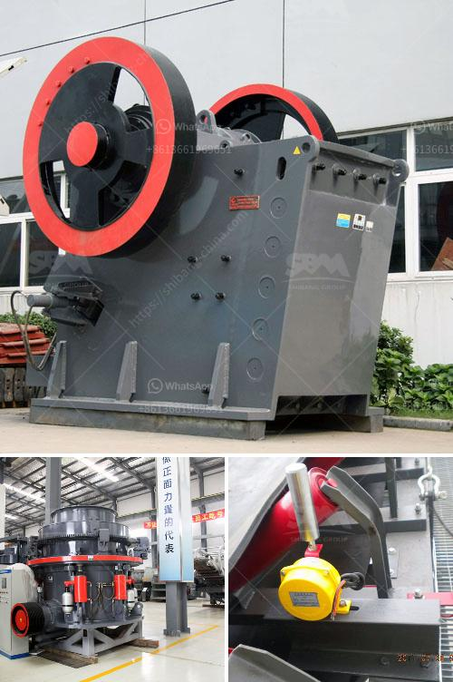

<h3>rollers for conveyor belts manizales</h3>
Conveyor belts play a vital role in various industries, allowing for the efficient movement of goods and materials from one point to another. To ensure their optimal performance, it is important to have reliable and high-quality rollers. In the city of Manizales, known for its strong industrial presence, investing in reliable rollers for conveyor belts is essential to enhance efficiency and ensure the safety of operations.

Rollers serve as the backbone of conveyor belt systems, providing support and facilitating the movement of materials along the belt. When these rollers are of high quality, they reduce friction, enhance the smoothness of operation, and minimize energy consumption. This results in increased productivity and cost savings for businesses in Manizales.

One of the key factors to consider when choosing rollers for conveyor belts in Manizales is their durability. The industrial environment in the city demands rollers that can withstand the rigors of heavy loads, consistent operation, and exposure to various elements. High-quality materials, such as steel or polyurethane, should be used in the construction of rollers to ensure their longevity and ability to withstand the demands of the industry.

Efficiency is another important aspect to be considered when selecting rollers for conveyor belts. Well-designed rollers should ensure minimal power consumption by reducing friction and enabling smooth movement. The design should also allow for easy installation and maintenance, minimizing downtime and optimizing productivity. Choosing rollers with advanced features like sealed or greased-for-life bearings can further enhance efficiency and reduce the need for frequent maintenance.

Safety is paramount in any industrial setting, and Manizales is no exception. Conveyor belts are known for their potential hazards, especially if rollers are not properly designed or maintained. Faulty rollers can cause material spillage, belt slippage, and even accidents that endanger workers. Investing in rollers that prioritize safety features, such as anti-static properties, low noise emission, and non-toxicity can help mitigate risks and protect the well-being of employees.

Furthermore, rollers for conveyor belts in Manizales should also be tailored to meet specific industry requirements. Different industries might have varying demands in terms of load capacity, belt speed, and operational environment. Working with roller manufacturers who can offer customized solutions will ensure that the rollers are designed to suit the unique needs of the industry, leading to optimal performance and seamless integration with the conveyor belt system.

In conclusion, investing in high-quality rollers for conveyor belts in Manizales is crucial to enhance efficiency and ensure the safety of operations. Considerations such as durability, efficiency, safety features, and customization should be made when selecting the rollers. By doing so, businesses in Manizales can improve productivity, reduce costs, and create a safer working environment. Therefore, it is essential to work with reputable roller manufacturers to ensure reliable and efficient conveyor belt systems in the city.
<h3>Contact us</h3><ul><li><strong>Whatsapp:&nbsp;<a href="https://wa.me/8613661969651">+8613661969651</a></strong></li><li><a href="https://swt.shibang-china.com/?git&amp;zhl&amp;rollers for conveyor belts manizales"><strong>Online Service(chat now)</strong></a></li></ul><h3>Related</h3><ul><li><a href='mtw 175 tanzania mill output in 325 mesh.md'>mtw 175 tanzania mill output in 325 mesh</a></li><li><a href='fine powder making machine.md'>fine powder making machine</a></li><li><a href='used vertical roller mill for sale.md'>used vertical roller mill for sale</a></li><li><a href='hard rock ball mill specs.md'>hard rock ball mill specs</a></li><li><a href='asphalt crushing machine capacity 15 ton hour.md'>asphalt crushing machine capacity 15 ton hour</a></li></ul>