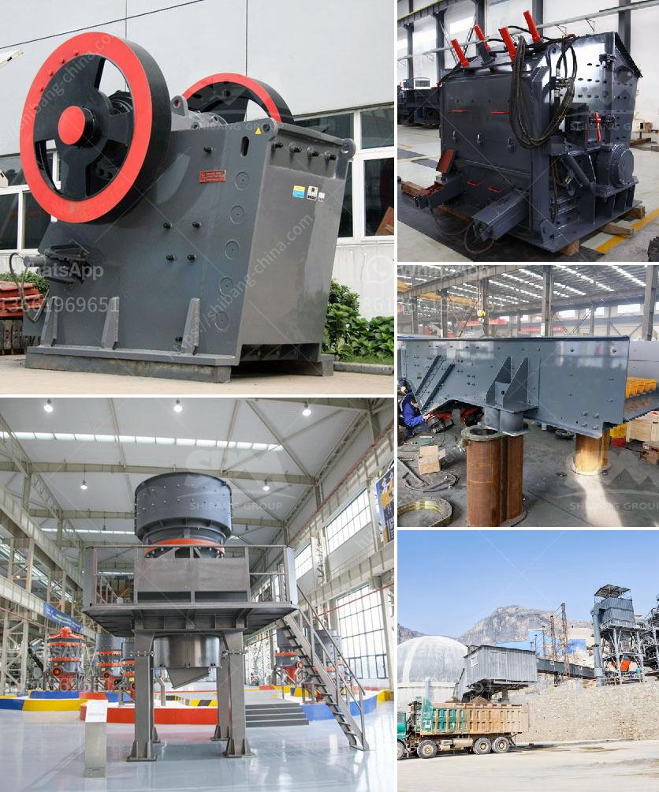

<h3>rolls crusher for sale</h3>
When it comes to crushing materials, there are several options available on the market. One of the most commonly used crushers is the rolls crusher. This machine utilizes two parallel cylinders, each with a steel roll that moves in opposite directions to compress the material. The rolls crusher is renowned for its ability to crush hard, medium-hard, and soft materials efficiently.

There are various types of rolls crushers available for different applications. Common types include smooth rolls crushers and toothed rolls crushers. The smooth rolls crusher consists of two smooth cylinders that rotate towards each other. On the other hand, the toothed rolls crusher features teeth on the crushing surface, which can handle harder materials.

One of the key advantages of the rolls crusher is its versatility. It can be used to crush a wide range of materials, including mineral ores, rocks, and even agricultural waste. This makes it a great solution for various industries, such as mining, quarrying, and recycling. Moreover, it can produce a homogeneous product size, making it suitable for further processing, whether it be for grinding, granulating, or pelletizing.

The rolls crusher also offers exceptional efficiency. With its dual-roll configuration, it crushes the material in a relatively low-speed crushing action, minimizing the generation of fines. This results in lower energy consumption and reduced wear on the machine. Additionally, the rolls crusher is known for its high throughput capacity, enabling operators to process large quantities of material in a short amount of time.

Furthermore, the rolls crusher is relatively easy to maintain. Most models are equipped with hydraulic systems that ensure quick and safe access to the crushing chamber, simplifying maintenance tasks and minimizing downtime. Moreover, the robust construction of the rolls crusher ensures long-lasting performance, even in demanding operating conditions.

If you're in the market for a rolls crusher, there are several factors to consider. Firstly, determine the type and size of material you will be crushing. This will help you choose the appropriate rolls crusher configuration to achieve the desired product size. Additionally, consider the required capacity and power consumption of the machine. Finally, evaluate the after-sales support provided by the manufacturer, such as spare parts availability and technical assistance.

In conclusion, the rolls crusher is a versatile and efficient crushing machine that offers numerous benefits for various industries. Its ability to crush a wide range of materials, its high throughput capacity, and its relatively low maintenance requirements make it a valuable asset for any operation. When looking for a rolls crusher for sale, be sure to carefully consider your requirements and choose a reputable manufacturer to ensure you get a reliable and durable machine.
<h3>Contact us</h3><ul><li><strong>Whatsapp:&nbsp;<a href="https://wa.me/8613661969651">+8613661969651</a></strong></li><li><a href="https://swt.shibang-china.com/?git&amp;zhl&amp;rolls crusher for sale"><strong>Online Service(chat now)</strong></a></li></ul><h3>Related</h3><ul><li><a href='ball mill magnetic separator.md'>ball mill magnetic separator</a></li><li><a href='aggregate crushers for sale saudi arabia.md'>aggregate crushers for sale saudi arabia</a></li><li><a href='25 tph vsi crushers.md'>25 tph vsi crushers</a></li><li><a href='alluvial gold washing plants in south africa.md'>alluvial gold washing plants in south africa</a></li><li><a href='the largest stone crusher system.md'>the largest stone crusher system</a></li></ul>