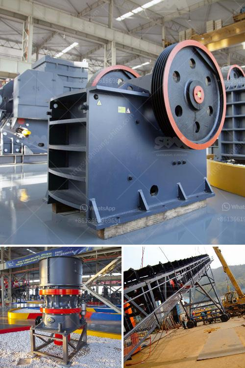

<h3>rotary kiln design calculations</h3>
Rotary kilns have been widely used in the cement industry to produce clinker. With the rapid development of the industry, the demands for rotary kilns are growing significantly. To meet these demands, designers and engineers have been studying and developing new and improved rotary kiln designs.

The rotary kiln design calculations. process should not be separated from the power input as it directly affects the kiln's running and output performance. A poorly designed kiln will consume abnormally high amounts of power and fuel, which can in turn lead to a decrease in efficiency. Therefore, proper design calculations are crucial for the successful operation of a rotary kiln.

One of the key design calculations is the thermal balance calculation, which determines the amount of heat input and output required to sustain the desired temperature inside the kiln. The thermal balance calculation takes into account various factors such as the fuel type, fuel consumption rate, kiln dimensions, heat losses, and material characteristics to ensure the efficient transfer of heat.

Another important aspect of the rotary kiln design calculations is the mechanical design calculation, which determines the size and strength of various components of the kiln. This includes the shell thickness, the tyre design, the roller design, and the support system design. The mechanical design calculations consider the material properties, the load distribution, and the safety factors to ensure the structural integrity of the kiln.

Furthermore, the kiln's combustion system design calculations play a crucial role in determining the performance and efficiency of the kiln. The combustion system design involves the calculation of the air flow rate, the fuel flow rate, and the burner design. These calculations ensure that the kiln operates at the optimum combustion efficiency, thereby minimizing the fuel consumption and emissions.

In addition to the thermal, mechanical, and combustion system design calculations, other design calculations such as the drive system design, the refractory lining design, and the sealing system design are equally important for the overall efficiency and operation of the kiln.

Overall, rotary kiln design calculations are a complex task that requires the expertise and knowledge of experienced engineers. These calculations involve a thorough understanding of the thermal, mechanical, and combustion principles, as well as the ability to analyze and interpret various parameters and data.

With the advancements in technology and computational tools, designers and engineers now have access to sophisticated software and simulation techniques to aid them in their rotary kiln design calculations. These tools can provide accurate and reliable predictions, enabling designers to optimize the kiln's performance and efficiency.

In conclusion, rotary kiln design calculations are essential for the successful operation of a kiln in the cement industry. The thermal, mechanical, and combustion system design calculations ensure that the kiln operates efficiently, leading to high-quality clinker production with minimal fuel consumption and emissions. With the aid of modern tools and techniques, designers and engineers can now achieve more accurate and optimized designs for rotary kilns.
<h3>Contact us</h3><ul><li><strong>Whatsapp:&nbsp;<a href="https://wa.me/8613661969651">+8613661969651</a></strong></li><li><a href="https://swt.shibang-china.com/?git&amp;zhl&amp;rotary kiln design calculations"><strong>Online Service(chat now)</strong></a></li></ul><h3>Related</h3><ul><li><a href='used gold mining equipment for sale in ghana.md'>used gold mining equipment for sale in ghana</a></li><li><a href='used stone crushers in pakistan.md'>used stone crushers in pakistan</a></li><li><a href='scm ultra fine hammer mill price.md'>scm ultra fine hammer mill price</a></li><li><a href='german stone grinding machine manufacturer.md'>german stone grinding machine manufacturer</a></li><li><a href='portable concrete crusher.md'>portable concrete crusher</a></li></ul>