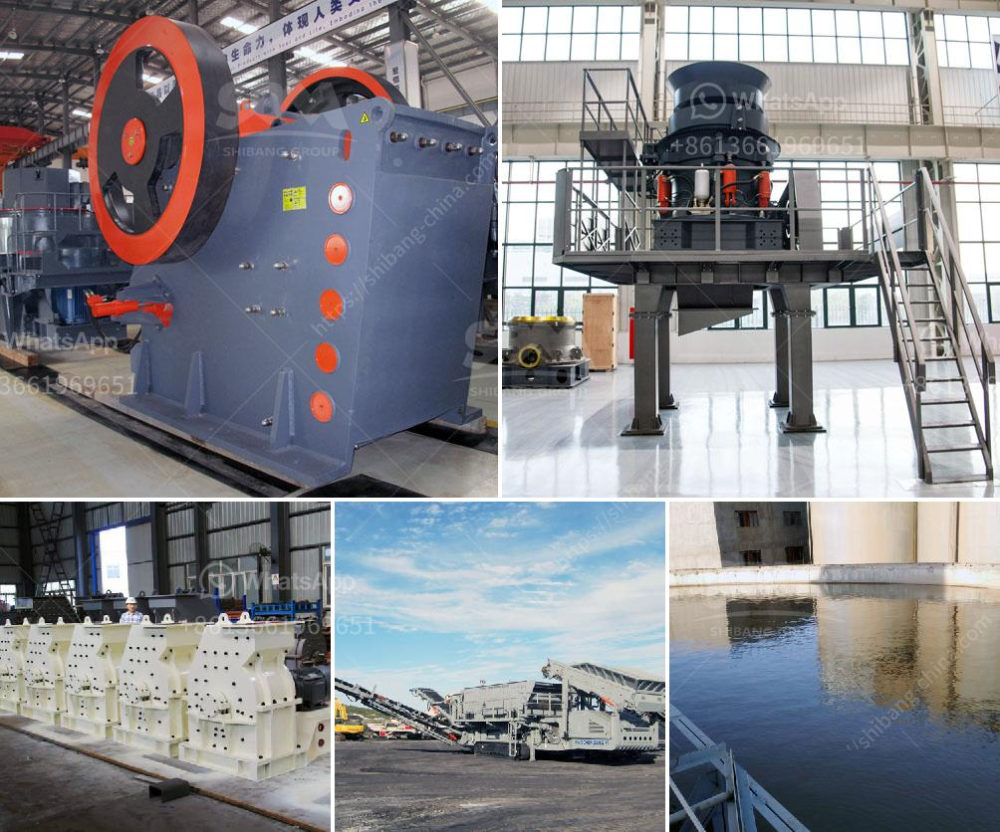

<h3>sale of stone hammer hammer</h3>
In today's fast-paced and technology-driven world, it is easy to overlook the incredible power and historical significance of ancient tools. However, the allure of traditional craftsmanship is experiencing a resurgence, and people are seeking out tools that stand the test of time. One such tool that has captured the attention of artisans and enthusiasts worldwide is the stone hammer. With its rich history and practical uses, the sale of stone hammers has gained significant popularity amongst those seeking to enhance their craftsmanship.

The stone hammer's roots can be traced back thousands of years. Our ancestors used these primitive yet powerful tools for various purposes, including shaping rocks, crafting exquisite designs in wood and bone, and even building structures. The ingenious design of stone hammers ensured their durability and effectiveness, making them indispensable in ancient societies.

Today, the stone hammer is experiencing a resurgence due to its sheer power and versatility. Many craftsmen, sculptors, blacksmiths, and enthusiasts have rediscovered the unique benefits of using such a simple yet powerful tool. The hard, unyielding density of stone can produce impressive results when combined with the force and accuracy of a stone hammer, enhancing the precision and control of each strike.

Artisans and craftsmen across various industries are finding that using a stone hammer can help them unleash their creativity in new and exciting ways. Whether it's in sculpture, woodworking, or jewelry making, the stone hammer provides a level of artistic expression and authenticity that modern machinery cannot replicate. The tactile experience of connecting with the stone, feeling the energy transfer through each strike, and witnessing the transformation it brings about is truly unparalleled.

Whether you are working on a new construction project or restoring historical structures, the stone hammer is an essential tool for masons and builders. Its unparalleled ability to shape and size stones allows for intricate craftsmanship and attention to detail that is crucial for both aesthetic and structural integrity.

In an era where sustainability is paramount, the sale of stone hammers aligns with the principles of eco-consciousness. These timeless tools require minimal energy consumption, produce negligible waste, and are crafted from natural materials. Investing in a stone hammer is not only a tribute to our ancestors but also a step towards reducing our carbon footprint.

When considering the purchase of a stone hammer, it is essential to choose one that suits your specific needs. Factors such as weight, handle length, and grip material play a significant role in ensuring a comfortable and efficient experience. Consulting with experienced craftsmen or knowledgeable suppliers will help you find the stone hammer that perfectly complements your craftsmanship goals.

The resurgence in the sale of stone hammers is a testament to humanity's enduring fascination with ancient tools. From unleashing creativity to enhancing craftsmanship and contributing to environmental sustainability, these timeless tools offer benefits that cannot be replicated by modern machinery. By investing in a stone hammer, you connect with centuries of tradition, embody the artisan spirit, and truly appreciate the art of craftsmanship. So, step into the world of ancient tools and unleash your creativity with a stone hammer!
<h3>Contact us</h3><ul><li><strong>Whatsapp:&nbsp;<a href="https://wa.me/8613661969651">+8613661969651</a></strong></li><li><a href="https://swt.shibang-china.com/?git&amp;zhl&amp;sale of stone hammer hammer"><strong>Online Service(chat now)</strong></a></li></ul><h3>Related</h3><ul><li><a href='crusher machine manufacturers shanghai.md'>crusher machine manufacturers shanghai</a></li><li><a href='large volume conveyor belt systems rentals.md'>large volume conveyor belt systems rentals</a></li><li><a href='stone quarrys crusher in ghana.md'>stone quarrys crusher in ghana</a></li><li><a href='crusher new used for sale in uae.md'>crusher new used for sale in uae</a></li><li><a href='sand washing plant suppliers.md'>sand washing plant suppliers</a></li></ul>