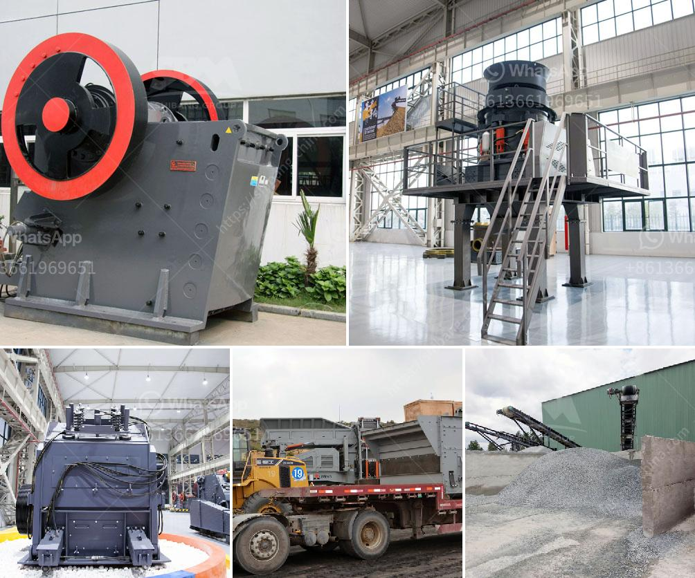

<h3>sale pe series jaw crusher</h3>
The PE series jaw crusher, manufactured by our company, is designed for using in mines, quarries, and other industrial applications, on the base of previous experience of sales at home and abroad assuring good reliability and high productivity. The size range of feed material (maximum compression strength 300Mpa) is from 210 to 1200 mm. They offer wide range of solution for customers' varying needs, including a comprehensive selection of crushers, jaw crushers, and impact crushers. They are also well-known for their excellent reliability and high-quality craftsmanship.

One of the standout features of the PE series jaw crusher is its short toggle plate and toggle seat, which ensures the steady performance of the crusher. The toggle plate and toggle seat reduce the occurrence of overload on the main frame, avoiding potential damage to the crusher. The PE series jaw crusher also incorporates thicker steel plate in its structure, making it more robust and durable. The increased weight of the jaw crusher also improves its stability during operation, reducing the risk of vibration and noise.

The advanced technological design of the PE series jaw crusher allows for optimized performance and easy maintenance. The jaw plates are interchangeable and reversible, ensuring high utilization of wear parts. The jaw crusher is also equipped with a hydraulic setting adjustment system, which allows the operator to adjust the discharge opening quickly and easily. This feature enables the user to control the size of the final product, increasing the flexibility of the equipment.

In summary, the PE series jaw crusher is a reliable and efficient crushing machine, mainly used for primary crushing. It is equipped with advanced technology and features to ensure high productivity and easy maintenance. With its robust construction and durable design, it offers excellent reliability and long service life. If you are in need of a jaw crusher for your mining or industrial application, consider the PE series jaw crusher for its outstanding performance and value for money.
<h3>Contact us</h3><ul><li><strong>Whatsapp:&nbsp;<a href="https://wa.me/8613661969651">+8613661969651</a></strong></li><li><a href="https://swt.shibang-china.com/?git&amp;zhl&amp;sale pe series jaw crusher"><strong>Online Service(chat now)</strong></a></li></ul><h3>Related</h3><ul><li><a href='slag grinding mill india.md'>slag grinding mill india</a></li><li><a href='roller mill for dolmite.md'>roller mill for dolmite</a></li><li><a href='gypsum powder dryer price pakistan.md'>gypsum powder dryer price pakistan</a></li><li><a href='captains of crusher zenith.md'>captains of crusher zenith</a></li><li><a href='screening and crushing equipment for chrome.md'>screening and crushing equipment for chrome</a></li></ul>