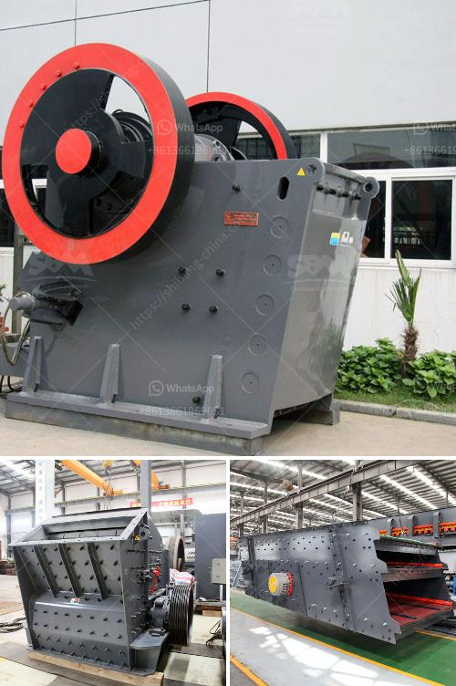

<h3>sales of crusher machines</h3>
Sales of crusher machines are on the rise as the construction and mining industries continue to boom. The demand for such machines is increasing due to their ability to crush several types of materials efficiently. These machines are widely used in various industries, including mining, construction, and recycling.

One of the key factors driving the sales of crusher machines is the increasing need for infrastructure development projects. With the rapid urbanization taking place globally, there is a growing demand for housing and infrastructural facilities. Crusher machines play a crucial role in breaking down stones, rocks, and other materials into smaller sizes, making it easier to transport and use them in construction projects.

Another significant factor that contributes to the sales of crusher machines is the growing need for recycling. As sustainability becomes a priority, industries are focusing on recycling waste materials to reduce their carbon footprint. Crusher machines are instrumental in crushing and transforming waste materials into reusable products, making them an excellent investment for recycling businesses.

Additionally, the increasing mining activities worldwide are driving the demand for crusher machines. Mining companies extract various types of minerals and ores, which are further processed and refined by crushers to meet specific requirements. Crusher machines are designed to handle different types of materials, making them versatile and essential in the mining industry.

Advanced technologies and innovations in crusher machines have also boosted sales. Manufacturers are constantly developing new features and designs to enhance the efficiency and performance of these machines. For instance, some crusher machines now come with automated systems, which ensure precise and consistent crushing results. These advancements make crusher machines more reliable and productive, leading to increased sales.

In conclusion, the sales of crusher machines are witnessing substantial growth due to the rising demand for infrastructure development, recycling, and mining activities. The need for efficient crushing solutions, coupled with advancements in technology, has made crusher machines indispensable in various industries. As the demand for these machines continues to surge, manufacturers are expected to invest in research and development to meet the evolving needs of customers and maintain a competitive edge in the market.
<h3>Contact us</h3><ul><li><strong>Whatsapp:&nbsp;<a href="https://wa.me/8613661969651">+8613661969651</a></strong></li><li><a href="https://swt.shibang-china.com/?git&amp;zhl&amp;sales of crusher machines"><strong>Online Service(chat now)</strong></a></li></ul><h3>Related</h3><ul><li><a href='hammer mill for sale in south africa.md'>hammer mill for sale in south africa</a></li><li><a href='south africa coal mining cost per ton.md'>south africa coal mining cost per ton</a></li><li><a href='mobile stone crushing plant made in germany.md'>mobile stone crushing plant made in germany</a></li><li><a href='gold ore crusher for sale.md'>gold ore crusher for sale</a></li><li><a href='zimbabwe hammer mills.md'>zimbabwe hammer mills</a></li></ul>