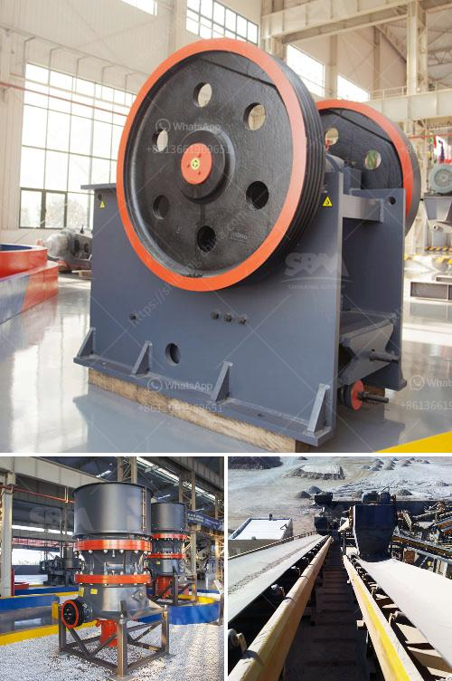

<h3>salt machinery manufacturers india price</h3>
India is among the largest producers and consumers of salt in the world. With the growing demand for salt, the requirement for efficient salt machinery has increased substantially. Salt machinery manufacturers in India have played a crucial role in meeting this demand, providing high-quality machinery at competitive prices.

The salt production process in India involves various stages, such as crushing, washing, drying, and packaging. Salt machinery manufacturers offer a wide range of equipment that caters to each of these stages. The machinery is designed to be durable, efficient, and handle large capacities to meet the requirements of salt manufacturers.

When it comes to price, salt machinery manufacturers in India offer a diverse range of options to suit different budgets. The price of salt machinery depends on various factors, including the capacity, automation level, quality of materials, and brand reputation. Generally, larger and more automated machinery tends to have higher prices, whilst smaller and less automated equipment is more affordable.

In India, the price of a complete salt processing plant can range from INR 10 lakhs to INR 100 lakhs or even more, depending on the capacity and features required. A small-scale salt processing plant with a capacity of around 2-4 tons per hour may cost around INR 10-20 lakhs. On the other hand, a large-scale plant with a capacity of 20-40 tons per hour can cost INR 60 lakhs to INR 100 lakhs.

The price of individual salt machinery also varies based on their specific functionality. For example, a salt crushing machine may cost around INR 2-4 lakhs, while a salt washing machine could be priced between INR 5-10 lakhs. Similarly, a salt drying machine might cost INR 8-12 lakhs, and a packaging machine could be priced between INR 3-6 lakhs.

It is important to note that the prices mentioned above are just approximate figures and can vary based on the brand, quality, capacity, and other specifications of the machines. It is advisable to compare prices from multiple salt machinery manufacturers, evaluate their reputation and customer reviews, before making a purchase.

Some well-known salt machinery manufacturers in India include Salt Refinery Manufacturers, Kudos Engineers, and Newtech Industries. These manufacturers offer a wide range of machinery options and have established themselves as reliable suppliers in the industry. It is always recommended to choose a well-established and reputed manufacturer to ensure the quality and durability of the machinery.

In conclusion, salt machinery manufacturers in India offer a wide range of equipment at competitive prices to cater to the growing demand for salt production. Prices for salt machinery vary based on factors such as capacity, automation level, and brand reputation. It is essential for salt manufacturers to compare prices, consider their specific requirements, and choose a reliable manufacturer to meet their production needs effectively.
<h3>Contact us</h3><ul><li><strong>Whatsapp:&nbsp;<a href="https://wa.me/8613661969651">+8613661969651</a></strong></li><li><a href="https://swt.shibang-china.com/?git&amp;zhl&amp;salt machinery manufacturers india price"><strong>Online Service(chat now)</strong></a></li></ul><h3>Related</h3><ul><li><a href='used gypsum plant for sale europe.md'>used gypsum plant for sale europe</a></li><li><a href='crusher plant supplier in nepal.md'>crusher plant supplier in nepal</a></li><li><a href='stone crusher coalaries.md'>stone crusher coalaries</a></li><li><a href='conveyor belt capacity.md'>conveyor belt capacity</a></li><li><a href='new crushing machine in south africa.md'>new crushing machine in south africa</a></li></ul>