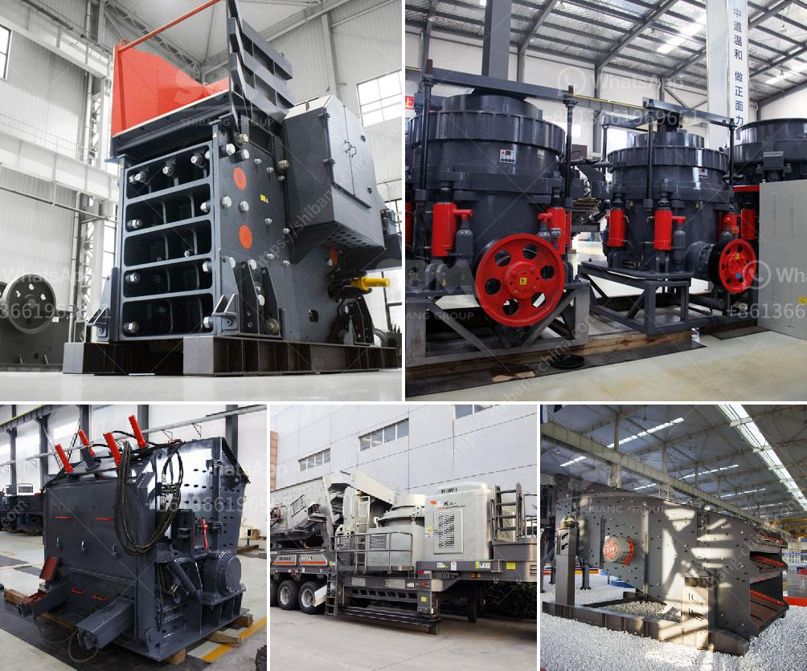

<h3>sand crusher price water</h3>
When it comes to the development of water infrastructure, sand plays an essential role. From filtering water to constructing dams and reservoirs, sand is a vital material required in various water-related projects. However, finding the right quality of sand at an affordable price can be a challenging task. This is where the sand crusher price becomes a crucial factor to consider.

To begin with, let us understand the significance of sand in water-related projects. Sand is primarily used as a filtration medium for water treatment plants. It acts as a barrier to remove impurities, such as suspended solids, bacteria, and viruses from water, making it safe for consumption. The quality of sand used in these plants directly affects the efficiency of the water purification process. Therefore, it is crucial to ensure that the sand used is of the highest quality.

Apart from water treatment, sand is also used in the construction of dams, reservoirs, and other water storage structures. These structures help in managing the water supply, preventing water scarcity during droughts, and ensuring a continuous and reliable water source for various purposes. Sand is used as a base material for constructing these structures, providing stability and strength. Hence, the quality of sand is of utmost importance to ensure the durability and longevity of these water infrastructure projects.

Now, let's delve into the price aspect of sand crushers. A sand crusher is a machine used to crush sand into granular form. It helps in reducing the size of sand particles and ensures a uniform shape for better filtration efficiency. The price of a sand crusher depends on various factors such as its capacity, performance, and brand reputation.

In general, sand crushers with higher capacities tend to be more expensive. This is because they can process larger quantities of sand within a shorter time, making them suitable for large-scale water projects. On the other hand, sand crushers with lower capacities are more affordable but may require additional time and resources for processing sand.

Performance also plays a crucial role in determining the price of a sand crusher. Higher-performing crushers often come with advanced features and technologies that enhance efficiency and output. These features may include adjustable settings, automatic lubrication systems, and easy maintenance options. While investing in a high-performance sand crusher may initially seem expensive, it can offer long-term benefits by reducing operational costs and minimizing downtime.

Lastly, the brand reputation of a sand crusher manufacturer can significantly impact its price. Established brands with a track record of delivering reliable and durable products may charge a premium compared to newer or lesser-known manufacturers. Investing in a reputable brand ensures the quality and longevity of the sand crusher, making it a cost-effective choice in the long run.

In conclusion, the price of a sand crusher holds immense importance in the context of water infrastructure projects. High-quality sand, processed through efficient crushers, is vital for water treatment plants and the construction of dams and reservoirs. The capacity, performance, and brand reputation are determining factors in the price of a sand crusher. Evaluating these factors carefully can help water infrastructure developers make informed decisions and ensure the success and sustainability of their projects.
<h3>Contact us</h3><ul><li><strong>Whatsapp:&nbsp;<a href="https://wa.me/8613661969651">+8613661969651</a></strong></li><li><a href="https://swt.shibang-china.com/?git&amp;zhl&amp;sand crusher price water"><strong>Online Service(chat now)</strong></a></li></ul><h3>Related</h3><ul><li><a href='chinese manufacturer for crusher screens vibrating feeders.md'>chinese manufacturer for crusher screens vibrating feeders</a></li><li><a href='puzzolana 200 tph cone crushers parts.md'>puzzolana 200 tph cone crushers parts</a></li><li><a href='grinding mill for limestone italy in bergamo.md'>grinding mill for limestone italy in bergamo</a></li><li><a href='clay grinding machine.md'>clay grinding machine</a></li><li><a href='marble milling machine.md'>marble milling machine</a></li></ul>