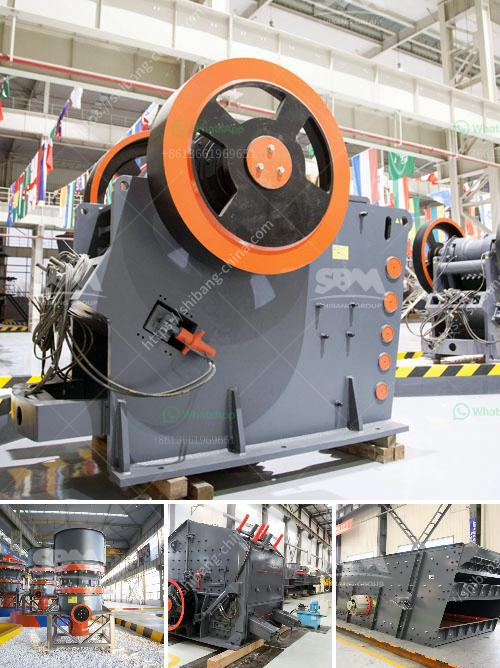

<h3>sand grinding mill japan for sale</h3>
Japan, known for its innovative technology and precision engineering, has introduced yet another game-changer in the field of stone processing - the sand grinding mill. With an increasing demand for finely ground sand in various industries, this cutting-edge equipment has become a must-have for businesses involved in stone processing and grinding.

The sand grinding mill, also known as a sand mill, is a versatile and efficient tool for grinding and processing a wide variety of materials. It is widely used in the fields of paint, ink, dye, coating, cosmetics, and pharmaceuticals, among others. 

One of the key advantages of the sand grinding mill is its ability to produce ultra-fine particles. Its unique grinding mechanism allows for the precise control of particle size distribution, resulting in superior product quality. This is particularly important for industries that require uniform and consistent particle size, such as in the production of high-quality paints or coatings.

In addition to its efficiency in particle size control, the sand grinding mill also offers a high level of productivity. With its advanced design, it can handle large volumes of material in a relatively short period. This not only saves time but also reduces production costs, making it an ideal solution for businesses looking to optimize their stone processing operations.

The sand grinding mill for sale in Japan is built to meet the highest industry standards. Its robust construction ensures durability and longevity, even under heavy usage. It also incorporates safety features to protect operators and prevent accidents in the workplace.

Moreover, the sand grinding mill is designed with ease of use in mind. Its intuitive interface and user-friendly controls make it accessible to both experienced operators and those new to stone processing. This makes it an excellent investment for businesses of all sizes, from small-scale workshops to large industrial plants.

In conclusion, the sand grinding mill in Japan is a game-changer in the field of stone processing. With its ability to produce ultra-fine particles, high productivity, and user-friendly features, it offers businesses a competitive edge in the market. Whether you are in the paint, ink, or cosmetic industry, this innovative equipment will undoubtedly enhance your stone grinding and processing operations. Don't miss out on this opportunity to stay ahead of the curve and elevate your business to new heights. Invest in a sand grinding mill today and experience the exceptional benefits it has to offer.
<h3>Contact us</h3><ul><li><strong>Whatsapp:&nbsp;<a href="https://wa.me/8613661969651">+8613661969651</a></strong></li><li><a href="https://swt.shibang-china.com/?git&amp;zhl&amp;sand grinding mill japan for sale"><strong>Online Service(chat now)</strong></a></li></ul><h3>Related</h3><ul><li><a href='crusher unit daily production capacity.md'>crusher unit daily production capacity</a></li><li><a href='how much does gold ore cost.md'>how much does gold ore cost</a></li><li><a href='the largest stone crusher system.md'>the largest stone crusher system</a></li><li><a href='stone crushing machine for sale in uganda.md'>stone crushing machine for sale in uganda</a></li><li><a href='bentonite crusher machine.md'>bentonite crusher machine</a></li></ul>