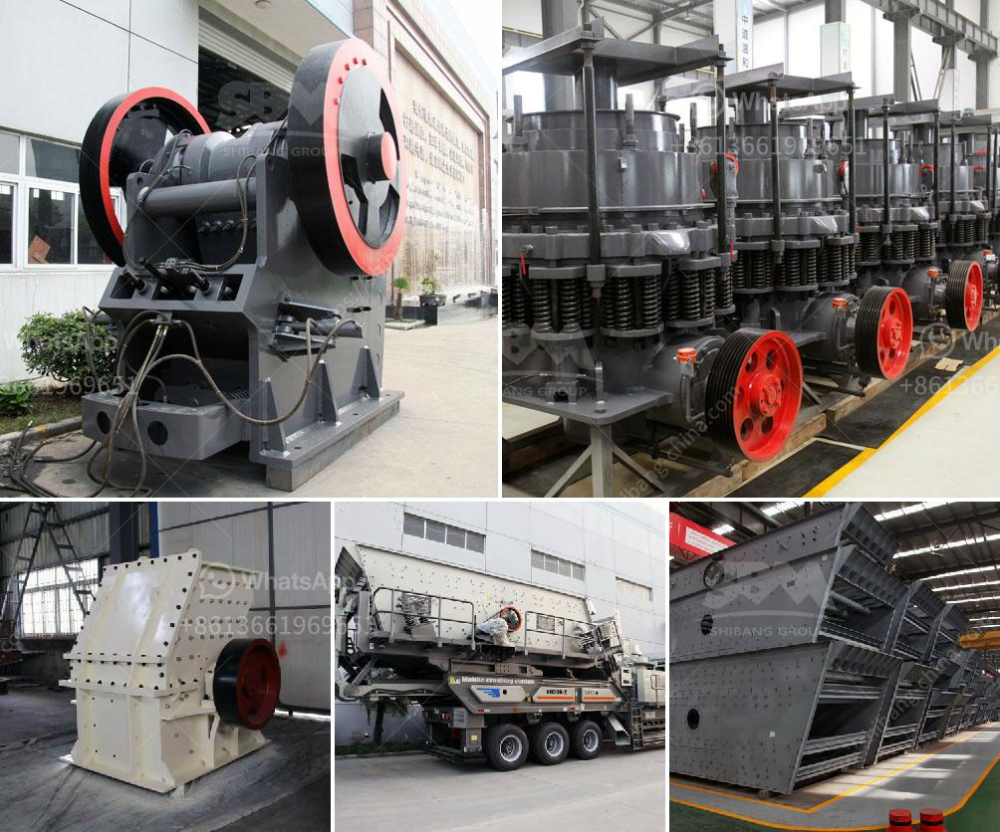

<h3>sand making machine indonesia</h3>
Indonesia, known for its stunning beaches and exotic islands, has always been a popular tourist destination. With the increase in construction and infrastructure development in recent years, the demand for sand has also escalated. To meet this growing demand, sand making machines have become essential in Indonesia.

Sand making machines are advanced equipment designed to produce sand of high quality for various construction purposes. These machines perform the task of crushing and shaping coarse sand to fine particles. They are widely used in many industries, including construction, mining, and manufacturing.

The sand making machine industry in Indonesia is rapidly expanding, as many businesses are investing in the production of high-quality sand. This investment is driven by the government's initiatives to develop and improve the country's infrastructure and the thriving construction industry.

One of the key advantages of sand making machines is their ability to produce sand that meets specific requirements. The machines can crush different types of rocks and ores to create particles of various sizes and shapes, depending on the application. This flexibility allows construction companies and manufacturers to use sand that best suits their needs.

Additionally, sand making machines are known for their efficiency and cost-effectiveness. They can significantly reduce labor costs and enhance productivity by quickly producing large quantities of sand. This speeds up construction projects and improves overall efficiency.

Another advantage of using sand making machines in Indonesia is their environmental friendliness. These machines produce sand by crushing rocks, eliminating the need for river sand mining. This reduces the ecological impact on rivers and prevents the depletion of natural resources.

In conclusion, the sand making machine industry in Indonesia is thriving due to the increasing demand for high-quality sand in the construction and manufacturing sectors. These machines provide a cost-effective and efficient solution for producing sand that meets specific requirements. Furthermore, their use contributes to sustainable development by reducing the reliance on river sand mining. With the continued growth in infrastructure development, the sand making machine sector is expected to expand further, fueling Indonesia's construction boom.
<h3>Contact us</h3><ul><li><strong>Whatsapp:&nbsp;<a href="https://wa.me/8613661969651">+8613661969651</a></strong></li><li><a href="https://swt.shibang-china.com/?git&amp;zhl&amp;sand making machine indonesia"><strong>Online Service(chat now)</strong></a></li></ul><h3>Related</h3><ul><li><a href='regulatory conveyor belts.md'>regulatory conveyor belts</a></li><li><a href='iron crushing equipment for sale.md'>iron crushing equipment for sale</a></li><li><a href='crushing powder machine germany.md'>crushing powder machine germany</a></li><li><a href='providers conveyor belts in mexico.md'>providers conveyor belts in mexico</a></li><li><a href='price of hammer mill in china.md'>price of hammer mill in china</a></li></ul>