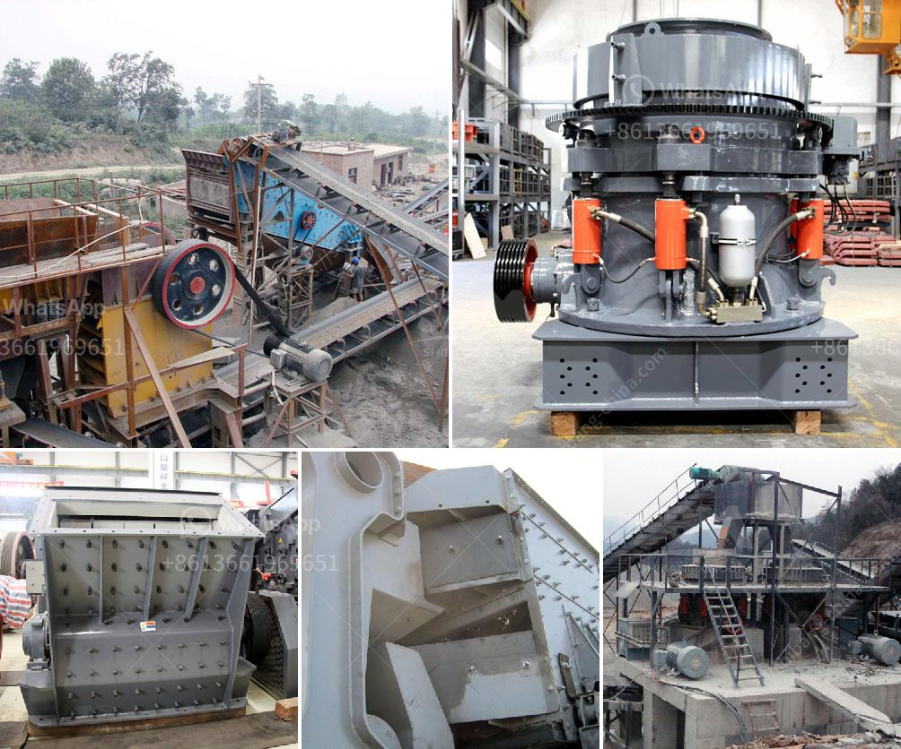

<h3>sand making plant sand washing plant</h3>
Sand is a natural resource that plays a crucial role in various industries, including construction and infrastructure development. However, not all sand is suitable for these applications. To meet the demand for high-quality sand, sand making plants and sand washing plants have become essential components in the sand production process.

A sand making plant, also known as a sand making machine, is designed to produce artificial sand by crushing rocks and stones. It often includes a vibrating feeder, jaw crusher, sand making machine, vibrating screen, and belt conveyor. The output is generally between 50-500 tons per hour.

The first step in the sand production process is the primary crushing of the raw materials. Large stones are fed into the jaw crusher, and the vibrating feeder evenly feeds the materials for efficient and uniform crushing. The crushed materials are then transferred to the sand making machine for further processing.

The sand making machine plays a crucial role in shaping the artificial sand particles. It uses the rock-on-rock principle to crush the materials, ensuring that the sand produced has a uniform size and shape. This machine is highly efficient and can produce high-quality sand in large quantities.

After the sand is produced, it still needs to go through a washing process to remove impurities and ensure its cleanliness. A sand washing plant is used for this purpose. It consists of a vibrating screen, sand washer, and conveyor belt.

The sand washing process starts with the raw sand being fed into the vibrating screen. The screen separates the sand particles according to their size. The oversized particles are sent back to the sand making machine for reprocessing, while the correctly sized particles are sent to the sand washer.

The sand washer, also known as a sand washing machine, uses water to remove impurities from the sand. It agitates the sand and then drains the dirty water, leaving behind clean and usable sand. The cleaned sand is then transported by the conveyor belt for further use or storage.

The combination of a sand making plant and a sand washing plant ensures the production of high-quality sand that meets industry standards. The sand can be used in various applications, including construction, concrete production, and landscaping. It is an essential ingredient in the manufacturing of concrete blocks, asphalt, and even glass.

In conclusion, sand making plants and sand washing plants play a crucial role in the production of high-quality sand. These plants are designed to efficiently and effectively produce artificial sand and remove impurities, ensuring that the final product meets the required standards. With the increasing demand for sand in various industries, these plants have become essential components in the sand production process.
<h3>Contact us</h3><ul><li><strong>Whatsapp:&nbsp;<a href="https://wa.me/8613661969651">+8613661969651</a></strong></li><li><a href="https://swt.shibang-china.com/?git&amp;zhl&amp;sand making plant sand washing plant"><strong>Online Service(chat now)</strong></a></li></ul><h3>Related</h3><ul><li><a href='gold hammer mill for sale in south africa.md'>gold hammer mill for sale in south africa</a></li><li><a href='concrete crusher prices.md'>concrete crusher prices</a></li><li><a href='quartz powder suppliers in dubai.md'>quartz powder suppliers in dubai</a></li><li><a href='quartz powder plant in india.md'>quartz powder plant in india</a></li><li><a href='stone crusher for sale gumtree.md'>stone crusher for sale gumtree</a></li></ul>