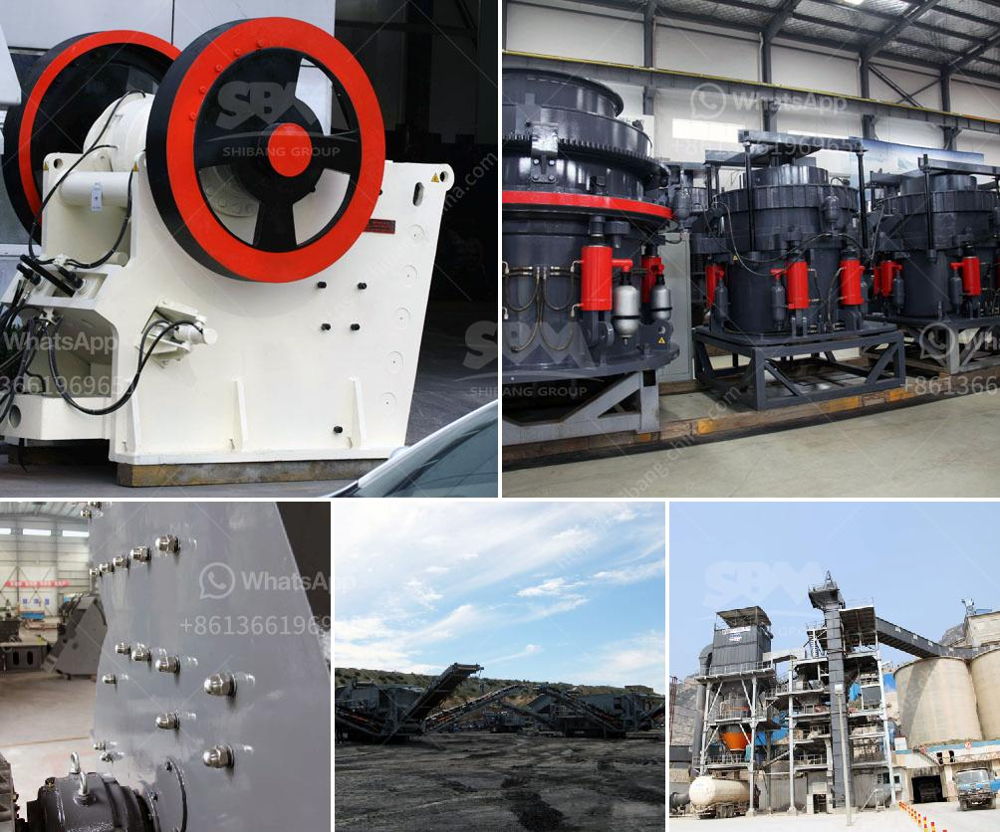

<h3>sand powder milling machine</h3>
Sand powder milling machine is increasingly being used as a vital tool for industries to grind sand into slurry. In the past, sand had to be manually ground or processed in inefficient machinery. However, with the advent of sand powder milling machine, this laborious task has been simplified, allowing for greater productivity and efficiency.

The primary purpose of sand powder milling machines is to grind large pieces of sand into finer particles that can be used in various applications. These machines use a combination of grinding media such as balls or rods, along with the sand itself, to achieve the desired consistency. The process involves feeding the sand into the machine, where it is crushed and ground to the desired size. The resulting sand slurry can then be used in various industrial processes, including casting, molding, and concrete production.

One of the key advantages of sand powder milling machines is their ability to handle large volumes of sand. These machines are designed to process tons of sand per hour, making them ideal for industrial-scale production. Moreover, the milling process is highly efficient, with minimal wastage of sand. This not only reduces the overall cost of production but also contributes to sustainable practices by minimizing waste.

In addition to their efficiency, sand powder milling machines also offer flexibility in terms of the final product. By adjusting the grinding parameters, operators can obtain sand slurry with different properties, such as particle size and distribution. This versatility enables industries to cater to a wide range of applications. For example, finer sand particles are often used in the production of high-quality ceramics, while coarser particles are more suitable for construction materials.

Another notable advantage of sand powder milling machines is their durability. These machines are built to withstand the harsh conditions of industrial environments. They are constructed from sturdy materials, such as stainless steel, and equipped with robust components, ensuring a long lifespan even in demanding applications.

Furthermore, advancements in technology have allowed for the automation and digitalization of sand powder milling machines. Modern machines are equipped with sensors, controllers, and user-friendly interfaces, enabling precise control over the milling process. This automation not only improves accuracy but also reduces the dependence on manual labor, further enhancing efficiency and productivity.

Despite the numerous advantages, it is important to note that sand powder milling machines also come with certain limitations. For instance, they require regular maintenance to ensure optimal performance. Additionally, the cost of purchasing and maintaining these machines can be significant, especially for smaller businesses. Therefore, it is crucial to carefully assess the needs and budget of the industry before investing in a sand powder milling machine.

In conclusion, sand powder milling machines have revolutionized the way sand is processed. These machines offer increased efficiency, productivity, and flexibility, making them indispensable tools for industries. With their ability to handle large volumes of sand and produce tailored slurry, sand powder milling machines are driving innovation in various sectors. As technology continues to evolve, we can expect further advancements in these machines, making sand processing even more streamlined and sustainable.
<h3>Contact us</h3><ul><li><strong>Whatsapp:&nbsp;<a href="https://wa.me/8613661969651">+8613661969651</a></strong></li><li><a href="https://swt.shibang-china.com/?git&amp;zhl&amp;sand powder milling machine"><strong>Online Service(chat now)</strong></a></li></ul><h3>Related</h3><ul><li><a href='hammer mill machinery in namibia.md'>hammer mill machinery in namibia</a></li><li><a href='aggregate crushing machines.md'>aggregate crushing machines</a></li><li><a href='mining and quarrying machinery and equipment.md'>mining and quarrying machinery and equipment</a></li><li><a href='pf impact crusher for stone breaking machine for sale.md'>pf impact crusher for stone breaking machine for sale</a></li><li><a href='marble mine processing equipment manufacturers in india.md'>marble mine processing equipment manufacturers in india</a></li></ul>