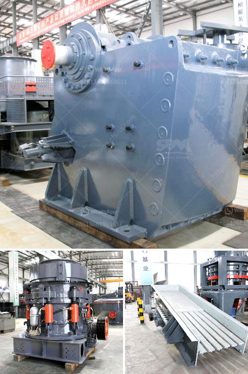

<h3>sand screw professional apr</h3>
The sand screw professional apr is an essential tool for anyone working with sand on a regular basis. Whether you are a professional landscaper, a construction worker, or simply a passionate gardener, this tool will streamline your work and save you time and effort.

One of the key features of the sand screw professional apr is its efficiency. It is designed to easily and quickly move sand from one place to another. The apron’s design helps prevent spills and wastage, ensuring that you get the most out of your sand. This is especially beneficial for projects that require a large amount of sand, such as creating pathways, filling sandboxes, or constructing sandbags.

Another advantage of the sand screw professional apr is its versatility. The apron can be easily adjusted to fit different body sizes and shapes, ensuring a comfortable and secure fit for everyone. This allows for greater mobility and ease of movement when working with sand, reducing strain and fatigue on the body.

The durability of the sand screw professional apr is also worth mentioning. It is made from high-quality materials that are built to withstand the rigors of heavy-duty use. Whether you are working in extreme weather conditions or rough terrains, you can rely on the apron to withstand the test of time. This ensures that your investment will serve you well in the long run.

Lastly, the sand screw professional apr is designed with user convenience in mind. It is lightweight, making it easy to transport and store when not in use. The adjustable straps and buckles allow for quick and easy adjustments, ensuring a secure and comfortable fit for any user.

In conclusion, the sand screw professional apr is a valuable tool for anyone who frequently works with sand. From its efficiency and versatility to its durability and user convenience, this apron is a must-have companion for all sand-related tasks. Invest in the sand screw professional apr, and watch as your sand work becomes faster, easier, and more efficient.
<h3>Contact us</h3><ul><li><strong>Whatsapp:&nbsp;<a href="https://wa.me/8613661969651">+8613661969651</a></strong></li><li><a href="https://swt.shibang-china.com/?git&amp;zhl&amp;sand screw professional apr"><strong>Online Service(chat now)</strong></a></li></ul><h3>Related</h3><ul><li><a href='harga stone crusher kapsitas 20 ton.md'>harga stone crusher kapsitas 20 ton</a></li><li><a href='grinder machine parts and function.md'>grinder machine parts and function</a></li><li><a href='sand making plant sand washing plant.md'>sand making plant sand washing plant</a></li><li><a href='puzzolana crusher malaysia.md'>puzzolana crusher malaysia</a></li><li><a href='quartz production line.md'>quartz production line</a></li></ul>