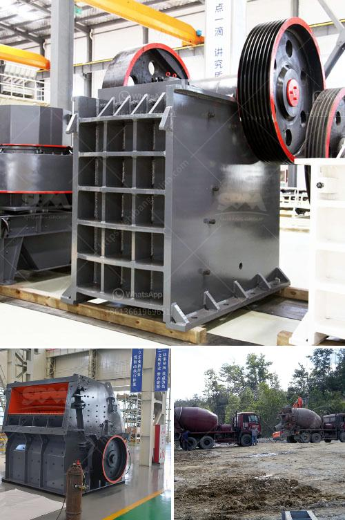

<h3>sand stone quarry mining</h3>
Sandstone quarry mining is a popular form of resource extraction, where blocks of sandstone are mined from the earth to be used for various purposes such as construction and landscaping. Sandstone is a sedimentary rock composed of sand-sized minerals or rock grains, primarily composed of quartz and feldspar. Its unique characteristics, including durability, attractive appearance, and ability to be carved and shaped, have made it a sought-after building material since ancient times.

Quarrying sandstone involves several stages and processes. First, the land is surveyed to identify potential areas with viable deposits of sandstone. Then, heavy machinery such as excavators and bulldozers are used to remove surface vegetation, soil, and other overlying materials to expose the sandstone bedrock. Once the sandstone is exposed, special mining methods such as drilling and blasting are employed to extract large blocks of sandstone from the quarry.

The extracted sandstone blocks are then transported to processing plants, where they are cut into desired sizes and shapes for commercial use. This involves the use of diamond wire saws, stone block cutters, and other specialized equipment to ensure precision and efficiency. The final products are then polished, honed, or left in their natural state, depending on their intended purpose.

Sandstone quarry mining has several benefits. It provides employment opportunities for local communities, stimulates economic growth, and contributes to the construction industry by supplying high-quality building materials. Sandstone is widely used in the construction of buildings, bridges, monuments, and paving projects due to its strength, durability, and aesthetic appeal.

However, sandstone quarry mining also presents some challenges and concerns. The extraction process can lead to deforestation, habitat destruction, and soil erosion if not managed properly. It is important for mining companies to implement sustainable practices, such as reforestation, to reduce the negative environmental impacts and ensure the long-term viability of the industry.

In conclusion, sandstone quarry mining is a vital industry that provides crucial materials for various construction projects. With proper management and sustainable practices, the industry can continue to meet the growing global demand for sandstone while minimizing its environmental footprint.
<h3>Contact us</h3><ul><li><strong>Whatsapp:&nbsp;<a href="https://wa.me/8613661969651">+8613661969651</a></strong></li><li><a href="https://swt.shibang-china.com/?git&amp;zhl&amp;sand stone quarry mining"><strong>Online Service(chat now)</strong></a></li></ul><h3>Related</h3><ul><li><a href='vibrating feeders operating parameters from zenith china.md'>vibrating feeders operating parameters from zenith china</a></li><li><a href='ball mill magnetic separator.md'>ball mill magnetic separator</a></li><li><a href='the world largest mobile crusher.md'>the world largest mobile crusher</a></li><li><a href='quarry plant equipments and costs.md'>quarry plant equipments and costs</a></li><li><a href='drawing for raymond mill.md'>drawing for raymond mill</a></li></ul>