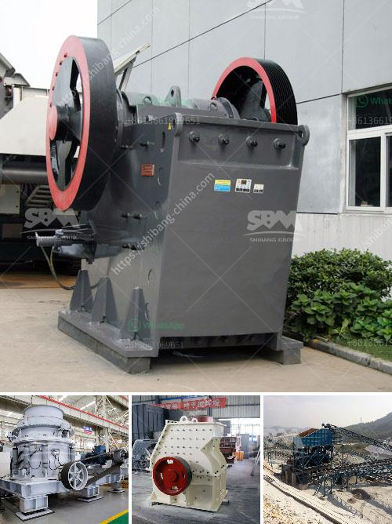

<h3>sand wash plant hire perth</h3>
Sand wash plant hire Perth is a popular option for businesses and individuals looking to efficiently and effectively clean and process sand. With the increasing demand for high-quality sand in various industries such as construction, mining, and landscaping, having access to a sand wash plant can be a game-changer.

Perth, located in Western Australia, is home to numerous sand quarries, where sand is extracted for various purposes. However, raw sand typically contains impurities such as clay, debris, and organic matter that need to be removed before it can be used. This is where sand wash plants come into play.

Sand wash plants are designed to clean, scrub, and separate sand particles to produce a clean, usable sand. They utilize various processes such as washing, screening, and dewatering to remove impurities and produce high-quality sand. The efficiency of these plants is crucial as it allows for the production of large quantities of clean sand in a short period.

Hiring a sand wash plant in Perth offers several advantages. Firstly, it eliminates the need to invest in purchasing and maintaining a plant, which can be costly for small to medium-sized businesses and individuals. Hiring allows businesses to access the latest and most advanced sand wash plants without the hefty upfront costs.

Secondly, sand wash plant hire in Perth offers flexibility. Businesses can rent the plant for a specific project or on a long-term basis, depending on their needs. This flexibility allows them to adjust their sand production capacity according to the demands of their projects, ensuring optimal resource allocation.

Thirdly, hiring a sand wash plant provides access to trained and experienced operators. Sand wash plants require skilled operators who understand the intricacies of the equipment and the processes involved. By hiring a plant, businesses can rely on the expertise of trained professionals to operate the plant efficiently and effectively, minimizing downtime and maximizing productivity.

Furthermore, sand wash plant hire in Perth provides access to the latest technology and equipment. Sand wash plants are constantly evolving, with manufacturers introducing innovative features to improve efficiency and reduce environmental impact. By renting a plant, businesses can benefit from the latest advancements without having to upgrade their own equipment constantly.

Another significant advantage of sand wash plant hire is the reduced environmental impact. Sand wash plants use water and chemicals to clean and process sand, which can have an environmental impact if not managed properly. By renting a plant, businesses can ensure that the plant adheres to environmental regulations and best practices, minimizing the risk of pollution and negative impacts on the surrounding ecosystems.

In conclusion, sand wash plant hire in Perth offers businesses and individuals the opportunity to efficiently and effectively clean and process sand. With the increasing demand for high-quality sand in various industries, having access to a sand wash plant can provide a competitive edge. The advantages of hiring a plant include cost savings, flexibility, access to trained operators, access to the latest technology, and reduced environmental impact. Ultimately, sand wash plant hire allows businesses to focus on their core operations while relying on experts to handle their sand processing needs.
<h3>Contact us</h3><ul><li><strong>Whatsapp:&nbsp;<a href="https://wa.me/8613661969651">+8613661969651</a></strong></li><li><a href="https://swt.shibang-china.com/?git&amp;zhl&amp;sand wash plant hire perth"><strong>Online Service(chat now)</strong></a></li></ul><h3>Related</h3><ul><li><a href='crusher jaw crusher 10 36.md'>crusher jaw crusher 10 36</a></li><li><a href='stone quarry business proposal crusher machine.md'>stone quarry business proposal crusher machine</a></li><li><a href='conveyor belts contacts.md'>conveyor belts contacts</a></li><li><a href='mobile crusher price list.md'>mobile crusher price list</a></li><li><a href='stone crusher permission maharashtra.md'>stone crusher permission maharashtra</a></li></ul>