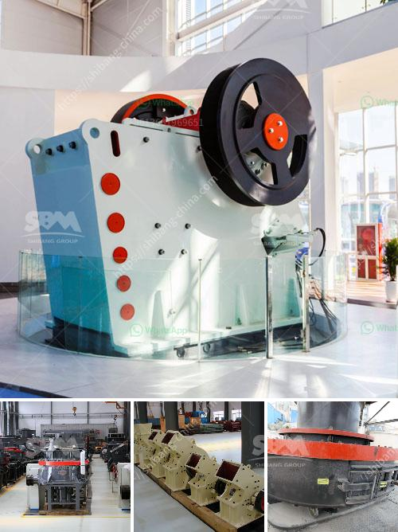

<h3>sand washing machine in ethiopia</h3>
Sand washing machine is a kind of equipment that is often used in sand production line. It can not only remove the impurities covering the surface of the sand, but also destroy the water vapor layer wrapped around the sand, so as to facilitate dehydration and play an efficient sand washing and cleaning role. Sand washing machines are widely used in Ethiopia.

In recent years, with the development of construction industry in Ethiopia, the demand for sand is also increasing. To meet this demand, various sand washing machines have been developed. In addition, the improvement of technology and technology has brought good news to the majority of users. The sand washing machine produced by Ethiopian manufacturers adopts advanced technology at home and abroad, and its work efficiency and production capacity are high, and the finished product has good quality and low water content.

The sand washing machine in Ethiopia is for cleaning the sandstone, which consists of different sizes of particles. There are two types of sand washing machines, wheel type and spiral type. The wheel type sand washing machine is more widely used in sand and gravel field, infrastructure and other industries. It is mainly used for the washing, dehydration and classification of sandstone, which is efficient and has good cleaning effect.

The spiral sand washing machine is more suitable for washing fine and medium-sized sand and gravel. It is the preferred machine in the sand and gravel production line. However, the ethiopian cleaning machine is circular motion, which can effectively remove the impurities adhering to the surface of the sand and separate the dirt and water from the sand. The sand washing machine produced by Ethiopian manufacturers has the advantages of reliable structure, reasonable layout, convenient maintenance and high efficiency.

In conclusion, sand washing machines are essential equipment in sand production line. With the continuous development of construction industry in Ethiopia, the demand for sand is increasing. The sand washing machine produced by Ethiopian manufacturers can effectively clean and separate sand and gravel, with reliable performance and reasonable price. It is widely used in sand production line and is favored by many users.
<h3>Contact us</h3><ul><li><strong>Whatsapp:&nbsp;<a href="https://wa.me/8613661969651">+8613661969651</a></strong></li><li><a href="https://swt.shibang-china.com/?git&amp;zhl&amp;sand washing machine in ethiopia"><strong>Online Service(chat now)</strong></a></li></ul><h3>Related</h3><ul><li><a href='gypsum board processing machinery.md'>gypsum board processing machinery</a></li><li><a href='mobile crusher morocco.md'>mobile crusher morocco</a></li><li><a href='clay grinding machine.md'>clay grinding machine</a></li><li><a href='pulverizer crusher machine for limestone.md'>pulverizer crusher machine for limestone</a></li><li><a href='small scale mine business plan pdf.md'>small scale mine business plan pdf</a></li></ul>