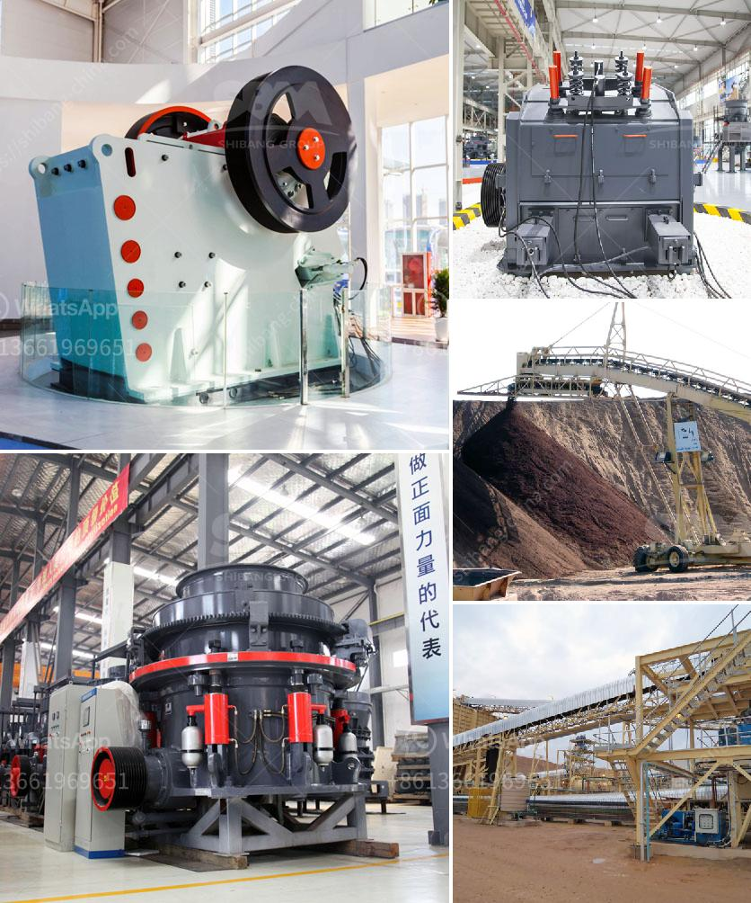

<h3>sand washing plant in south africa</h3>
Sand washing plant in South Africa is a popular choice for many customers. With the rapid development of construction industry, the demand for sand and aggregate is also increasing. As a result, there are many suppliers and manufacturers of sand washing plant in South Africa.

As a leading global manufacturer of crushing and milling equipment, we offer advanced, rational solutions for any size-reduction requirements, including quarry, aggregate, grinding production and complete plant plan. We also supply individual crushers and mills as well as spare parts of them.

The sand washing plant in South Africa is mainly used for sand washing. The process involves: 1. The excitation motor and pump are connected in reverse for operation. 2. The sand and gravel enters the washing tank and is transported to the sand washing machine. 3. The impeller of the wheel bucket rotates continuously during operation, and the sand or slag particles are separated and discharged with water. 4. The sand and gravel after washing are sent to the dehydration sieve for dehydration by the sand washing machine, and the sand with a particle size of less than 5mm is passed through the pipeline to the sand washing machine. 5. The filtered sand is sent to the finished product stacking area through the sand washing machine, and then transported by the belt conveyor.

The sand washing plant in South Africa is operated safely and stably, and the finished product meets the requirements of various users. The particle size of washed sand is uniform, the cleaning effect is high, and the economic benefits are achieved. Sand washing plants are widely used in roads, hydropower, construction, mining and other industries to clean and separate materials.
<h3>Contact us</h3><ul><li><strong>Whatsapp:&nbsp;<a href="https://wa.me/8613661969651">+8613661969651</a></strong></li><li><a href="https://swt.shibang-china.com/?git&amp;zhl&amp;sand washing plant in south africa"><strong>Online Service(chat now)</strong></a></li></ul><h3>Related</h3><ul><li><a href='gypsum processing plant for sale.md'>gypsum processing plant for sale</a></li><li><a href='crushing service with peru jaw crusher.md'>crushing service with peru jaw crusher</a></li><li><a href='quarry crusher plant location in malaysia.md'>quarry crusher plant location in malaysia</a></li><li><a href='roll ball mill manufacturers.md'>roll ball mill manufacturers</a></li><li><a href='limestone grinding process.md'>limestone grinding process</a></li></ul>