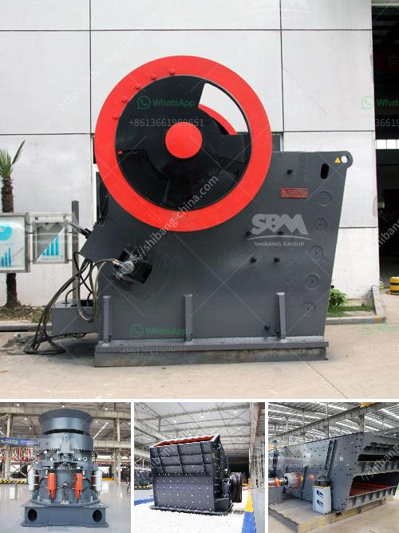

<h3>sand washing plant suppliers</h3>
Sand washing plant suppliers play a crucial role in the construction industry. They provide standard and specialized equipment to process and wash sand for various uses. As the demand for sand aggregates and construction materials increases, the need for efficient and reliable sand washing plants becomes even more significant. In this article, we will delve into the importance of sand washing plants and discuss why choosing the right suppliers is crucial for construction companies.

A sand washing plant is an essential piece of equipment used to wash sand and remove contaminants such as dirt and dust. It consists of a screening process to eliminate larger particles and a washing process to remove impurities and achieve a clean sand product. Sand washing plants are commonly used in the construction industry for mixing, concrete production, and road construction. They are also utilized in the mining industry for sand and gravel extraction.

When it comes to choosing sand washing plant suppliers, several factors need to be considered. First is the quality of the equipment provided. The suppliers must offer durable and reliable machinery that can withstand the rigorous demands of construction sites. High-quality equipment ensures that the sand washing plant operates efficiently, minimizing downtime and maximizing productivity.

Another important factor to consider is the capacity of the sand washing plant. Depending on the scale of construction projects, different capacities are required. Suppliers must be able to provide a range of plant sizes, from small portable plants to large stationary plants. This flexibility ensures that construction companies can choose the appropriate sand washing plant for their specific needs.

Furthermore, the suppliers' knowledge and expertise in the sand washing industry are crucial. Experienced suppliers understand the complexities involved in sand washing processes and can provide guidance and support to construction companies. They should be able to offer technical advice, installation services, and after-sales support to ensure the smooth operation and maintenance of the plant.

In addition to equipment quality and expertise, the environmental impact of the sand washing plant is another vital consideration. Sustainable construction practices are becoming increasingly important, and suppliers must offer eco-friendly and energy-efficient equipment. Modern sand washing plants should incorporate water recycling systems to minimize water usage and reduce the plant's environmental footprint.

Lastly, cost-effectiveness plays a significant role in choosing sand washing plant suppliers. Construction companies need to analyze the upfront cost, maintenance expenses, and long-term benefits of the equipment. Suppliers should offer competitive prices for their products while ensuring high-quality machinery and reliable after-sales service.

In conclusion, sand washing plant suppliers are integral to the construction industry as they provide the necessary equipment to process and wash sand. Choosing the right suppliers is crucial for construction companies to ensure efficient and reliable operations. Factors to consider include equipment quality, capacity, expertise, environmental impact, and cost-effectiveness. By selecting reputable and knowledgeable suppliers, construction companies can optimize their sand washing processes and contribute to sustainable construction practices.
<h3>Contact us</h3><ul><li><strong>Whatsapp:&nbsp;<a href="https://wa.me/8613661969651">+8613661969651</a></strong></li><li><a href="https://swt.shibang-china.com/?git&amp;zhl&amp;sand washing plant suppliers"><strong>Online Service(chat now)</strong></a></li></ul><h3>Related</h3><ul><li><a href='crushing powder machine germany.md'>crushing powder machine germany</a></li><li><a href='used crusher for sale in jamaica.md'>used crusher for sale in jamaica</a></li><li><a href='ball mill hou feng in china.md'>ball mill hou feng in china</a></li><li><a href='business plan for sand making machine.md'>business plan for sand making machine</a></li><li><a href='scm ultra fine hammer mill price.md'>scm ultra fine hammer mill price</a></li></ul>