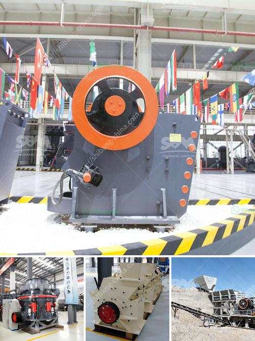

<h3>sandstone crusher</h3>
Sandstone is a natural stone that is formed from sedimentary rock. It is mainly composed of sand-sized minerals or rock grains, predominantly feldspar and quartz. This stone is widely used in construction, as it is durable and versatile. One of the key pieces of equipment used for crushing sandstone is the sandstone crusher.

Sandstone crushers are highly effective in crushing minerals like sandstone, dolomite and limestone. Crushing sandstone with high crushing efficiency of 95% or above, the sandstone crusher equipment is designed to convert larger rocks into smaller pieces. With its unique sensor system, this machine is capable of measuring and reporting the crusher’s activates in real-time.

The stone crushing equipment is constructed with reinforced steel plates to provide maximum strength and durability. The sandstone crusher is equipped with balanced flywheels that provide smooth running operation, ensuring maximum reliability.

The sandstone crusher is powered by a heavy-duty motor, making it powerful and efficient. With its unique transmission system, the crusher is able to deliver optimal performance at all times, even when faced with heavy workloads, making it suitable for large-scale crushing operations.

The sandstone crusher has an adjustable discharge opening, ensuring that the required sizes of sands can be produced quickly and efficiently. The cavity shape of the machine is optimized to improve the utilization of the lining board and ensure high material utilization.

In conclusion, the sandstone crusher is suitable for crushing a variety of materials, including sandstone, dolomite, and limestone, making it an ideal choice for crushing operations in construction, industrial minerals, and mining industries.
<h3>Contact us</h3><ul><li><strong>Whatsapp:&nbsp;<a href="https://wa.me/8613661969651">+8613661969651</a></strong></li><li><a href="https://swt.shibang-china.com/?git&amp;zhl&amp;sandstone crusher"><strong>Online Service(chat now)</strong></a></li></ul><h3>Related</h3><ul><li><a href='marbel grinding machine nigeria.md'>marbel grinding machine nigeria</a></li><li><a href='stone quarry business proposal crusher machine.md'>stone quarry business proposal crusher machine</a></li><li><a href='stone crusher price ton per day.md'>stone crusher price ton per day</a></li><li><a href='marbel grinder price in pakistan.md'>marbel grinder price in pakistan</a></li><li><a href='onsite construction debris recycling machines.md'>onsite construction debris recycling machines</a></li></ul>