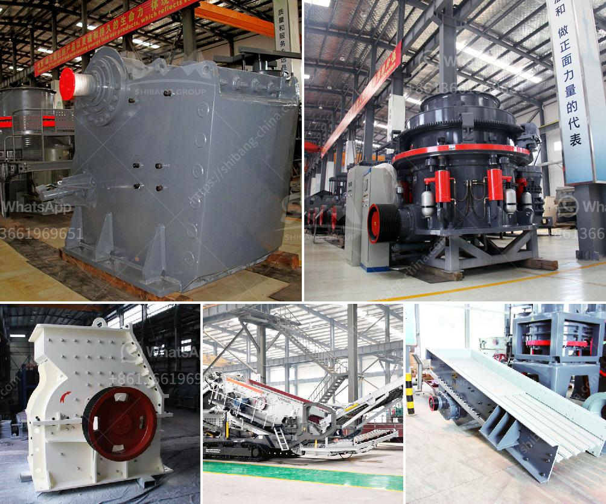

<h3>sayaji impact crusher</h3>
Impact crushers are used in the construction industry to create crushed rock or sand from various materials. These materials include aggregates, limestone, and granite. When the stones are subjected to the high speed impact of the blow bars in the Sayaji Impact Crusher, they are shattered into small pieces. These smaller pieces then undergo further crushing or screening, depending on the specific requirements of the project.

The Sayaji Impact Crusher is designed to serve the primary and secondary crushing market with a one-of-a-kind rotor and crushing chamber configuration. The high-speed rotating rotor crushes the materials against the chamber walls resulting in efficient reduction of large particles into finer aggregates or specific sizes for further processing. 

One of the significant advantages of the Sayaji Impact Crusher is its ability to handle various types of materials. From soft and medium-hard rocks to abrasive and hard stones, it can effectively break them down into smaller sizes. This versatility makes it an indispensable tool in the construction and mining industries where the quality and size of the crushed materials play a crucial role in the overall project's success. 

Furthermore, the Sayaji Impact Crusher boasts a compact design that optimizes space utilization, making it suitable for both stationary and mobile applications. Its robust construction and advanced technology ensure exceptional durability, longer service life, and reduced operational and maintenance costs, ensuring maximum profitability for its users.

Additionally, safety features such as a hydraulic overload protection system and a user-friendly control panel make the Sayaji Impact Crusher easy to operate and maintain. The machine's innovative design also minimizes downtime, allowing for continuous and uninterrupted crushing operations.

In conclusion, the Sayaji Impact Crusher delivers high performance and efficiency for various crushing applications in the construction industry. Whether it's rock crushing, gravel production, or concrete recycling, this machine is a game-changer. Its ability to handle different materials, compact design, and safety features make it an invaluable asset for any construction project. With the Sayaji Impact Crusher, contractors can achieve the desired aggregate sizes and maximize their productivity and profitability.
<h3>Contact us</h3><ul><li><strong>Whatsapp:&nbsp;<a href="https://wa.me/8613661969651">+8613661969651</a></strong></li><li><a href="https://swt.shibang-china.com/?git&amp;zhl&amp;sayaji impact crusher"><strong>Online Service(chat now)</strong></a></li></ul><h3>Related</h3><ul><li><a href='stamler usa feeder breaker crusher.md'>stamler usa feeder breaker crusher</a></li><li><a href='cone crushers manufacturer.md'>cone crushers manufacturer</a></li><li><a href='starting a quarry business in nigeria.md'>starting a quarry business in nigeria</a></li><li><a href='silica sand production line in german.md'>silica sand production line in german</a></li><li><a href='silica quartz crusher processing.md'>silica quartz crusher processing</a></li></ul>