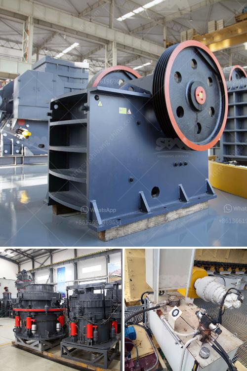

<h3>scm ultra fine hammer mill price</h3>
The SCM ultra fine hammer mill is a high-efficiency machine that is capable of producing powder materials with a fineness ranging from 325 mesh to 2500 mesh. This reliable mill is designed for grinding soft and hard materials alike, ensuring optimum performance and product quality. But what sets it apart from the competition is its unbeatable price.

One of the key advantages of the SCM ultra fine hammer mill is its cost-effectiveness. Compared to other similar machines in the market, this mill stands out due to its affordable price. Despite its exceptional quality and high-performance capabilities, the SCM ultra fine hammer mill is priced considerably lower than its competitors, making it an ideal choice for both small-scale and large-scale production needs.

The low price of the SCM ultra fine hammer mill is not a reflection of its quality or functionality. In fact, it is quite the opposite. This mill is manufactured using top-of-the-line materials and components, ensuring durability and long-lasting performance. Its advanced technology and precision engineering allow for efficient and consistent grinding, resulting in high-quality powder materials.

Furthermore, the SCM ultra fine hammer mill is equipped with a range of features that enhance its usability and operational efficiency. Its user-friendly interface and simple control system make it easy to operate and maintain. The mill's compact design also allows for easy installation and integration into existing production lines, ensuring minimal disruption and maximum productivity.

When considering the cost of a milling machine, it is important to take into account not only the initial purchase price but also the long-term expenses, such as maintenance and operational costs. The SCM ultra fine hammer mill excels in both areas. With its low price, high-quality performance, and minimal maintenance requirements, this mill offers exceptional value for money.

In conclusion, the SCM ultra fine hammer mill is an unbeatable choice for those seeking an efficient and cost-effective milling solution. With its affordable price, top-notch quality, and reliable performance, this mill is a valuable addition to any production facility. Whether grinding soft or hard materials, the SCM ultra fine hammer mill delivers outstanding results while keeping costs low.
<h3>Contact us</h3><ul><li><strong>Whatsapp:&nbsp;<a href="https://wa.me/8613661969651">+8613661969651</a></strong></li><li><a href="https://swt.shibang-china.com/?git&amp;zhl&amp;scm ultra fine hammer mill price"><strong>Online Service(chat now)</strong></a></li></ul><h3>Related</h3><ul><li><a href='marble stone milling plant.md'>marble stone milling plant</a></li><li><a href='project report granite cutting file.md'>project report granite cutting file</a></li><li><a href='high capacity high quality cone crusher to rent.md'>high capacity high quality cone crusher to rent</a></li><li><a href='gypsum powder production process in india pdf.md'>gypsum powder production process in india pdf</a></li><li><a href='ball mill spares manufacturers in india.md'>ball mill spares manufacturers in india</a></li></ul>