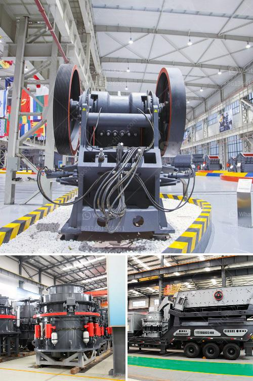

<h3>screening and crushing equipment for chrome</h3>
Screening and crushing equipment is used for separating and reducing the size of extracted materials for further processing or end-use, such as in mining and construction. Chrome, also known as chrome ore, is an essential component in stainless steel, as it adds durability and corrosion resistance to the final product. To extract chrome from ore, the process includes screening the material and crushing it into smaller particles. This article will delve into the importance of screening and crushing equipment in the chrome industry.

Screening equipment is essential in separating different-sized particles and ensuring that only materials of the desired size reach the next stage of processing. In the context of chrome mining, screening equipment is commonly used to classify particles into different sizes, such as fines, lumps, and concentrates. This classification process helps optimize the efficiency of downstream operations, such as crushing and beneficiation, by ensuring that the feed size is appropriate for the specific process.

Crushing equipment, on the other hand, is used to reduce the size of extracted materials into smaller, more manageable particles. In chrome mining, crushing is an important step in the process of preparing mined ore for further downstream processing. Crushing typically consists of two stages: primary crushing and secondary crushing. Primary crushing involves reducing the size of larger rocks or ore chunks into smaller sizes, such as pebbles. Secondary crushing further reduces the size to a fine powder or specific size range suitable for downstream processing.

Several types of screening and crushing equipment are commonly used in the chrome mining industry. Vibrating screens are widely utilized for sizing and classifying particles, with multi-deck screens being particularly effective in separating different size fractions. These screens are capable of handling large volumes of material and offering high screening efficiency.

In terms of crushing equipment, jaw crushers and cone crushers are commonly used for primary and secondary crushing, respectively. Jaw crushers are ideal for crushing large rocks or ore chunks into smaller sizes, while cone crushers are often used to produce finer particles. Both types of crushers are durable and efficient, ensuring a reliable and consistent supply of properly crushed material.

Efficient screening and crushing equipment in chrome mining operations leads to several benefits. Firstly, it improves the overall productivity of the operation by ensuring that only desirable materials are processed further, eliminating the need to handle unnecessary waste. Secondly, proper screening and crushing equipment help to optimize the performance of downstream processes, such as beneficiation and smelting, by providing a consistent feed size. Lastly, efficient screening and crushing equipment reduces the overall energy consumption and operating costs of mining operations.

In conclusion, screening and crushing equipment play an essential role in the chrome mining industry. Screening equipment ensures proper classification and separation of ore particles, while crushing equipment reduces the size of extracted materials for further processing. By selecting the appropriate equipment and using it efficiently, mining companies can maximize productivity, reduce waste, and optimize downstream processes in the chrome industry.
<h3>Contact us</h3><ul><li><strong>Whatsapp:&nbsp;<a href="https://wa.me/8613661969651">+8613661969651</a></strong></li><li><a href="https://swt.shibang-china.com/?git&amp;zhl&amp;screening and crushing equipment for chrome"><strong>Online Service(chat now)</strong></a></li></ul><h3>Related</h3><ul><li><a href='grinding machinery for sale in guatemala.md'>grinding machinery for sale in guatemala</a></li><li><a href='cost of cinder powder in bangalore.md'>cost of cinder powder in bangalore</a></li><li><a href='gypsum crusher specification.md'>gypsum crusher specification</a></li><li><a href='3 4 inch crushed limestone.md'>3 4 inch crushed limestone</a></li><li><a href='strainer of crushing machine.md'>strainer of crushing machine</a></li></ul>