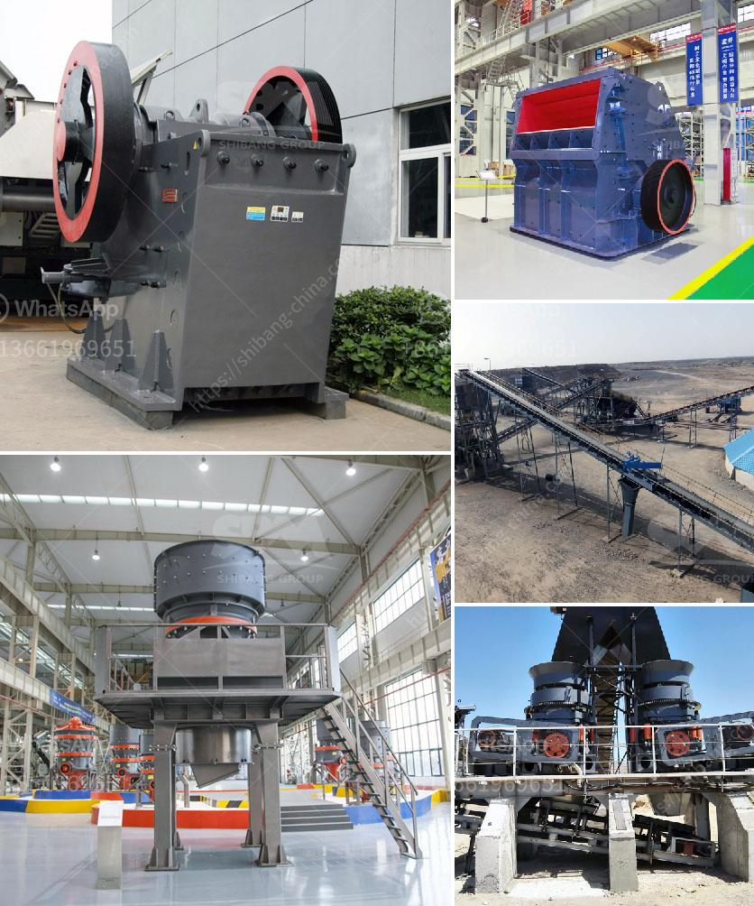

<h3>screens hammer mills</h3>
The grinding and pulverizing industry is a rapidly growing sector that plays a crucial role in various industries, from agriculture to food processing. One of the key equipment used in this field is the hammer mill, a grinding machine that transforms large solid materials into smaller particles. Among the many variations of hammer mills available, screens hammer mills have gained notable popularity due to their efficiency and versatility.

Screens hammer mills are designed with a rotating cylindrical rotor that is equipped with hammers or blades. As the rotor rotates at high speed, the hammers or blades efficiently strike the incoming material, breaking it down into smaller particles. The crushed material then passes through a perforated screen, allowing particles of the desired size to exit the machine while larger particles remain inside for further grinding.

The use of screens in hammer mills is a critical element that contributes to their effectiveness. These screens come in a variety of sizes and shapes, allowing for precise control over the final particle size. By selecting the appropriate screen, operators can achieve the desired particle size distribution and ensure consistent results. Whether it is achieving a fine powder or coarse granules, screens hammer mills excel in delivering the required product quality.

One of the primary advantages of screens hammer mills is their versatility. These machines are capable of handling a wide range of materials, including grains, herbs, spices, wood chips, and even minerals. From processing agricultural products for livestock feed to grinding spices for the food industry, screens hammer mills are a reliable choice. Moreover, they can be easily adapted for different applications by simply changing the screens, making them a cost-effective solution for various processing needs.

Another notable feature of screens hammer mills is their high efficiency. The unique design of these machines ensures consistent particle size reduction, reducing energy consumption and overall process time. This efficiency is further complemented by the self-cleaning action of the screens, preventing clogging and promoting uninterrupted operation. With screens hammer mills, operators can achieve higher throughput rates while maintaining product integrity.

The robust construction of screens hammer mills also contributes to their popularity. These machines are designed to withstand heavy-duty applications, with wear-resistant components and reinforced frames. This durability translates into long-lasting performance, reducing maintenance costs and downtime. Additionally, many manufacturers offer customizable options to meet specific processing requirements, ensuring a tailored solution for every industry.

In conclusion, screens hammer mills have proven to be a pivotal tool in the grinding and pulverizing industry. Their effective design, versatility, efficiency, and durability make them a preferred choice in a wide range of applications. Whether it is for food processing, animal feed production, or any other grinding need, screens hammer mills deliver consistent results and help businesses achieve their production goals efficiently.
<h3>Contact us</h3><ul><li><strong>Whatsapp:&nbsp;<a href="https://wa.me/8613661969651">+8613661969651</a></strong></li><li><a href="https://swt.shibang-china.com/?git&amp;zhl&amp;screens hammer mills"><strong>Online Service(chat now)</strong></a></li></ul><h3>Related</h3><ul><li><a href='german stone grinding machine manufacturer.md'>german stone grinding machine manufacturer</a></li><li><a href='crusher production line.md'>crusher production line</a></li><li><a href='types of grinding mills.md'>types of grinding mills</a></li><li><a href='slag crusher manufacturer.md'>slag crusher manufacturer</a></li><li><a href='gyratory cone crusher.md'>gyratory cone crusher</a></li></ul>