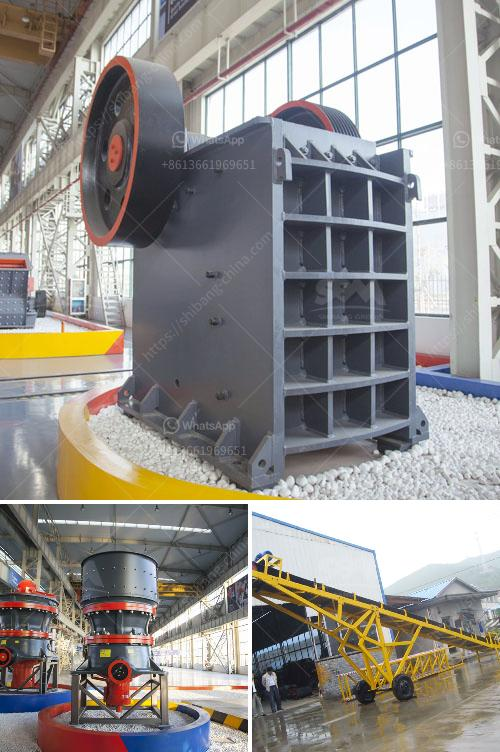

<h3>screw conveyor for sand</h3>
In any industrial setting that involves the movement of bulk materials, having efficient and reliable equipment is crucial. Among the various options available, screw conveyors have proven to be one of the most effective tools for transporting sand and other granular materials. With their unique design and versatility, these systems offer significant benefits in terms of automation, cost-effectiveness, and ease of installation. In this article, we will explore the use of screw conveyors for sand transportation and understand why they have become an essential part of bulk material handling.

A screw conveyor, also known as an auger conveyor, consists of a rotating helical screw blade that is enclosed in a tube or trough. As the screw rotates, it moves materials forward, allowing for continuous feeding, unloading, and mixing operations. This mechanism is particularly well-suited for handling granular materials like sand, gravel, and aggregates.

One of the key advantages of using a screw conveyor for sand is its ability to convey materials at various angles. They can be installed horizontally or inclined, allowing for greater flexibility in system design. This makes it possible to transport materials to higher or lower levels, overcoming elevation challenges within the plant. Moreover, screw conveyors can be customized to fit the specific requirements of the application, including length, diameter, and capacity, ensuring optimal performance.

Another significant benefit of screw conveyors is their minimal maintenance requirements. With fewer moving parts and a simple design, these systems are durable and reliable, reducing the need for frequent repairs. The abrasive nature of sand can pose challenges for certain conveying equipment, but the screw conveyor's robust construction can withstand the wear and tear, leading to increased operational efficiency and cost savings.

Automation is a vital aspect of modern industrial processes, and screw conveyors can be seamlessly integrated into fully automated systems. By incorporating sensors, switches, and programmable logic controllers (PLCs), operators can monitor and control the entire conveying process, optimizing productivity and minimizing human intervention. Furthermore, the enclosed tube design of the screw conveyor prevents dust and spillage, ensuring a safe and clean working environment.

Efficiency and cost-effectiveness are two crucial considerations for any industrial operation. Screw conveyors excel in both aspects. Their high-speed operation and continuous material flow contribute to improved productivity. As sand can be conveyed in large quantities, these systems help to streamline operations, reducing labor costs and time. Furthermore, energy consumption is relatively low since these machines only require power to rotate the screw and do not rely on complex mechanisms.

Installation and setup are often key concerns for industrial facility owners. Screw conveyors offer a straightforward installation process, with options for both portable and stationary configurations. Their modular design allows for easy assembly, modification, and expansion as per changing production needs. This adaptability is particularly useful in industries where material handling requirements can evolve over time.

In conclusion, screw conveyors are an indispensable tool for bulk material handling, particularly in the context of sand transportation. With their reliable performance, versatility, and minimal maintenance needs, these systems provide significant advantages in terms of efficiency, cost-effectiveness, and automation. By employing screw conveyors, industries can optimize their sand handling processes, enhance productivity, and ensure smooth operations.
<h3>Contact us</h3><ul><li><strong>Whatsapp:&nbsp;<a href="https://wa.me/8613661969651">+8613661969651</a></strong></li><li><a href="https://swt.shibang-china.com/?git&amp;zhl&amp;screw conveyor for sand"><strong>Online Service(chat now)</strong></a></li></ul><h3>Related</h3><ul><li><a href='price of grinding powder manufacturing machine.md'>price of grinding powder manufacturing machine</a></li><li><a href='double roll crusher indonesia.md'>double roll crusher indonesia</a></li><li><a href='cost sand dryer in keralan.md'>cost sand dryer in keralan</a></li><li><a href='stone quarry crusher equipment germany.md'>stone quarry crusher equipment germany</a></li><li><a href='difference between horizontal milling machine.md'>difference between horizontal milling machine</a></li></ul>