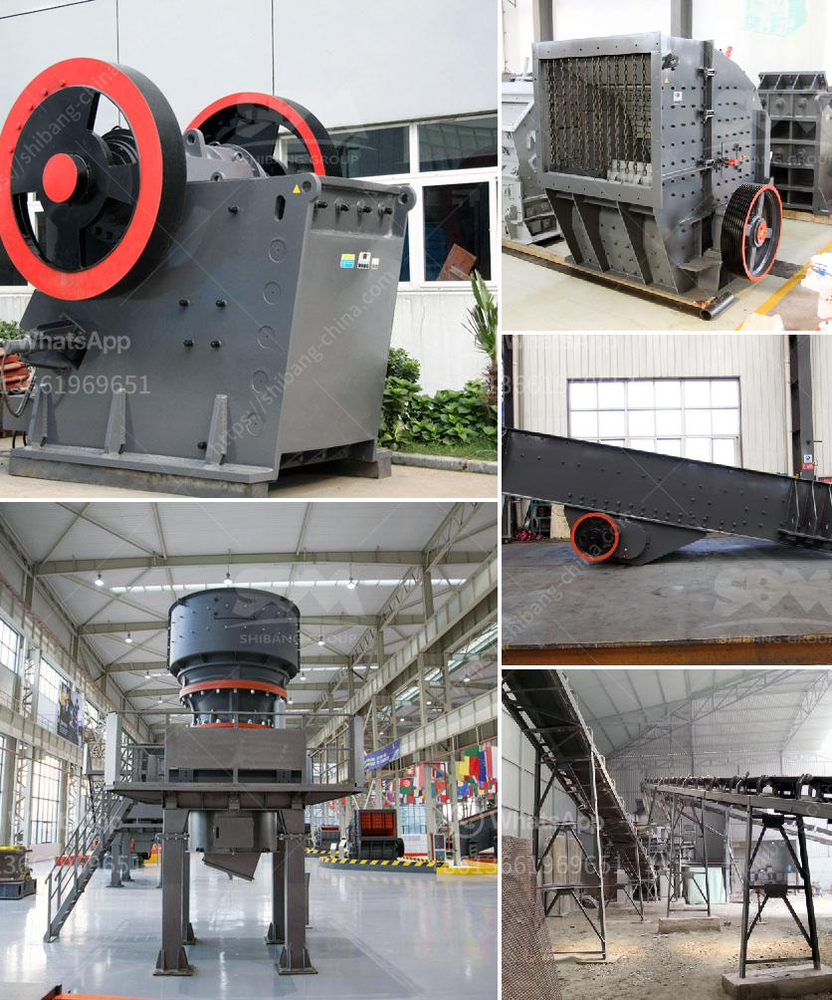

<h3>second hand crusher machine price</h3>
With the depletion of natural resources, recycling has become inevitable. In this context, the importance of second-hand crusher machines is undeniable. In comparison to the new crushers on the market, second-hand crushers, also known as used crushers, offer several benefits that make them a more cost-effective option. This article will explore the reasons why second-hand crusher machines come at a lower price point and how they can meet your crushing needs.

The primary reason why second-hand crusher machines are available at a lower price point is their depreciation. New crushers undergo rapid depreciation, just like any other machinery. The initial cost of the machine declines as soon as it's operated and exposed to wear and tear. Thus, buying a used crusher helps you save a significant amount of money. You can acquire a good quality second-hand crusher machine at a fraction of the cost of a new one.

Buying a second-hand crusher machine doesn't mean compromising on quality. Many reputable sellers ensure that the used crushers they offer are in good condition and thoroughly inspected before being sold. Some sellers even refurbish the machines, ensuring that all necessary repairs and maintenance have been carried out. By opting for a reliable seller, you can rest assured that you're investing in a machine that will perform to your expectations.

Another advantage of buying a second-hand crusher machine is the availability of a wide range of models. The used machinery market provides various types of crushers, ranging from jaw crushers and impact crushers to cone crushers and roll crushers. Different models serve different crushing purposes, ensuring that you find the right machine to meet your specific requirements. This versatility allows you to explore different options and choose the most suitable crusher for your operations.

When purchasing a new crusher machine, the lead time can be quite extensive. On the other hand, second-hand crusher machines are readily available and can be delivered within a short period. This quick delivery allows you to minimize downtime and start utilizing the machine promptly.

Opting for second-hand crusher machines promotes sustainability by reducing waste and conserving natural resources. By reusing and repurposing existing machinery, the need for extensive manufacturing and mining to produce new crushers is significantly reduced. This eco-friendly approach contributes to a greener future.

In conclusion, second-hand crusher machines offer a cost-effective solution for your crushing needs. They come at a lower price point, helping you save money without compromising on quality. This market offers a wide range of models, ensuring that you find a crusher machine that meets your specific requirements. Additionally, quick delivery and the promotion of sustainability make second-hand crushers a wise choice. Consider purchasing a used crusher machine for your crushing operations and enjoy the benefits it offers.
<h3>Contact us</h3><ul><li><strong>Whatsapp:&nbsp;<a href="https://wa.me/8613661969651">+8613661969651</a></strong></li><li><a href="https://swt.shibang-china.com/?git&amp;zhl&amp;second hand crusher machine price"><strong>Online Service(chat now)</strong></a></li></ul><h3>Related</h3><ul><li><a href='capital requirement for one ton cement mill.md'>capital requirement for one ton cement mill</a></li><li><a href='concrete crusher prices.md'>concrete crusher prices</a></li><li><a href='calcium carbonate processing.md'>calcium carbonate processing</a></li><li><a href='vibrating screens manufacturers.md'>vibrating screens manufacturers</a></li><li><a href='used coal power plant for sale.md'>used coal power plant for sale</a></li></ul>