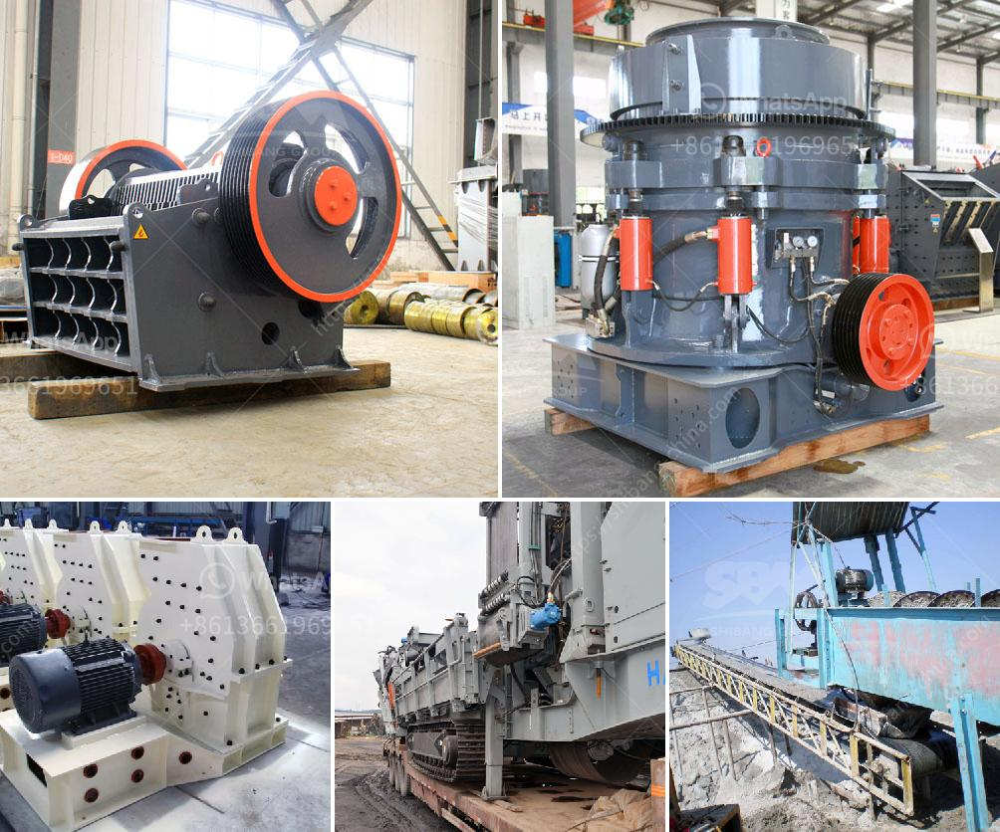

<h3>second hand crushers and screens in south africa</h3>
Second-hand crushers and screens in South Africa have long been a popular choice for economical construction projects. They have specifically proven their worth when it comes to delivering reliable output in the mining industry. A well-functioning crusher or screen is crucial to the success of a construction or mining project. However, the cost of new equipment can often be prohibitive, especially for small-scale operations. This is where second-hand crushers and screens come into play, offering cost-effective solutions while still ensuring top-quality performance.

Second-hand crushers and screens are widely available in South Africa at affordable prices. They are mainly sourced from local construction and mining industries, where they have been previously used and properly maintained. These pre-owned machines can be found in excellent condition, often requiring minimal refurbishment.

There are several advantages to purchasing second-hand crushers and screens. Firstly, the lower price point makes them accessible to a wider range of customers, including start-up businesses and small-scale contractors. By investing in second-hand equipment, these customers can get their projects off the ground without breaking the bank.

Second-hand crushers and screens also offer environmental benefits. Reusing equipment significantly reduces waste in the construction and mining industries. By extending the lifespan of these machines, we can minimize the carbon footprint associated with their production and disposal. Recycling resources is a crucial step towards sustainability, and second-hand equipment plays a vital role in achieving this goal.

Moreover, second-hand crushers and screens in South Africa are readily available, allowing customers to quickly acquire the necessary equipment for their projects. This helps to avoid delays and ensures that construction or mining operations can proceed smoothly.

Before purchasing second-hand equipment, it is essential to consider a few factors. Firstly, the buyer should thoroughly inspect the machine to ensure it is in good working condition. This may involve checking for wear and tear, testing the operational features, and assessing the overall quality.

It is also advisable to inquire about the history of the machine. Knowing its usage, previous owners, and maintenance history can give buyers valuable information about the equipment's performance and reliability. Additionally, customers should inquire about the availability of spare parts and the cost of maintenance or repairs in order to make an informed decision.

In conclusion, second-hand crushers and screens in South Africa provide an affordable and sustainable solution for construction and mining projects. By repurposing pre-owned equipment, customers can save costs while still achieving top-quality performance. These machines are readily available and offer a range of environmental benefits. However, thorough inspection and consideration of maintenance costs are essential before making a purchase. With careful research and planning, second-hand equipment can be a valuable asset in meeting the needs of construction and mining industries in South Africa.
<h3>Contact us</h3><ul><li><strong>Whatsapp:&nbsp;<a href="https://wa.me/8613661969651">+8613661969651</a></strong></li><li><a href="https://swt.shibang-china.com/?git&amp;zhl&amp;second hand crushers and screens in south africa"><strong>Online Service(chat now)</strong></a></li></ul><h3>Related</h3><ul><li><a href='ball mill manufacturers in gujarat.md'>ball mill manufacturers in gujarat</a></li><li><a href='cost of stone crusher plant in saudi.md'>cost of stone crusher plant in saudi</a></li><li><a href='grinding media balls turkey.md'>grinding media balls turkey</a></li><li><a href='crusher machine philippine price.md'>crusher machine philippine price</a></li><li><a href='grinder mill in malaysia.md'>grinder mill in malaysia</a></li></ul>