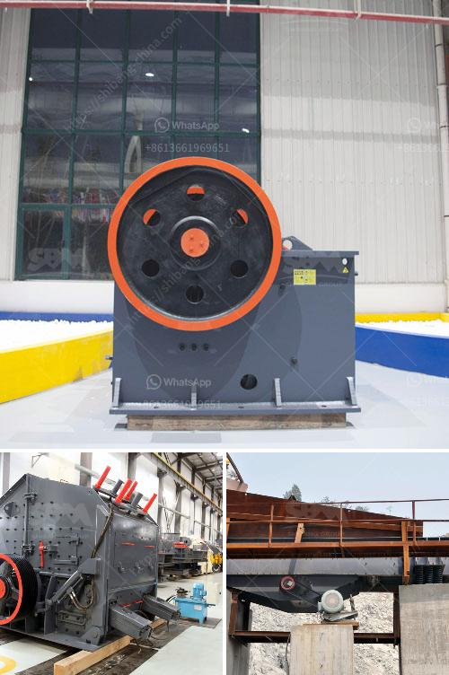

<h3>second hand crushing and screening plant sale</h3>
In the competitive world of mining and construction, owning the right equipment is paramount for success. However, investing in brand new machinery can put a substantial strain on your budget. Luckily, the second-hand market offers an alternative that not only saves costs but also delivers reliable and efficient equipment. This article explores the benefits of buying a used crushing and screening plant, helping you make an informed decision.

One of the most obvious benefits of buying used equipment is the significant cost savings compared to purchasing new. By opting for a second-hand machine, you cut down on the initial investment. The savings can be as much as 30-40% when compared to new machinery, allowing you to allocate those funds to other crucial areas of your project.

Used crushing and screening plants are often available with a history of performance, providing peace of mind for buyers. This history can give you valuable insights into maintenance records, any previous issues, and the overall durability of the machine. Utilizing this information can help you avoid unexpected breakdowns and costly downtime.

The second-hand market offers a wide selection of crushing and screening plants from various manufacturers, giving you options to choose the best fit for your specific needs. This flexibility allows you to explore different models and technologies, ensuring the equipment aligns with your project requirements. Additionally, purchasing a used plant enables you to react swiftly to changing market demands without committing to long-term investments.

When compared to buying new machinery, acquiring a used crushing and screening plant can save you substantial time. Instead of waiting for a new plant's production lead time, you can quickly secure a second-hand machine that is readily available for immediate use. This can be a crucial advantage when faced with tight project deadlines or urgent operational requirements.

Choosing a used crushing and screening plant contributes to sustainability efforts. Manufacturing new equipment requires vast energy resources and incurs significant carbon emissions. By giving a second life to existing machinery, you contribute to the circular economy. Additionally, purchasing used equipment reduces waste and conserves natural resources.

While purchasing a used crushing and screening plant offers many benefits, several factors should be considered to ensure a successful investment. Conducting thorough inspections, requesting maintenance records, and understanding the equipment's utilization history are essential steps. Engaging with reputable sellers, seeking professional advice, and conducting independent inspections can significantly mitigate any potential risks.

Buying a used crushing and screening plant presents a prudent alternative for budget-conscious mining and construction companies. With significant cost savings, reliable performance, increased flexibility, and reduced lead times, the second-hand market offers an excellent opportunity to acquire top-quality machinery. By choosing a pre-owned plant, you contribute to sustainability efforts while efficiently meeting your project requirements. Embrace the benefits of the second-hand market and unlock a world of cost-saving opportunities.
<h3>Contact us</h3><ul><li><strong>Whatsapp:&nbsp;<a href="https://wa.me/8613661969651">+8613661969651</a></strong></li><li><a href="https://swt.shibang-china.com/?git&amp;zhl&amp;second hand crushing and screening plant sale"><strong>Online Service(chat now)</strong></a></li></ul><h3>Related</h3><ul><li><a href='mineral used for making talcum powder.md'>mineral used for making talcum powder</a></li><li><a href='iron processing equipment price.md'>iron processing equipment price</a></li><li><a href='vibrating screen in the philippines.md'>vibrating screen in the philippines</a></li><li><a href='marble stone milling plant manufacturer.md'>marble stone milling plant manufacturer</a></li><li><a href='feldspar stone processing plant.md'>feldspar stone processing plant</a></li></ul>