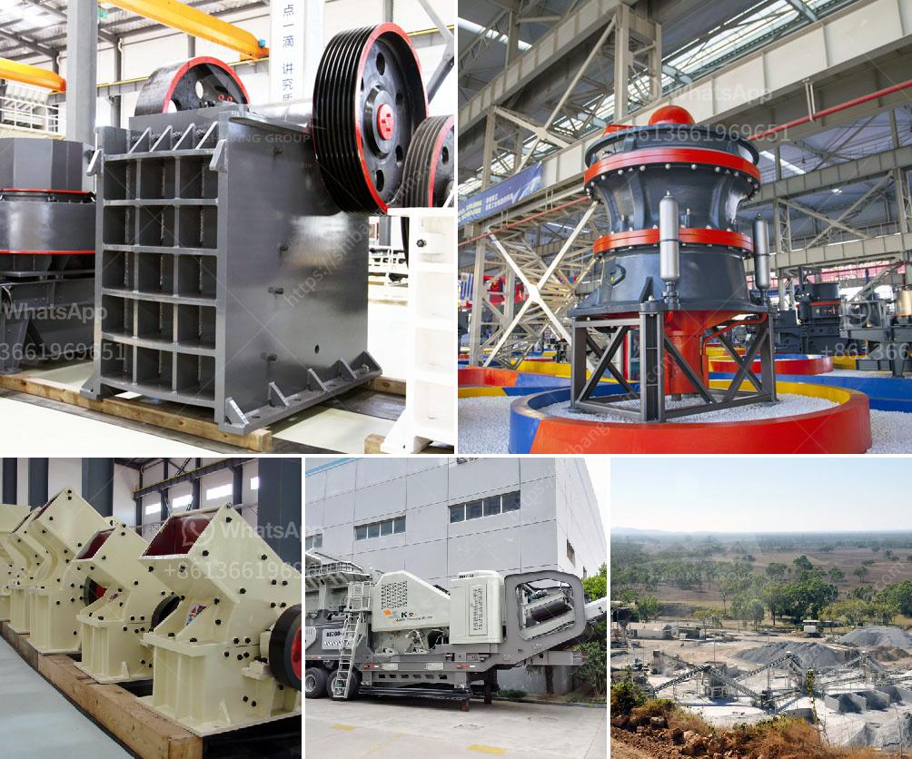

<h3>second hand jaw pulverizer india</h3>
In the fast-paced world of construction and infrastructure development, finding cost-effective solutions is of paramount importance. One such solution gaining popularity in India is the use of second-hand jaw pulverizers. These robust machines have proven their worth by providing efficient and affordable alternatives to new equipment, particularly in the construction sector. This article explores the benefits, considerations, and growth potential of second-hand jaw pulverizers in India.

The rising demand for construction projects, ranging from residential complexes to commercial buildings and infrastructure, often involves the need for costly equipment. The cost of procuring new jaw pulverizers can be a major barrier for small to medium construction firms. However, the emergence of the second-hand market offers a viable alternative that addresses budget constraints without compromising the quality and efficiency of the construction process.

While some may harbor concerns about the reliability of second-hand equipment, the market for second-hand jaw pulverizers in India ensures that customers have access to high-quality machinery. Many providers in the market conduct rigorous inspections, refurbishments, and performance checks on the machinery before offering them for sale. This ensures that the used jaw pulverizers can operate at their full potential, providing similar levels of performance to their new counterparts at a fraction of the cost.

Investing in new equipment comes with inherent risk, particularly for small businesses. The depreciation of equipment value and the uncertainty of future projects make the investment in new machinery a risky endeavor. Opting for second-hand jaw pulverizers allows construction firms to mitigate this risk, as they can sell the equipment at a similar price in the future, minimizing the loss in the investment.

The used market for jaw pulverizers in India has opened up opportunities for small to medium enterprises to access the machinery needed for timely project completion. With new projects constantly being undertaken and ongoing projects requiring swift action, the flexibility and availability of second-hand jaw pulverizers play a vital role. This availability supports streamlined construction processes and project timelines, allowing businesses to remain competitive and meet clients' demands efficiently.

By purchasing second-hand jaw pulverizers, construction firms indirectly contribute to the concept of sustainability. Repurposing machinery increases equipment lifespan, reducing the overall carbon footprint associated with the production of new machines. Introducing refurbished equipment into circulation instead of scrapping them prematurely aligns with the ideology of sustainability and responsible resource management.

The flourishing market for second-hand jaw pulverizers in India is redefining the construction industry's approach to equipment procurement. By offering cost-effective alternatives without compromising performance, these machines unlock new opportunities for small to medium construction businesses and facilitate timely project completion. The growth potential of this market lies in building trust in the quality and reliability of second-hand machinery while simultaneously addressing financial constraints. Embracing this market can significantly drive cost-efficiency, reduce financial risk, and contribute to environmental sustainability in the Indian construction sector.
<h3>Contact us</h3><ul><li><strong>Whatsapp:&nbsp;<a href="https://wa.me/8613661969651">+8613661969651</a></strong></li><li><a href="https://swt.shibang-china.com/?git&amp;zhl&amp;second hand jaw pulverizer india"><strong>Online Service(chat now)</strong></a></li></ul><h3>Related</h3><ul><li><a href='quarry machines manufacturer.md'>quarry machines manufacturer</a></li><li><a href='gypsum powder dryer price pakistan.md'>gypsum powder dryer price pakistan</a></li><li><a href='ball mills in lima.md'>ball mills in lima</a></li><li><a href='concrete crusher for sale in uae crusher.md'>concrete crusher for sale in uae crusher</a></li><li><a href='stone quarry business proposal crusher machine.md'>stone quarry business proposal crusher machine</a></li></ul>