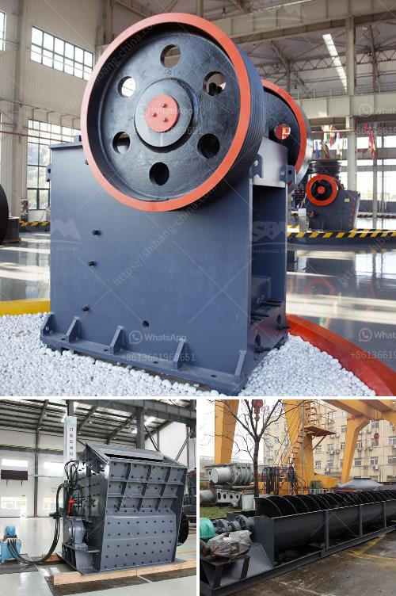

<h3>second hand small cement mill in uae</h3>
A second-hand small cement mill holds great potential for businesses in the United Arab Emirates (UAE). As the second-largest economy in the Middle East, the UAE has a booming construction sector that requires a constant supply of cement. Investing in a second-hand cement mill can provide significant savings for businesses while fulfilling their cement production needs.

One of the primary advantages of purchasing a second-hand small cement mill is the reduced upfront cost compared to buying a new one. This cost-saving opportunity is particularly beneficial for small and medium-sized enterprises (SMEs) and startups that may have restricted budgets. By purchasing a used cement mill, businesses can allocate their capital towards other crucial aspects of their operations, such as marketing, hiring, and expanding their customer base.

Moreover, a second-hand cement mill can be quickly and easily integrated into existing production facilities. Unlike major machinery upgrades or replacements, which often require significant downtime and interruptions to operations, installing a second-hand mill can be comparatively smooth and efficient. This seamless integration allows businesses to maintain a continuous supply of cement, thereby meeting contractual obligations and minimizing any disruptions in their construction projects.

The availability of second-hand cement mills also helps to reduce the environmental impact associated with the manufacturing process. Cement production is known for its contribution to carbon emissions and resource consumption. By choosing a used cement mill, businesses can participate in a circular economy by giving the equipment a new life instead of contributing to further resource extraction and energy consumption.

When considering the purchase of a second-hand small cement mill, it is crucial to evaluate its overall condition and the reputation of the seller. Conducting a thorough inspection, including examining key components like the mill shell, grinding media, and gears, can help identify any potential issues. Additionally, researching the seller's credibility and reputation within the industry can provide added assurance of the equipment's quality and reliability.

It is also advisable to ensure that the second-hand cement mill meets the specific requirements of the business. Factors such as production capacity, energy efficiency, and compatibility with existing machinery should be considered before finalizing the purchase. Consulting with experts or engaging the services of professional engineers can help make an informed decision that aligns with the business's long-term goals.

In conclusion, the availability of second-hand small cement mills in the UAE presents a cost-effective and efficient solution for businesses in the construction industry. Investing in a used cement mill not only reduces upfront costs but also contributes to sustainability efforts by extending the lifespan of equipment. Careful evaluation and research are essential to ensure the quality and compatibility of the equipment, maximizing the benefits and returns on investment.
<h3>Contact us</h3><ul><li><strong>Whatsapp:&nbsp;<a href="https://wa.me/8613661969651">+8613661969651</a></strong></li><li><a href="https://swt.shibang-china.com/?git&amp;zhl&amp;second hand small cement mill in uae"><strong>Online Service(chat now)</strong></a></li></ul><h3>Related</h3><ul><li><a href='alluvial gold washing plant in zimbabwe.md'>alluvial gold washing plant in zimbabwe</a></li><li><a href='portable copper ore processing machines in usa.md'>portable copper ore processing machines in usa</a></li><li><a href='dolomite lime manufacturers in ghana.md'>dolomite lime manufacturers in ghana</a></li><li><a href='vibrating screen in the philippines.md'>vibrating screen in the philippines</a></li><li><a href='floatation washing machine for silica sand.md'>floatation washing machine for silica sand</a></li></ul>