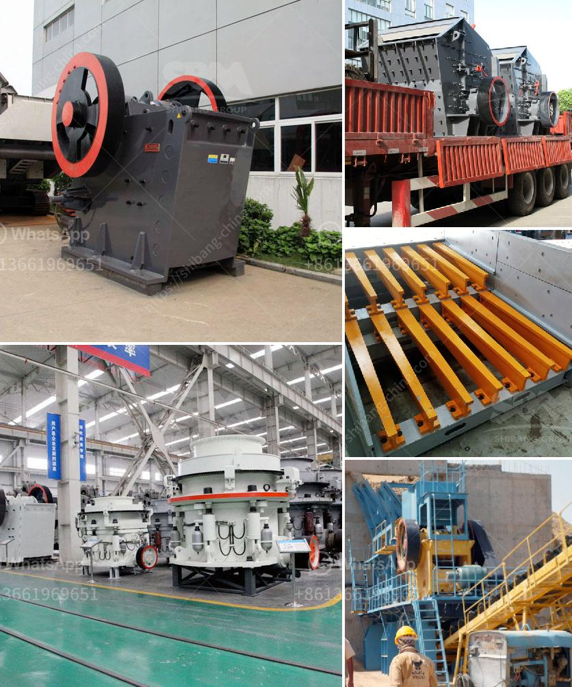

<h3>secondary impact crusher</h3>
A secondary impact crusher is a machine that is used after the primary crushing process in order to further reduce the size of the material. It is commonly used in construction, mining, and recycling industries. There are several types of secondary impact crushers, each with varying features and benefits.

One of the main advantages of a secondary impact crusher is its ability to handle a wide range of materials. Whether it is soft or hard, abrasive or non-abrasive, the secondary impact crusher can efficiently process it. This versatility is important in industries where different types of materials need to be crushed.

The design of a secondary impact crusher also plays a significant role in its overall performance. The rotor, blow bars, and anvils are all crucial components that determine the efficiency and effectiveness of the crushing process. The rotor is the heart of the machine as it is responsible for the actual impact of the material. The blow bars and anvils, on the other hand, are consumable wear parts that need to be periodically replaced.

Another important aspect of a secondary impact crusher is its capacity. The output size of the crushed material is directly related to the capacity of the machine. A higher capacity allows for more material to be processed, thereby increasing productivity and reducing the time required for crushing. It is important to choose a secondary impact crusher that has the right capacity for the specific needs of the project.

Maintenance and operational costs are also considerations when choosing a secondary impact crusher. A well-designed machine with proper maintenance can significantly reduce downtime and repair costs. Additionally, energy consumption should also be taken into account. Energy-efficient machines can help reduce operating costs in the long run.

Safety features are paramount when working with a secondary impact crusher. It is important to ensure that the machine is equipped with all the necessary safety devices to protect the operator and prevent accidents. This includes safety guards, emergency stop buttons, and a lockout/tagout system.

In conclusion, a secondary impact crusher is a versatile and efficient machine that is used in various industries for crushing a wide range of materials. Its ability to handle different types of materials, its capacity, and its design are all important factors to consider when choosing a crusher. Moreover, maintenance and operating costs, energy consumption, and safety features should also be taken into account. By carefully evaluating these factors, one can select the most suitable secondary impact crusher for their specific needs.
<h3>Contact us</h3><ul><li><strong>Whatsapp:&nbsp;<a href="https://wa.me/8613661969651">+8613661969651</a></strong></li><li><a href="https://swt.shibang-china.com/?git&amp;zhl&amp;secondary impact crusher"><strong>Online Service(chat now)</strong></a></li></ul><h3>Related</h3><ul><li><a href='size and number of balls for ball mill.md'>size and number of balls for ball mill</a></li><li><a href='diamond screening plant for hire south africa.md'>diamond screening plant for hire south africa</a></li><li><a href='iron crushing equipment.md'>iron crushing equipment</a></li><li><a href='malaysia hammer mills.md'>malaysia hammer mills</a></li><li><a href='60ton ball mill nigeria.md'>60ton ball mill nigeria</a></li></ul>