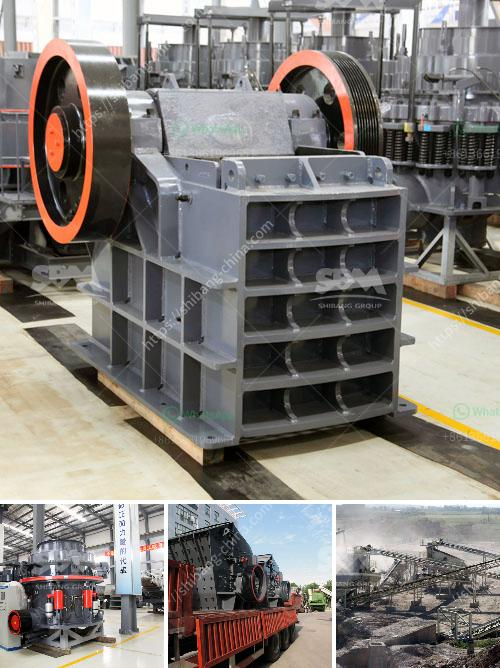

<h3>sells crushing plant in osorno</h3>
In today's fast-paced world, the construction industry relies heavily on efficient and reliable machinery to meet project deadlines. One such machinery that has gained immense popularity and recognition is the crushing plant. The crushing plant is a powerful and versatile tool that is used to break down large rocks into smaller pieces to be used for construction purposes. In Osorno, a city in Chile, a newly established company is making waves by selling top-quality crushing plants to meet the growing demand in the construction industry.

Osorno, known for its strong presence in the construction market, has seen a surge in construction projects in recent years. Catering to the needs of this flourishing city, the company has brought in crushing plants that are not only high in performance but also low on maintenance. These plants are designed with cutting-edge technology to ensure maximum productivity and efficiency.

One of the key features of these crushing plants is their ability to handle a wide range of materials. Whether it is tough granite or fragile limestone, the crushing plants in Osorno can handle it all. With powerful jaw crushers and impactors, these plants can crush even the hardest materials to the desired size, providing a much-needed solution for construction companies.

Additionally, these crushing plants are equipped with advanced automation systems that enable easy operation and troubleshooting. The operators can monitor and control various parameters of the plant from a centralized control room, ensuring smooth and uninterrupted production. This not only enhances productivity but also reduces the risk of accidents and downtime.

Moreover, the selling of crushing plants in Osorno is not just benefiting the construction industry but also the environment. By recycling and repurposing materials, the crushing plants help reduce the need for new resources, thereby minimizing the industry's carbon footprint.

In conclusion, the selling of crushing plants in Osorno has emerged as a game-changer for the construction industry. With their exceptional performance, durability, and sustainability, these plants offer a promising solution to the ever-growing demand for construction materials. By investing in such advanced machinery, construction companies in Osorno can stay ahead in the game and revolutionize the industry.
<h3>Contact us</h3><ul><li><strong>Whatsapp:&nbsp;<a href="https://wa.me/8613661969651">+8613661969651</a></strong></li><li><a href="https://swt.shibang-china.com/?git&amp;zhl&amp;sells crushing plant in osorno"><strong>Online Service(chat now)</strong></a></li></ul><h3>Related</h3><ul><li><a href='vertical shaft impact crusher plf.md'>vertical shaft impact crusher plf</a></li><li><a href='providers conveyor belts in mexico.md'>providers conveyor belts in mexico</a></li><li><a href='output of crushing plant.md'>output of crushing plant</a></li><li><a href='gold plant for sale philippines.md'>gold plant for sale philippines</a></li><li><a href='process of gypsum board manufacturing.md'>process of gypsum board manufacturing</a></li></ul>