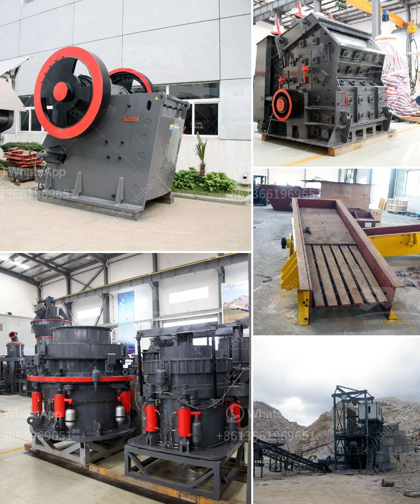

<h3>shafts of a ball mill</h3>
The Ball Mill Shaft is a crucial part of ball mills, which are extensively used in the cement, mining, and power generation industries. These mills rely on the grinding process to pulverize large amounts of raw materials into fine powders. To ensure optimal performance, the shaft must be properly designed and manufactured.

The shaft of a ball mill is generally made of high-quality steel that undergoes a heat treatment process to enhance its tensile strength and wear resistance. It ensures that the shaft can withstand heavy loads and provide consistent performance over an extended period. In addition, the surface of the shaft is often polished or coated to reduce friction and prevent corrosion.

The ball mill shaft is responsible for transmitting torque from the motor to the grinding media inside the mill. This torque helps to rotate the mill, allowing the grinding media to crush and grind the raw materials into the desired fineness. As a result, the shaft needs to be rigid and sturdy to handle the substantial forces and vibrations generated during the milling process.

A critical aspect of the ball mill shaft design is the alignment of the shaft with the mill's geometry. Any misalignment between the shaft and the mill can lead to excessive wear and tear, reduced efficiency, and even breakage. Therefore, precise alignment during installation or maintenance is crucial to avoid these issues.

Regular inspection and maintenance of the ball mill shaft are also essential to ensure its long-lasting performance. This includes monitoring the shaft for signs of wear, cracks, or deformities and addressing any issues promptly. Lubrication plays a vital role in reducing friction and preventing premature failure of the shaft. Hence, proper lubrication should be carried out regularly.

In conclusion, the shaft of a ball mill is a significant component that directly impacts the mill's performance. Its design, material selection, alignment, and maintenance are critical factors that determine the efficiency and durability of the mill. By providing the necessary torque and stability, a well-designed shaft contributes to the success of industrial processes.
<h3>Contact us</h3><ul><li><strong>Whatsapp:&nbsp;<a href="https://wa.me/8613661969651">+8613661969651</a></strong></li><li><a href="https://swt.shibang-china.com/?git&amp;zhl&amp;shafts of a ball mill"><strong>Online Service(chat now)</strong></a></li></ul><h3>Related</h3><ul><li><a href='100 tph cone crusher price.md'>100 tph cone crusher price</a></li><li><a href='used mobile jaw crushers for sale in uae.md'>used mobile jaw crushers for sale in uae</a></li><li><a href='price of stone crusher capacitytons an hour.md'>price of stone crusher capacitytons an hour</a></li><li><a href='crushing plant for sale.md'>crushing plant for sale</a></li><li><a href='metal corn crusher in china.md'>metal corn crusher in china</a></li></ul>