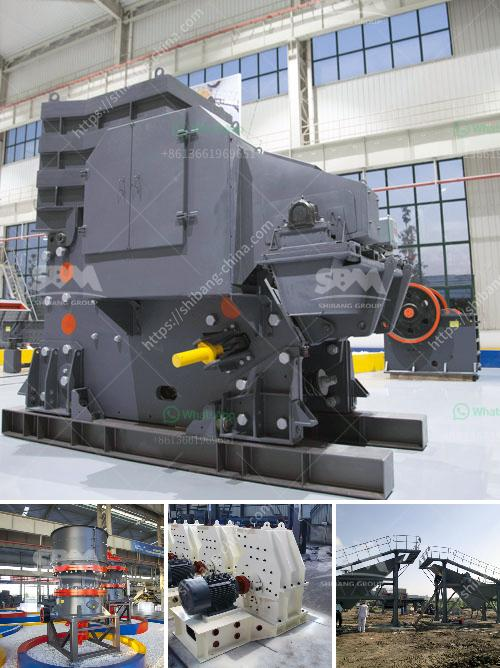

<h3>silica crusher plant in the philippines</h3>
Silica, or silicon dioxide, is a natural mineral present in many forms, including sand, quartz, and stone. It is widely used across various industries, such as construction, glass making, ceramics, and foundries. Silica is essential in the production of various materials due to its high purity, durability, and ability to withstand high temperatures. In the Philippines, silica crusher plants are essential for various industries.

A silica crusher plant is often used to process sand, gravel, and rock into fine particles, which are used to create goods like glass, insulation material, and concrete. These plants crush, dry, and refine the raw material before it is sold to customers or used further in the production process.

The Philippines has a rich deposit of silica that is primarily found in the northern regions, such as Pangasinan, Ilocos Norte, and Ilocos Sur. These areas have a high demand for silica crusher plants to cater to the growing needs of the local construction and manufacturing sectors.

A silica crusher plant operates on a large scale, taking raw materials from the mine and producing refined silica. The process involves screening the silica to sort it into different sizes and then crushing it to further refine and remove impurities. The final product is then ready for distribution to various industries.

The crushers used in these plants are typically heavy-duty machines that can handle large rocks and minerals. They are equipped with powerful motors and robust crushers to ensure efficient and effective crushing operations. Additionally, these plants incorporate advanced technologies, such as dust control systems and noise reduction measures, to promote a safe and eco-friendly working environment.

In conclusion, silica crusher plants play a crucial role in the Philippines' construction and manufacturing industries. They process raw materials to produce refined silica, which is used in diverse applications. The presence of these plants demonstrates the country's commitment to advancing its industrial sectors and contributing to economic growth. As demand for silica continues to rise, investments in silica crusher plants are necessary to meet industry requirements and position the Philippines as a key player in this sector.
<h3>Contact us</h3><ul><li><strong>Whatsapp:&nbsp;<a href="https://wa.me/8613661969651">+8613661969651</a></strong></li><li><a href="https://swt.shibang-china.com/?git&amp;zhl&amp;silica crusher plant in the philippines"><strong>Online Service(chat now)</strong></a></li></ul><h3>Related</h3><ul><li><a href='stone crusher machine in pakistan.md'>stone crusher machine in pakistan</a></li><li><a href='providers conveyor belts in mexico.md'>providers conveyor belts in mexico</a></li><li><a href='quarry machines manufacturer.md'>quarry machines manufacturer</a></li><li><a href='impact crusher hammer mill.md'>impact crusher hammer mill</a></li><li><a href='costs of conveyor belts.md'>costs of conveyor belts</a></li></ul>