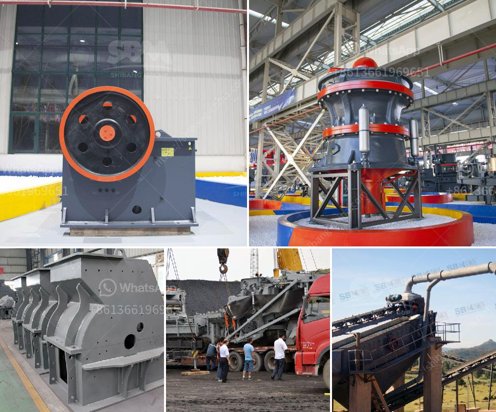

<h3>silica flour mill</h3>
Silica flour, also known as ground silica, is made by grinding pure silica sand to a fine powder. It is used in a wide range of applications, including in the production of fiberglass, paints, ceramics, and solar panels. To reach the desired fineness, the silica sand is ground in a silica flour mill, which typically utilizes high-pressure rollers to achieve a smooth powder consistency. In this article, we will explore the advantages of using a silica flour mill and delve into the various applications of silica flour.

One of the primary advantages of using a silica flour mill is the excellent particle size control it offers. The high-pressure rollers and precise grinding process ensure consistent particle size distribution, resulting in a finer and more uniform powder. This consistency is crucial in applications where specific particle sizes are required to achieve desired properties, such as in the production of ceramics or the manufacturing of paints. By using a silica flour mill, manufacturers can have complete control over the particle size, ensuring the quality of their end products.

Silica flour is used in a wide range of industries due to its unique properties. In the fiberglass industry, for instance, silica flour acts as a reinforcing filler. When added to the resin matrix, it enhances the mechanical strength, stability, and durability of the fiberglass products. Silica flour is also a key ingredient in the production of paints and coatings. Due to its small particle size and high surface area, silica flour acts as a thickening and suspending agent, improving the paint's consistency and preventing settling. Moreover, in ceramics, silica flour is used as a flux to lower the melting point of the materials, improve the body structure, and enhance the glaze.

Another essential application of silica flour is in the manufacturing of solar panels. The high purity and excellent performance of silica flour make it an ideal material for producing photovoltaic (PV) cells. Silica flour is used as a dopant to introduce impurities into the semiconductor layers of the PV cells, promoting the generation of electricity when exposed to sunlight. Moreover, it also provides an excellent surface for bonding different layers together, crucial for the efficient operation of the solar panel.

Furthermore, the use of a silica flour mill ensures a consistent and controlled production process. With precise grinding equipment, manufacturers can maintain the purity and quality of the silica flour. Purity is of utmost importance, especially in applications where a high degree of transparency or chemical stability is required, like in the production of glass or electronic components. Additionally, with a dedicated silica flour mill, production can be tailored to meet specific customer requirements, allowing for better customization and improved product performance.

In conclusion, the use of a silica flour mill offers numerous advantages for industries reliant on finely ground silica sand. The ability to control particle size distribution, consistent production process, and excellent material properties make it a crucial component in various sectors, including fiberglass, paints, ceramics, and solar panels. As technology advances and global demands continue to grow, the importance of silica flour mills in enabling the production of high-quality, efficient products is further emphasized.
<h3>Contact us</h3><ul><li><strong>Whatsapp:&nbsp;<a href="https://wa.me/8613661969651">+8613661969651</a></strong></li><li><a href="https://swt.shibang-china.com/?git&amp;zhl&amp;silica flour mill"><strong>Online Service(chat now)</strong></a></li></ul><h3>Related</h3><ul><li><a href='calculation of a cost of a crusher.md'>calculation of a cost of a crusher</a></li><li><a href='grinding machinery for sale in guatemala.md'>grinding machinery for sale in guatemala</a></li><li><a href='grinding feldspar for glazes.md'>grinding feldspar for glazes</a></li><li><a href='feldspar stone processing plant.md'>feldspar stone processing plant</a></li><li><a href='size of a 50 tpd rotary kiln.md'>size of a 50 tpd rotary kiln</a></li></ul>