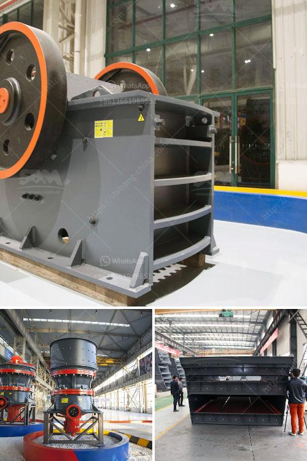

<h3>silica processing company</h3>
Silica is a critical mineral that plays a vital role in various industries. Whether it is used in the production of glass, ceramics, electronics, or even as an ingredient in cosmetics, the demand for high-quality silica is consistently increasing. To cater to this demand and revolutionize the way silica is processed, numerous companies have emerged in recent years, but one name stands out among the rest – the Silica Processing Company.

The Silica Processing Company is a leading provider of innovative solutions for silica processing, setting new standards in quality, efficiency, and sustainability. With a team of experienced professionals and state-of-the-art facilities, they have successfully positioned themselves as the go-to choice for businesses across industries.

One of the key factors that sets the Silica Processing Company apart from its competitors is its commitment to sustainability. In an era where environmental consciousness has become paramount, the company takes pride in its eco-friendly processing techniques. They utilize advanced technologies that minimize waste generation and reduce the overall carbon footprint of their operations.

Moreover, the Silica Processing Company emphasizes the importance of quality control at every step of the production process. They understand that in industries such as glass manufacturing or electronics, even the slightest impurity can lead to significant damage. Hence, they employ stringent quality checks to ensure that their silica products adhere to the highest industry standards.

Another area where the Silica Processing Company excels is in its research and development capabilities. They continually invest in cutting-edge technologies and conduct extensive research to improve their processing techniques. By collaborating with industry experts and utilizing the latest equipment, they stay ahead of the curve and deliver silica products that are not only of superior quality but also tailored to the specific needs of their clients.

In addition to their commitment to sustainability and quality, the Silica Processing Company also prides itself on its adherence to strict safety protocols. They prioritize the well-being of their employees and maintain a safe working environment at all times. By ensuring compliance with industry regulations and implementing proactive safety measures, they have created a culture of accountability and professionalism within the organization.

Client satisfaction is at the heart of the Silica Processing Company's operations. They believe in building long-term partnerships with their clients by providing exceptional customer service. From initial consultation to final product delivery, their dedicated team works closely with each client, addressing their specific requirements, concerns, and queries, ensuring a seamless experience throughout the process.

In conclusion, the Silica Processing Company is revolutionizing the way silica is processed and meeting the evolving demands of various industries. With their emphasis on sustainability, commitment to quality, focus on research and development, adherence to safety protocols, and unwavering dedication to customer satisfaction, they have earned their reputation as a trustworthy and industry-leading provider. As businesses continue to rely on silica for their operations, the Silica Processing Company remains at the forefront, continuously delivering innovative solutions and driving growth in the industry.
<h3>Contact us</h3><ul><li><strong>Whatsapp:&nbsp;<a href="https://wa.me/8613661969651">+8613661969651</a></strong></li><li><a href="https://swt.shibang-china.com/?git&amp;zhl&amp;silica processing company"><strong>Online Service(chat now)</strong></a></li></ul><h3>Related</h3><ul><li><a href='clinker grinding plant manufacturers germany.md'>clinker grinding plant manufacturers germany</a></li><li><a href='hammer mill prices south africa.md'>hammer mill prices south africa</a></li><li><a href='copper slag crusher machine manufacturer india.md'>copper slag crusher machine manufacturer india</a></li><li><a href='quotation for impact crusher.md'>quotation for impact crusher</a></li><li><a href='gypsum grinding machine manufacturer in india.md'>gypsum grinding machine manufacturer in india</a></li></ul>