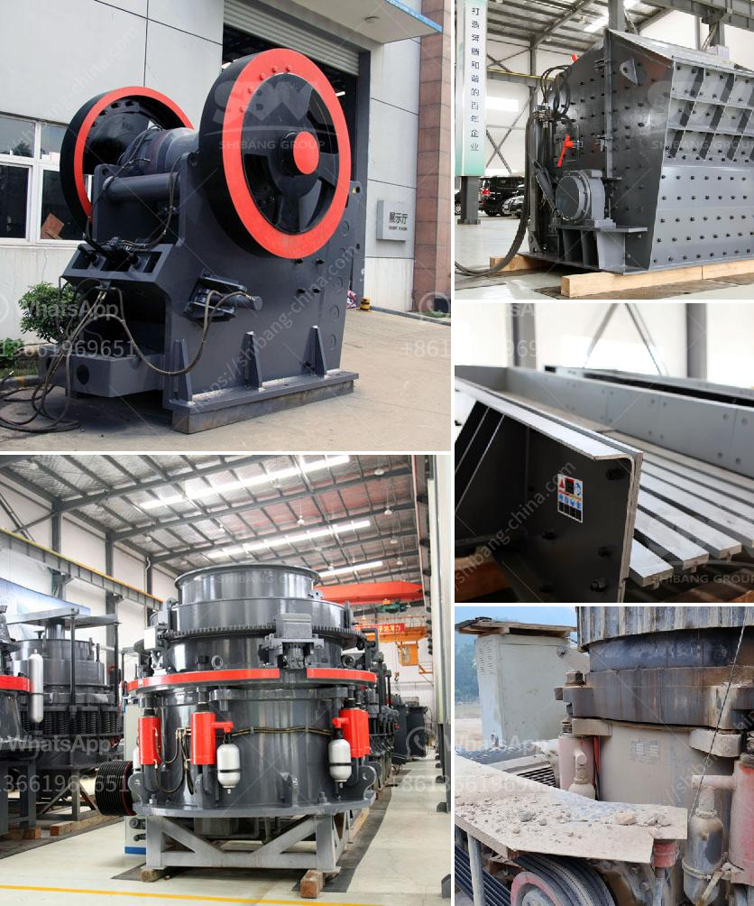

<h3>silica quartz crusher processing</h3>
Silica quartz, also known as silicon dioxide, is a common mineral that is found in abundance in the Earth’s crust. It is found in various forms, including quartz crystals, quartz sand, and quartzite. In its purest form, silica quartz is a hard, transparent crystal with a high melting point. Due to its physical and chemical properties, silica quartz has wide-ranging industrial applications.

One of the major uses of silica quartz is in the production of glass. Silica quartz is the main component of glass, providing it with its transparency and hardness. Glass manufacturers rely on high-quality silica quartz to produce clear, durable, and scratch-resistant glasses for various applications, including windows, bottles, and lenses.

Other industries also heavily rely on silica quartz. For instance, in the construction industry, silica quartz is used as an essential raw material in the production of cement, concrete, and bricks. Its strong resistance to heat, chemical corrosion, and physical abrasion make it an ideal material for enhancing the durability and strength of these construction materials.

Moreover, silica quartz plays a crucial role in the electronics industry. It is used in the manufacturing of semiconductors, optical fibers, and solar panels. Its high purity and excellent electrical conductivity make it an ideal material for producing high-performance electronic devices. The demand for silica quartz in the electronics industry has been growing exponentially with the increasing usage of smartphones, computers, and other electronic devices.

To process silica quartz into various industrial products, a powerful and efficient crusher is needed. The silica quartz crusher is equipped with high-performance jaws and rollers to effectively break down silica quartz into desired sizes for further processing. These crushers consist of a cavity designed to squeeze the quartz grains through a series of crushing actions, ensuring maximum reduction in size.

The first step in the crushing process is the primary crushing, where silica quartz is fed into a jaw crusher for initial reduction in size. The crushed material is then screened to remove undersized particles before being conveyed to a secondary cone crusher for further size reduction.

After secondary crushing, the silica quartz particles are sorted into different grades based on their sizes. The sorted quartz is then subjected to additional processes, such as washing, grinding, and magnetic separation, to remove impurities and obtain the desired grain size and purity.

The final product obtained from the processing of silica quartz is used in various applications. High-purity silica quartz is used in the production of silicon chips for the semiconductor industry, while lower-grade silica quartz is used as fillers in paints, rubber products, and ceramics. It is also used in the production of foundry molds, refractory materials, and abrasive products.

In conclusion, silica quartz crusher processing plays a crucial role in the production of various industrial products. With the right equipment and techniques, silica quartz can be successfully crushed and processed into desired sizes and purities. The utilization of silica quartz in multiple industries highlights its significance and importance in the modern industrial landscape.
<h3>Contact us</h3><ul><li><strong>Whatsapp:&nbsp;<a href="https://wa.me/8613661969651">+8613661969651</a></strong></li><li><a href="https://swt.shibang-china.com/?git&amp;zhl&amp;silica quartz crusher processing"><strong>Online Service(chat now)</strong></a></li></ul><h3>Related</h3><ul><li><a href='providers conveyor belts in mexico.md'>providers conveyor belts in mexico</a></li><li><a href='jaw crusher c160 menghancurkan peralatan.md'>jaw crusher c160 menghancurkan peralatan</a></li><li><a href='to produce tons of li ne powder.md'>to produce tons of li ne powder</a></li><li><a href='used mobile jaw crushers for sale in uae.md'>used mobile jaw crushers for sale in uae</a></li><li><a href='used mini grinding plant india sale.md'>used mini grinding plant india sale</a></li></ul>