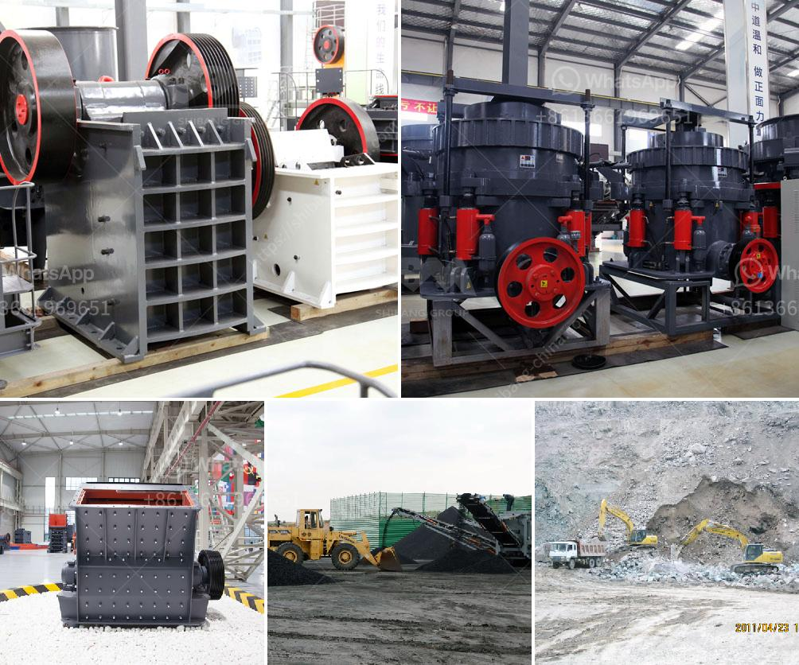

<h3>silica sand crushing plant in pakistan</h3>
Silica sand is a raw material that is used in glass manufacturing, ceramics, and foundry castings, among other applications. It is also commonly used in the petroleum industry as proppants for hydraulic fracturing. In Pakistan, silica sand is extensively mined and processed, making the country one of the major producers and exporters of silica sand worldwide.

One of the leading industries in Pakistan that can benefit from the use of silica sand is the construction sector. Silica sand is an important ingredient in concrete production, acting as a filler to provide strength and durability to the final product. Therefore, the demand for silica sand is constantly increasing, leading to the establishment of silica sand crushing plants in various regions of Pakistan.

A silica sand crushing plant consists of a series of crushing machines, such as jaw crusher, cone crusher, impact crusher, vibrating feeder, vibrating screen, belt conveyor, and other auxiliary equipment. The different types of crushers have different crushing principles and particle sizes, and provide various specifications of crushed silica sand for different applications.

The crushing process begins with the raw silica sand being fed into the primary jaw crusher for primary crushing. After crushing, the crushed material is conveyed to the secondary cone crusher for further crushing. The secondary crusher reduces the silica sand to the desired size, which is then screened to remove any impurities. The final product is high-quality silica sand that meets the specific requirements of the customer.

In Pakistan, there are several silica sand crushing plants operating, with capacities ranging from 50 TPH to 300 TPH. The plants are capable of producing different grades of silica sand, providing a wide range of options for customers. Additionally, these plants are equipped with advanced technology and machinery, ensuring efficient and sustainable production processes.

Silica sand crushing plants in Pakistan not only provide high-quality silica sand, but also contribute to the local economy and create employment opportunities. The demand for silica sand in Pakistan is expected to continue growing, making the establishment of more crushing plants a viable business opportunity for investors.

In conclusion, silica sand crushing plants in Pakistan play a crucial role in the construction industry as well as other sectors, such as glass manufacturing and petroleum. With the growing demand for silica sand, these plants offer a valuable resource for meeting the country's needs while contributing to economic growth.
<h3>Contact us</h3><ul><li><strong>Whatsapp:&nbsp;<a href="https://wa.me/8613661969651">+8613661969651</a></strong></li><li><a href="https://swt.shibang-china.com/?git&amp;zhl&amp;silica sand crushing plant in pakistan"><strong>Online Service(chat now)</strong></a></li></ul><h3>Related</h3><ul><li><a href='impact stone crusher.md'>impact stone crusher</a></li><li><a href='roller mill dimensions.md'>roller mill dimensions</a></li><li><a href='kenya hammer mill is manufactured.md'>kenya hammer mill is manufactured</a></li><li><a href='coal crusher size 100 tph.md'>coal crusher size 100 tph</a></li><li><a href='jaw crusher price in nigeria.md'>jaw crusher price in nigeria</a></li></ul>