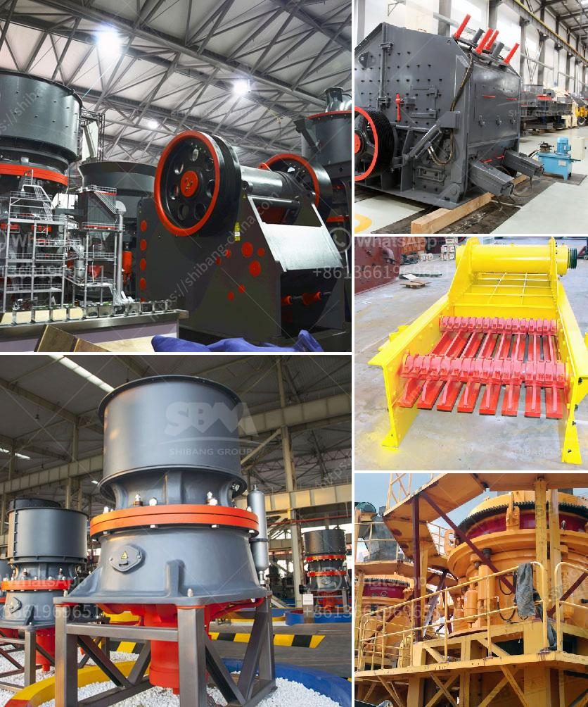

<h3>silica sand plant</h3>
Silica sand, also known as industrial sand, is one of the most abundant minerals on the earth's surface. It is primarily composed of silicon dioxide (SiO2) and is commonly used in a variety of industrial applications. In recent years, the demand for silica sand has been steadily increasing due to its versatile nature and diverse range of uses.

A silica sand plant is a facility where the raw material is extracted, processed, and refined to produce high-quality silica sand products suitable for various industries. The plant typically consists of crushing, screening, and washing processes, which enable the production of different grades of silica sand for different applications.

The construction industry is one of the major consumers of silica sand. It is used in the production of concrete, mortar, and other construction materials. The high silica content in the sand enhances the strength and durability of these materials, making them ideal for construction projects.

Another significant application of silica sand is in the manufacturing of glass. Silica sand is the primary component of glass, providing transparency and heat resistance. Whether for windows, bottles, or other glass products, the quality and purity of silica sand are crucial in achieving the desired clarity and strength in the finished glass products.

Furthermore, silica sand plays a vital role in the oil and gas industry. It is used as a proppant in hydraulic fracturing, or fracking, operations to extract oil and natural gas from deep underground reservoirs. Silica sand is injected into the wells to prop open the fractures created during the fracking process, allowing the trapped hydrocarbons to flow to the surface.

Additionally, silica sand is used in the foundry industry to produce molds and cores for metal casting. The high thermal conductivity of silica sand enables the molds to withstand the extreme temperatures during casting, ensuring the production of high-quality metal components.

In conclusion, a silica sand plant is an essential facility that extracts, processes, and refines silica sand to meet the increasing demand of various industries. Its versatile nature and wide range of applications make it a vital resource for the construction, glass manufacturing, oil and gas, and foundry industries. The continuous growth and development in these industries further emphasize the significance of silica sand plants in meeting the global demand for this valuable mineral.
<h3>Contact us</h3><ul><li><strong>Whatsapp:&nbsp;<a href="https://wa.me/8613661969651">+8613661969651</a></strong></li><li><a href="https://swt.shibang-china.com/?git&amp;zhl&amp;silica sand plant"><strong>Online Service(chat now)</strong></a></li></ul><h3>Related</h3><ul><li><a href='construction waste recycling production line.md'>construction waste recycling production line</a></li><li><a href='ball mill operation cost.md'>ball mill operation cost</a></li><li><a href='conveyor belts in opracion.md'>conveyor belts in opracion</a></li><li><a href='sell stone crusher 2x4.md'>sell stone crusher 2x4</a></li><li><a href='pf impact crusher for stone breaking machine for sale.md'>pf impact crusher for stone breaking machine for sale</a></li></ul>