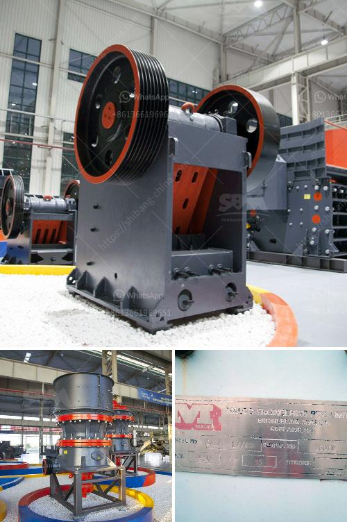

<h3>silica sand production line in german</h3>
Die Silicasandproduktion ist ein entscheidender Schritt bei der Herstellung von hochwertigem Glas, Beton und anderen industriellen Produkten. In diesem Artikel werden wir uns mit der Silicasandproduktionslinie befassen und ihre Bedeutung für die Industrie analysieren.

Die Silicasandproduktionslinie besteht aus einer Reihe von Maschinen, die speziell für die Gewinnung, Trennung, Reinigung und Verarbeitung von Silicasand entwickelt wurden. Der Prozess beginnt mit dem Abbau von Silikatgestein, das in Steinbrüchen oder Tagebau abgebaut wird. Sobald das Rohmaterial abgebaut ist, wird es zur weiteren Verarbeitung in eine Aufbereitungsanlage transportiert.

In der Aufbereitungsanlage wird der Rohschaum vorsortiert und grobe Verunreinigungen werden entfernt. Die Vorbehandlung zielt darauf ab, den Sand von organischen und anorganischen Verunreinigungen sowie von Schadstoffen zu befreien, um die Qualität des Endprodukts sicherzustellen.

Anschließend wird der vorsortierte Sand in einer Aufbereitungstrommel gewaschen, um Feinsande, Tonablagerungen und andere Verunreinigungen abzutrennen. Die Trommel ist mit Sieben und Sprührohren ausgestattet, die den Sand in verschiedene Fraktionen aufteilen und gleichzeitig das Waschwasser hinzufügen, um den Sand zu reinigen.

Der gewaschene Sand wird dann in einen Entwässerungsbehälter überführt, um überschüssiges Wasser zu entfernen und die Feuchtigkeit auf ein akzeptables Maß zu reduzieren. Der entwässerte Sand wird schließlich in einen Sandtrockner gegeben, um ihn gründlich zu trocknen und die Kornfeuchtigkeit zu eliminieren.

Nachdem der Sand getrocknet ist, wird er einer abschließenden Qualitätskontrolle unterzogen, um sicherzustellen, dass er den erforderlichen Reinheitsgrad und die korrekten Korngrößen erfüllt. Dieser Prozess beinhaltet in der Regel die Analyse des Siliziumdioxidgehalts, der Schüttgewichte und der Korngrößenverteilung.

Sobald der Sand die Qualitätskontrolle bestanden hat, wird er verpackt und für den Versand bereitgestellt. Je nach Anforderungen des Endbenutzers kann der Silicasand in verschiedenen Formen und Größen verpackt werden, z.B. als lose Masse in LKWs oder in Säcken.

Die Silicasandproduktionslinie hat eine enorme Bedeutung für die Industrie, da Silicasand ein unverzichtbarer Rohstoff in vielen Bereichen ist. Insbesondere die Glasindustrie ist stark auf hochwertigen Silicasand angewiesen, um Glasprodukte mit hoher Transparenz und Festigkeit herstellen zu können. Durch die optimale Verarbeitung des Silicasands in einer Produktionslinie kann eine gleichbleibend hohe Qualität gewährleistet werden.

Darüber hinaus ist Silicasand auch ein Schlüsselbestandteil von Beton, Mörtel und anderen Baustoffen. Der richtige Einsatz von Silicasand in der Bauindustrie kann die Haltbarkeit und Festigkeit von Gebäuden erhöhen.

Insgesamt spielt die Silicasandproduktionslinie eine wichtige Rolle bei der Bereitstellung von hochwertigem Silicasand für eine Vielzahl von Industrien. Durch den Einsatz von fortschrittlichen Maschinen und Technologien können Hersteller die Qualität, die Reinheit und die Korngröße des Silicasands genau steuern und somit ihren Kunden ein zuverlässiges Endprodukt liefern.
<h3>Contact us</h3><ul><li><strong>Whatsapp:&nbsp;<a href="https://wa.me/8613661969651">+8613661969651</a></strong></li><li><a href="https://swt.shibang-china.com/?git&amp;zhl&amp;silica sand production line in german"><strong>Online Service(chat now)</strong></a></li></ul><h3>Related</h3><ul><li><a href='screening and crushing equipment for chrome.md'>screening and crushing equipment for chrome</a></li><li><a href='standard ratio for cement sand building blocks.md'>standard ratio for cement sand building blocks</a></li><li><a href='project cost of tpd ofcement plant in pakistan.md'>project cost of tpd ofcement plant in pakistan</a></li><li><a href='vertical shaft crusher.md'>vertical shaft crusher</a></li><li><a href='machinery used in cement factory.md'>machinery used in cement factory</a></li></ul>