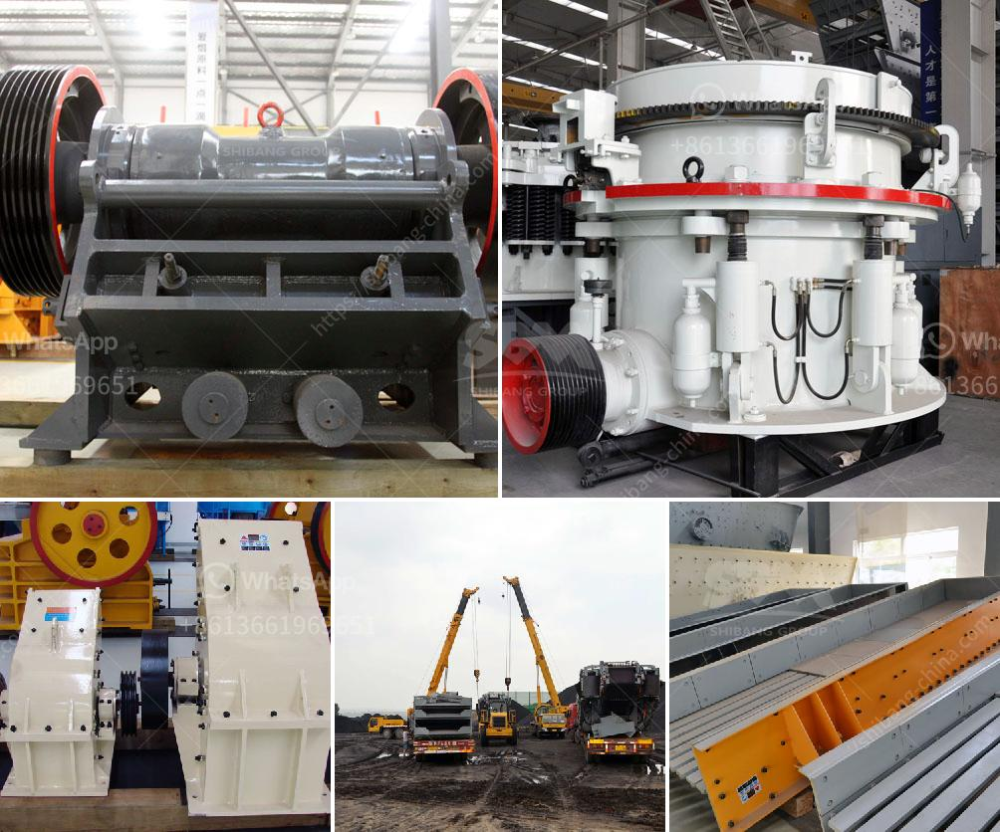

<h3>size and number of balls for ball mill</h3>
A ball mill is a type of grinder machine that uses cylindrical balls in a rotating chamber to grind materials such as minerals, ores, chemicals, ceramic raw materials, and paints. Ball mills rotate around a horizontal axis, partially filled with the material to be ground plus the grinding medium. Different materials are used as media, including ceramic balls, flint pebbles, and stainless steel balls.

When choosing the size and number of balls for a ball mill, it is important to consider several factors. These factors will determine the efficiency of the mill and the quality of the end product.

Firstly, the size of the balls affects the product fineness. In general, smaller balls are used for finer grinding, while larger balls are used for coarser grinding. The optimal ball size for a particular grinding application will depend on the size of the particles being ground, the hardness of the material, and the desired product fineness. Smaller balls provide a larger surface area for contact with the material, resulting in finer particle size reduction. However, smaller balls also require more energy to achieve the desired grind, so there is a trade-off between fineness and energy consumption.

Secondly, the number of balls in the ball mill can also affect the grinding efficiency. Too many balls may cause excessive wear of the grinding media and inefficient grinding, while too few balls may result in ineffective grinding and slow down the process. The optimal ball charge distribution for a particular grinding application will depend on the nature of the material being ground, the desired product fineness, and the mill operating conditions.

In addition to the size and number of balls, other factors that can affect the efficiency of a ball mill include the speed of the mill, the size and density of the grinding media, the residence time of the material in the mill, the mill feed rate, and the feed size distribution. All these factors should be carefully considered when designing and operating a ball mill.

It is worth mentioning that using a mixture of different ball sizes can result in more efficient grinding. The combination of large and small balls helps to break down the material more effectively, improving the grinding efficiency. This is because the larger balls help to break down the larger particles, while the smaller balls provide additional surface area for grinding the finer particles.

In conclusion, the size and number of balls in a ball mill play a crucial role in determining the efficiency of the mill and the quality of the end product. The appropriate choice of ball size and number will depend on the characteristics of the material being ground, the desired product fineness, and the mill operating conditions. Optimizing these factors can result in significant improvements in grinding efficiency and product quality.
<h3>Contact us</h3><ul><li><strong>Whatsapp:&nbsp;<a href="https://wa.me/8613661969651">+8613661969651</a></strong></li><li><a href="https://swt.shibang-china.com/?git&amp;zhl&amp;size and number of balls for ball mill"><strong>Online Service(chat now)</strong></a></li></ul><h3>Related</h3><ul><li><a href='ultrafine mill crusher price in india.md'>ultrafine mill crusher price in india</a></li><li><a href='working principle of raw mill in cement plant.md'>working principle of raw mill in cement plant</a></li><li><a href='project of crushing and screening stone crusher machine.md'>project of crushing and screening stone crusher machine</a></li><li><a href='nigeria crusher price.md'>nigeria crusher price</a></li><li><a href='crsusher plant in the philippines.md'>crsusher plant in the philippines</a></li></ul>