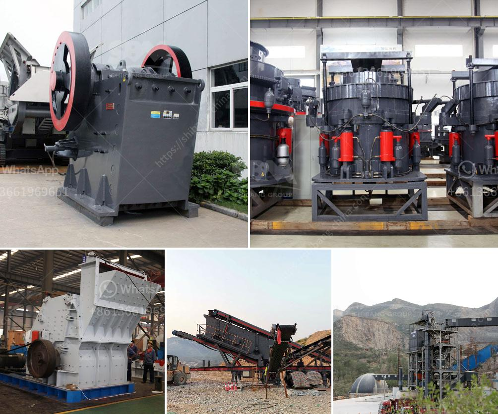

<h3>size ball mills for miner</h3>
Ball mills have been a crucial part of mining operations since its introduction in the late 19th century. They have evolved immensely over the years, from simple rotating cylinders with metal balls to complex machinery with multiple components. The primary purpose of a ball mill is to grind and blend materials for use in mineral processing, making them an essential tool for any mining operation.

One of the key considerations in selecting the right ball mill for a mining site is the particle size distribution of the feed material. It plays a crucial role in optimizing the efficiency of the grinding process and obtaining the desired product fineness. To achieve this, it is necessary to choose the appropriate size ball mill — one that can effectively break down the feed material into the desired particle size range.

Ball mills are available in various sizes, ranging from laboratory scale models with a few liters of capacity to large industrial mills with several meters in diameter and hundreds of tons of grinding media capacity. In the mid-size range commonly used in mining operations, ball mills can have various lengths and diameters to accommodate different specifications. However, the most common size range for mineral processing applications is between 300 and 500 liters.

The size of a ball mill also influences its performance and grinding capability. For instance, larger ball mills with higher diameter-to-length ratios usually have a higher circulating load and require longer retention times to achieve the desired grind size. On the other hand, smaller mills with lower diameter-to-length ratios are generally more efficient in terms of energy consumption, but may have limitations in terms of throughput and capacity.

In addition to the size of the ball mill, other factors come into play when deciding on the optimal configuration for a particular mining operation. These include the hardness and grindability of the ore, the desired product size, the mill's rotation speed, and the total ball load. All these factors should be carefully considered to ensure that the ball mill can effectively process the material and achieve the desired results.

Aside from size, other advancements in ball mill technology have enhanced their efficiency and reliability. These include the introduction of more robust liners and grinding media, improved motor gear design, and the use of advanced control systems. These advancements have enabled miners to operate ball mills more efficiently, achieve finer grind sizes, and reduce downtime and maintenance costs.

In conclusion, ball mills are an essential tool for mining operations, helping to grind and blend materials for mineral processing. Selecting the right size ball mill is crucial to optimize the efficiency of the grinding process and achieve the desired product fineness. It is important to consider factors like ore hardness, desired product size, and mill speed when choosing a ball mill for a mining site. Furthermore, advancements in ball mill technology have improved their performance, making them more reliable and efficient. As the mining industry continues to evolve, ball mills will remain a fundamental tool for mineral processing.
<h3>Contact us</h3><ul><li><strong>Whatsapp:&nbsp;<a href="https://wa.me/8613661969651">+8613661969651</a></strong></li><li><a href="https://swt.shibang-china.com/?git&amp;zhl&amp;size ball mills for miner"><strong>Online Service(chat now)</strong></a></li></ul><h3>Related</h3><ul><li><a href='ball mill for mineral grinding india.md'>ball mill for mineral grinding india</a></li><li><a href='raymond mill bentonite.md'>raymond mill bentonite</a></li><li><a href='stone crusher price 20x20 stone.md'>stone crusher price 20x20 stone</a></li><li><a href='vibrating grinding mill ball china.md'>vibrating grinding mill ball china</a></li><li><a href='coal crusher machine china.md'>coal crusher machine china</a></li></ul>