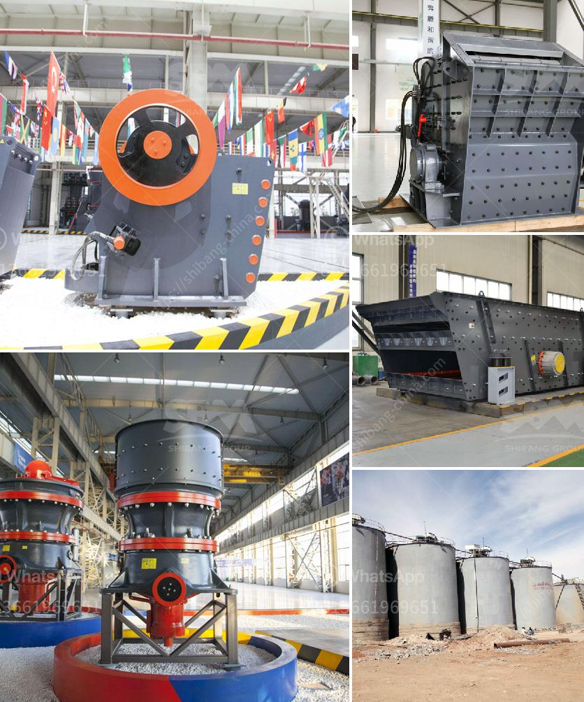

<h3>size maya size of a stone crusher</h3>
Stone crushing industry is an important industrial sector in the country engaged in producing crushed stone of various sizes depending upon the requirement which acts as raw material for various construction activities such as construction of roads, highways, bridges, buildings, canals etc. It is estimated that there are over 12,000 stone crusher units in India.

The stone crusher market recently has been noticed to have a surge in demand for crushers of smaller sizes such as 300-500mm in size. However, for larger stones, the mini crusher is becoming more and more popular. It has features of small size, compact structure, and large output capacity, which is featured with reliable performance, simple maintenance, and lower operation cost.

The stone crusher plant is used for producing sand, rock and stone for construction, highway, railway, and other applications. Fote Heavy Machinery, with 40 years of experience in the stone crushing production line, is skilled in the production line process design and has a high-cost performance.

The large stone material is evenly sent into the jaw crusher by the vibrating feeder for rough crushing, the coarse broken stone is sent by the belt conveyor to the impact crusher for further crushing, the stone of the fine crusher is sent to the vibrating screen for screening, and several different specifications of stone are screened, the stones satisfying the particle requirements are sent to the finished product material pile by the finished product belt conveyor, and the stones do not meet the particle requirements are returned to the impact crusher or cone crusher by the belt conveyor for re-crushing.

Stone crushers can be classified into primary crushing, secondary crushing and tertiary crushing machienes according to production need and final products requiements. Following are several popular stone crushers for sale in Ethiopia, such as jaw crusher, impact crusher and cone crusher etc.

There are several different kinds of crushers. A jaw crusher is used at the beginning of the aggregate crushing process, in the primary crushing stage to crush the largest boulders. Jaw crushers can crush all types of rock, including the hardest granite, brick, concrete and asphalt. Ethiopia stone jaw crusher has high reduction ratio and increased capacity with any feed materials. This is achieved through several unique features such as higher crushing speed, optimized kinematics, a longer stroke and easy adjustment. All stone jaw crushers are equipped with a proven, rugged and fast wedge-setting adjustment system - available as manual or hydraulic alternatives.

Among the several popular stone crushers, impact crusher is the most widely used. It can deal with different materials and ensure the highest precision of the final products. With simple structure, high capacity and low costs, it is worthy of choosing.

Impact crusher with deep rotor can make good use of the impacting energy of its rotor, so that it often used for the coarse crushing, medium crushing and fine crushing of crisp materials with below medium hardness such as calcium carbide, limestone, dolomite, coal, vulcanization iron ore, quartz, gypsum and chemical raw materials.

Due to the high hardness of the basalt, the wear caused by the impact crusher is relatively large, so the jaw crusher and the cone crusher are combined for crushing the stones with high hardness and they are generally configured as primary crushing equipment and secondary crushing equipment.

The process involved in crushing large size of stone boulders into different size of crushed stones depending upon the requirements in the demand sectors.

Primary crusher is generally called jaw crusher, that is used to crush the stones into smaller sized sizes for further further crushing.

Secondary crusher is generally an impact crusher, which is used to crush the crushed stones further into smaller sized sizes. The second kind of crusher suppliers is cone crusher. Finally, the stones are grinded with the grinding mill.

According to different materials, the impact crusher can be divided into river pebble crusher, granite crusher, limestone crusher and quartz crusher.

The stone crusher plant is mainly consists of Vibrating Feeder, Jaw crusher, Cone crusher and Impact Crusher, Vibrating Screen, Belt Conveyors and Control System, etc.

This article is mainly about the size of a stone crusher. Stone crusher is widely used in crushing and reshaping of rocks with compressive strength less than 320 MPa. It has features of high crushing ratio, uniform final product size, simple structure, reliable performance, easy maintenance and low operating cost.
<h3>Contact us</h3><ul><li><strong>Whatsapp:&nbsp;<a href="https://wa.me/8613661969651">+8613661969651</a></strong></li><li><a href="https://swt.shibang-china.com/?git&amp;zhl&amp;size maya size of a stone crusher"><strong>Online Service(chat now)</strong></a></li></ul><h3>Related</h3><ul><li><a href='coal washing plant design.md'>coal washing plant design</a></li><li><a href='cost of set up mini cement plant in india.md'>cost of set up mini cement plant in india</a></li><li><a href='quartz stone crushing machine for stone industries.md'>quartz stone crushing machine for stone industries</a></li><li><a href='conveyor belt for crusher china.md'>conveyor belt for crusher china</a></li><li><a href='crusher company in kenya.md'>crusher company in kenya</a></li></ul>