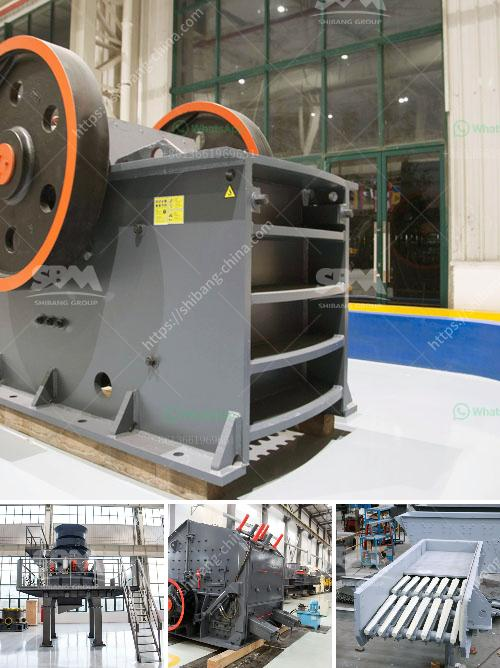

<h3>size of a 50 tpd rotary kiln</h3>
The size of a 50 tpd (tonnes per day) rotary kiln can be determined through several factors. These factors include the dimensions of the kiln, its length, diameter, and inclination, fuel characteristics, and processing requirements.

A rotary kiln is a large cylindrical vessel used for calcination, clinker production, or other thermal processing applications. It is primarily used in cement production but can also be employed in various industries such as lime, alumina, and chemical processing. The size of a rotary kiln is crucial as it determines the overall capacity and efficiency of the unit.

For a 50 tpd kiln, the length and diameter are key parameters that need careful consideration. In general, a longer kiln will provide a larger processing capacity as more material can undergo thermal treatment. Similarly, a larger diameter allows for more efficient heat transfer and greater throughput. However, the length and diameter of the kiln are limited by practical constraints such as the space available at the plant site and the structural requirements.

Typically, a 50 tpd rotary kiln would have a length of around 50 meters and a diameter of around 3-4 meters. These dimensions can vary depending on the specific requirements of the process and the equipment manufacturer. Moreover, the inclination or slope of the kiln is another factor to consider. An inclined kiln promotes material movement and aids in the flow of solids through the unit. The inclination angle can vary from 2-4 degrees depending on the process and material characteristics.

The fuel characteristics also play a significant role in determining the size of the rotary kiln. The selection of fuel can vary from coal, natural gas, oil, or alternative fuels such as waste or biomass. The energy content and combustion properties of the fuel impact the overall heat transfer and thermal efficiency of the kiln. Higher energy fuels may require larger kiln sizes to ensure complete combustion and sufficient heat transfer.

The processing requirements of the material being treated in the kiln are another key consideration. Different materials have varying rates of reaction and heat transfer properties. For example, clinker production in the cement industry requires high temperatures of around 1450 degrees Celsius. The kiln size must be designed to ensure adequate residence time and heat transfer to achieve the desired product quality.

In conclusion, the size of a 50 tpd rotary kiln is determined by various factors including its length, diameter, inclination, fuel characteristics, and processing requirements. A larger kiln enables higher processing capacity and efficiency, while practical constraints and material characteristics also need to be considered. Manufacturers and engineers work closely to design kilns that meet the specific needs of each industry, ensuring optimal performance and long-term reliability.
<h3>Contact us</h3><ul><li><strong>Whatsapp:&nbsp;<a href="https://wa.me/8613661969651">+8613661969651</a></strong></li><li><a href="https://swt.shibang-china.com/?git&amp;zhl&amp;size of a 50 tpd rotary kiln"><strong>Online Service(chat now)</strong></a></li></ul><h3>Related</h3><ul><li><a href='gold mining equipments manufacturers.md'>gold mining equipments manufacturers</a></li><li><a href='quartz stone powder manufacturing plant in india.md'>quartz stone powder manufacturing plant in india</a></li><li><a href='iron processing plant price.md'>iron processing plant price</a></li><li><a href='ball mill operation cost.md'>ball mill operation cost</a></li><li><a href='mobile stone crushing plant made in germany.md'>mobile stone crushing plant made in germany</a></li></ul>