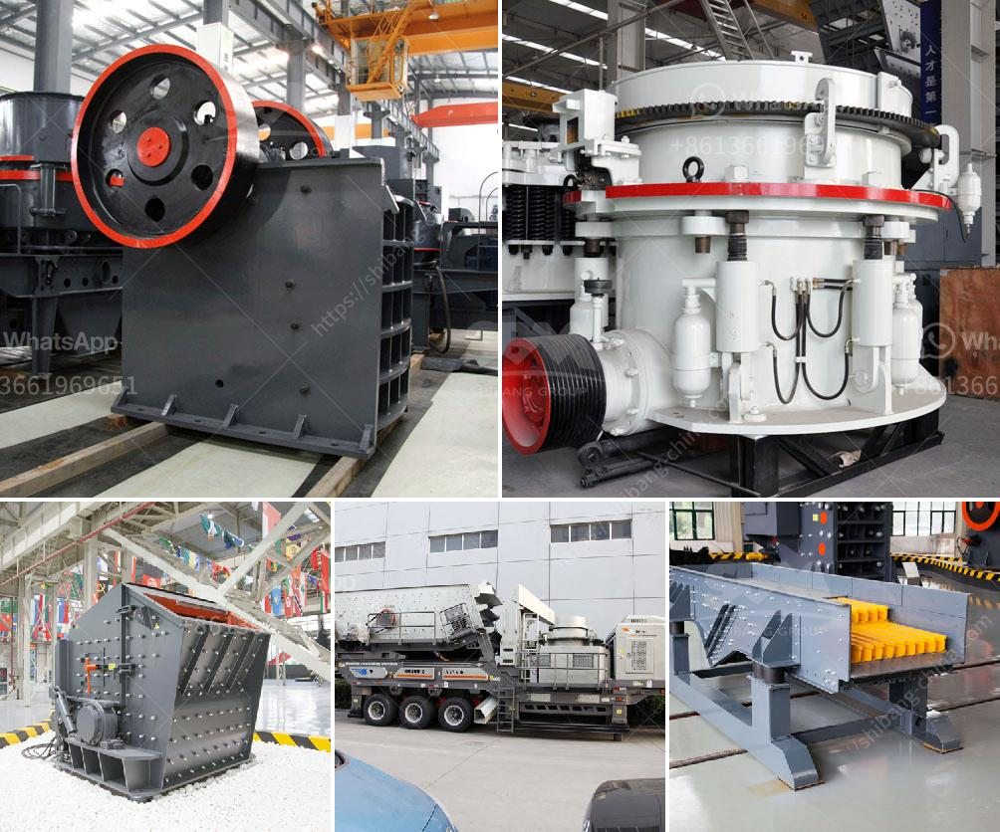

<h3>size of input and output of primary crusher</h3>
A primary crusher is a machine that is used to reduce large rocks into smaller rocks, gravel, or rock dust. Crushers are commonly classified into three main categories based on their abilities to reduce the size of material: impact crushers, cone crushers, and jaw crushers. The size of the input and output of these machines can vary greatly depending on the type of crusher and the properties of the material being crushed. In this article, we will discuss the size of the input and output of a primary crusher.

The size of the input material can range from 300mm to 1000mm or more, depending on the type of crusher. However, most crushers have a maximum feeding size between 1000mm and 1500mm. It is important to consider the size and hardness of the material being fed into the crusher because this will determine the type and size of the crusher needed. For example, if the material is a hard granite, a jaw crusher with a larger feeding size would be more suitable than a cone crusher.

The output size of a primary crusher also varies. Most crushers are designed to produce an output size between 0-50mm and 0-200mm. However, some crushers can produce larger output sizes such as 0-75mm, 0-100mm, or even 0-200mm. The size of the output depends on the settings of the crusher and the properties of the material being crushed.

In addition to the input and output sizes, other factors must also be considered when selecting a primary crusher. These factors include the capacity of the crusher, the horsepower, the type of drive system, and the dimensions of the crusher. These factors will determine the productivity and efficiency of the crusher.

The capacity of a crusher refers to the maximum amount of material it can process in a given time period. The capacity can vary from a few tons per hour to several thousand tons per hour, depending on the type and size of the crusher. It is important to select a crusher with a capacity that matches the needs of the application.

The horsepower of a crusher refers to the power output of the machine. A higher horsepower can result in higher crushing efficiency and higher productivity. However, a higher horsepower also means higher energy consumption. It is necessary to find a balance between horsepower and energy consumption to optimize the performance of the crusher.

The type of drive system also affects the performance of a primary crusher. Crushers can be driven by electrical motors or diesel engines. The choice of drive system depends on factors such as availability, cost, and environmental considerations.

The dimensions of a primary crusher can also vary. The height, width, and length of the crusher will determine its footprint and whether it can be easily transported or installed in a specific location. It is important to consider the available space and logistical constraints when selecting a crusher.

In conclusion, the size of the input and output of a primary crusher can vary greatly depending on the type of crusher and the properties of the material being crushed. The input size can range from 300mm to 1000mm or more, while the output size can vary from 0-50mm to 0-200mm. It is crucial to consider factors such as capacity, horsepower, drive system, and dimensions when selecting a primary crusher. By carefully considering these factors, one can ensure that the crusher chosen is suitable for the specific application and can provide optimal performance.
<h3>Contact us</h3><ul><li><strong>Whatsapp:&nbsp;<a href="https://wa.me/8613661969651">+8613661969651</a></strong></li><li><a href="https://swt.shibang-china.com/?git&amp;zhl&amp;size of input and output of primary crusher"><strong>Online Service(chat now)</strong></a></li></ul><h3>Related</h3><ul><li><a href='ball mills in lima.md'>ball mills in lima</a></li><li><a href='quarry business for sale in nigeria.md'>quarry business for sale in nigeria</a></li><li><a href='construction crusher price.md'>construction crusher price</a></li><li><a href='how much does a mobile crusher cost.md'>how much does a mobile crusher cost</a></li><li><a href='sayaji impact crusher.md'>sayaji impact crusher</a></li></ul>