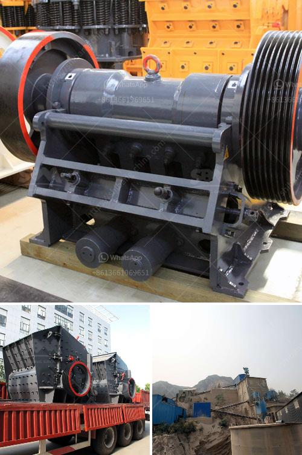

<h3>slag crusher cost</h3>
Slag is a byproduct obtained during the process of iron and steel manufacturing. Slag crushers are widely used to crush slag and other materials that are similar in nature such as glass, shells, minerals, and other ores. With the growing demand for slag crushers, the market is filled with several manufacturers offering various equipment options at varying costs.

The cost of a slag crusher depends on various factors such as the model, capacity, specifications, and manufacturer. Different manufacturers offer crushers with different specifications to cater to the diverse needs of industries. The capacity of a slag crusher can range from a few tons to hundreds of tons per hour, depending on the size and hardness of the material to be crushed. Generally, higher capacity crushers tend to be more expensive due to their advanced features and larger size.

One important factor that affects the cost of a slag crusher is its maintenance requirements. Regular maintenance is essential to ensure optimal performance and durability of the crusher. Some manufacturers offer low-maintenance crushers, which may cost less initially but can lead to higher maintenance costs in the long run. It is crucial to consider the maintenance requirements and costs associated with a slag crusher before making a purchase decision.

Another factor influencing the cost of a slag crusher is the quality of materials used in its construction. Crushers made with high-quality materials tend to be more durable and have a longer lifespan. However, such crushers may have a higher price tag compared to those made with lower-quality materials. It is essential to evaluate the quality of construction materials used in a slag crusher to determine its cost-effectiveness.

The cost of a slag crusher is not only limited to its purchase price but also includes other expenses such as transportation, installation, and operational costs. Transportation costs can vary depending on the distance between the manufacturer and the buyer's location. Similarly, installation costs can vary based on the complexity of the installation process and any additional requirements specific to the site. Operational costs include electricity consumption, manpower, and other maintenance expenses incurred during the crusher's lifespan.

In conclusion, the cost of a slag crusher depends on various factors such as the model, capacity, specifications, manufacturer, maintenance requirements, quality of construction materials, and other associated expenses. It is essential for buyers to evaluate these factors and compare multiple options from different manufacturers to make an informed decision. Investing in a reliable and cost-effective slag crusher can help industries improve their efficiency, reduce waste, and contribute to sustainable manufacturing processes.
<h3>Contact us</h3><ul><li><strong>Whatsapp:&nbsp;<a href="https://wa.me/8613661969651">+8613661969651</a></strong></li><li><a href="https://swt.shibang-china.com/?git&amp;zhl&amp;slag crusher cost"><strong>Online Service(chat now)</strong></a></li></ul><h3>Related</h3><ul><li><a href='mobile clusher for hire tanzania.md'>mobile clusher for hire tanzania</a></li><li><a href='how to start a quarry business in nigeria.md'>how to start a quarry business in nigeria</a></li><li><a href='quarry business in nigeria.md'>quarry business in nigeria</a></li><li><a href='marble stone milling plant.md'>marble stone milling plant</a></li><li><a href='gypsum powder manufacturing plant price.md'>gypsum powder manufacturing plant price</a></li></ul>