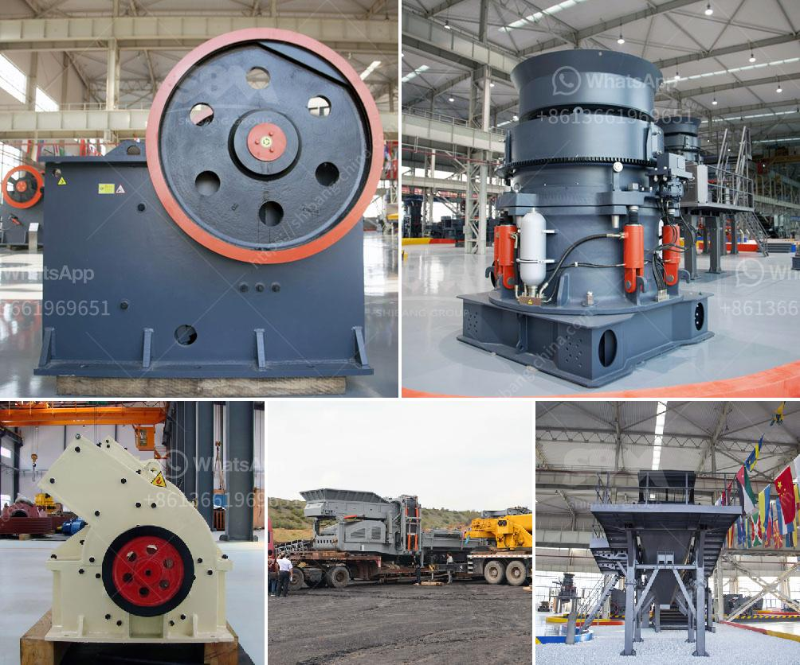

<h3>slag crusher manufacturer</h3>
Slag, a byproduct of industrial processes, is a type of waste material that can be detrimental to the environment if not properly disposed of. However, with advancements in technology, slag can now be processed and recycled for various purposes, making it an eco-friendly alternative to traditional materials. This is where slag crusher manufacturers come into play.

Slag crusher manufacturers are specialized in providing the perfect solution to crushing and processing slag. They offer a range of products to suit the needs of different industries, such as construction, cement production, and mining. These crushers are designed to break down the slag into smaller particles, which can then be used in various applications.

One of the key benefits of using a slag crusher is the reduction in waste material. Instead of disposing of the slag, which can be expensive and harmful to the environment, it can be recycled and repurposed. The crushers can process the slag into aggregate for construction projects, or even produce a fine powder that can be used as an additive in cement production.

Another advantage of using a slag crusher is the cost-effectiveness. By recycling the slag, industries can save on raw material costs and reduce their overall production expenses. Additionally, using recycled slag can contribute to a circular economy, where waste is transformed into a valuable resource.

When choosing a slag crusher manufacturer, it is important to consider several factors. Firstly, the manufacturer should have experience and expertise in slag processing. They should be able to provide the necessary equipment and technology to effectively crush and process the slag. Additionally, the manufacturer should have a good track record, with a reputation for delivering high-quality products and services.

It is also important to consider the specific requirements of the industry. Different industries may have different needs when it comes to slag processing. For example, the construction industry may require coarse aggregate for road construction, while the cement industry may require a fine powder for blending with cement. A reputable slag crusher manufacturer should be able to offer a range of products to cater to these varying needs.

In conclusion, slag crusher manufacturers play a crucial role in the recycling and processing of slag waste. By providing the necessary equipment and expertise, they enable industries to turn waste material into valuable resources. With their help, industries can not only reduce their environmental impact but also save on production costs. As the demand for sustainable and eco-friendly solutions continues to grow, the importance of slag crusher manufacturers cannot be overstated.
<h3>Contact us</h3><ul><li><strong>Whatsapp:&nbsp;<a href="https://wa.me/8613661969651">+8613661969651</a></strong></li><li><a href="https://swt.shibang-china.com/?git&amp;zhl&amp;slag crusher manufacturer"><strong>Online Service(chat now)</strong></a></li></ul><h3>Related</h3><ul><li><a href='processing of copper crusher in zambia.md'>processing of copper crusher in zambia</a></li><li><a href='small gypsum crushing machines australia.md'>small gypsum crushing machines australia</a></li><li><a href='stone crusher machine from uk.md'>stone crusher machine from uk</a></li><li><a href='mtw 175 tanzania mill output in 325 mesh.md'>mtw 175 tanzania mill output in 325 mesh</a></li><li><a href='pfw series impact crusher.md'>pfw series impact crusher</a></li></ul>