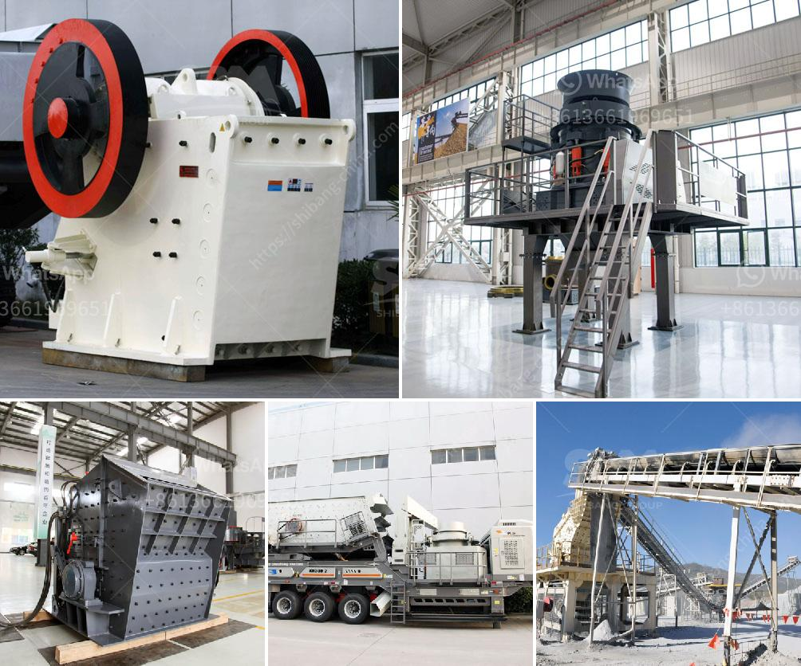

<h3>slag crushing machinery supplier from india</h3>
Slag is a by-product produced during the smelting process in various industries. It is a residue obtained from a metal-ore smelting process, which is commonly used as a substitute for natural materials. With the growing construction industry in India, the demand for slag as a substitute for cement and other natural materials is increasing rapidly. This has led to the emergence of slag crushing machinery suppliers from India who provide state-of-the-art machines to ensure high efficiency and productivity.

Slag crushing machinery suppliers from India offer advanced technology coupled with high-quality materials to deliver the desired product. These machines are also equipped with the latest safety features to ensure worker safety and minimize environmental impact. They are designed to crush the slag into smaller sizes, making it suitable for various applications, such as road construction, cement production, and agriculture.

The availability of slag crushing machinery suppliers has made it easier for industries to reduce their carbon footprint and adopt sustainable practices. By using slag as a substitute for natural materials, industries can significantly reduce greenhouse gas emissions and preserve natural resources. This has gained the attention of the Indian government, which has introduced various incentives and subsidies to promote the use of slag in construction projects.

Furthermore, the Indian market for slag crushing machinery is witnessing significant growth due to the increasing demand for high-quality construction materials. The construction industry is one of the major contributors to India's GDP, and the demand for slag as a substitute for cement is expected to rise in the coming years. This has created a lucrative opportunity for slag crushing machinery suppliers in the country.

In conclusion, the slag crushing machinery supplier industry in India is witnessing substantial growth due to the increasing demand for slag as a substitute for natural materials. With advanced technology and high-quality machines, these suppliers are catering to the needs of various industries to reduce their carbon footprint and adopt sustainable practices. The Indian government's support and the growing construction industry are further fueling the growth of this promising industry.
<h3>Contact us</h3><ul><li><strong>Whatsapp:&nbsp;<a href="https://wa.me/8613661969651">+8613661969651</a></strong></li><li><a href="https://swt.shibang-china.com/?git&amp;zhl&amp;slag crushing machinery supplier from india"><strong>Online Service(chat now)</strong></a></li></ul><h3>Related</h3><ul><li><a href='list of equipments for a quarry crusher.md'>list of equipments for a quarry crusher</a></li><li><a href='regulatory conveyor belts.md'>regulatory conveyor belts</a></li><li><a href='size of a 50 tpd rotary kiln.md'>size of a 50 tpd rotary kiln</a></li><li><a href='dolomite processing plants from germany.md'>dolomite processing plants from germany</a></li><li><a href='complete stone crushing.md'>complete stone crushing</a></li></ul>