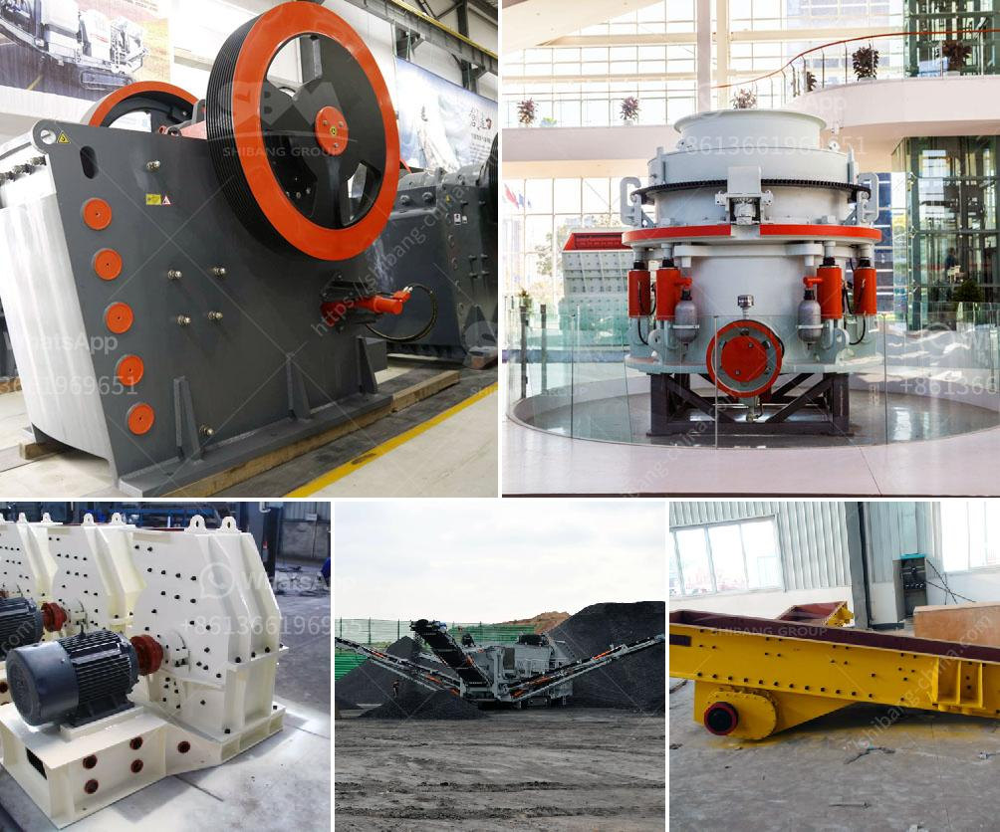

<h3>slag grindimg in ball mill</h3>
Slag is a byproduct of the iron and steel industry, formed when iron ores are melted at high temperatures to extract the metal. Slag itself is a complex mixture of various minerals, including silicates, oxides, and metal sulfides. For many years, slag has been used as an additive in the cement industry to improve its performance and reduce costs. 

Traditionally, slag has been treated by dumping it into landfills or using it as a road base material. However, with the advancements in technology, slag grinding in a ball mill has become a widely adopted method to enhance the cementitious properties of slag and optimize its further use.

The ball mill is a horizontal rotating device with cylindrical chambers that contain grinding media, such as balls, flint pebbles, or stainless steel balls. When the mill rotates, the balls grind the clinker/gypsum mixture into a fine powder. The size reduction process occurs due to the impact and attrition forces between the grinding media and the feed material. 

When it comes to grinding slag, the ball mill has several advantages that make it particularly suitable. Firstly, the ball mill has a large capacity, which means it can handle the high moisture content of slag and can operate continuously without any downtime. High-capacity mills are essential when grinding slag, as the high moisture content can cause the material to stick and block the mill's operation.

Secondly, the ball mill offers a flexible and adjustable grinding process. By changing the rotational speed and adding grinding additives, the properties of the slag can be modified to meet specific requirements. For example, grinding additives can control the setting time, improve the early strength, and enhance the cementitious properties of slag.

Furthermore, the ball mill provides a more energy-efficient grinding solution compared to other options, such as vertical roller mills (VRM) or roller presses. This is due to the lower specific power consumption of the ball mill and its ability to grind slag efficiently.

In addition to its technical advantages, using a ball mill for slag grinding has economic benefits. By utilizing slag as an additive in cement production, savings in clinker production costs can be achieved. This is because slag is cheaper than clinker and its properties enable the reduction of clinker content without compromising the final quality of the cement.

Overall, slag grinding in a ball mill is an efficient alternative for cement production. It allows the cement industry to utilize an industrial waste product and enhance its performance as a cement additive. Additionally, it provides economic benefits by reducing clinker production costs. With the continuous improvement of grinding technologies, the ball mill is expected to play an even more significant role in slag utilization in the future.
<h3>Contact us</h3><ul><li><strong>Whatsapp:&nbsp;<a href="https://wa.me/8613661969651">+8613661969651</a></strong></li><li><a href="https://swt.shibang-china.com/?git&amp;zhl&amp;slag grindimg in ball mill"><strong>Online Service(chat now)</strong></a></li></ul><h3>Related</h3><ul><li><a href='price list sag mill for sale.md'>price list sag mill for sale</a></li><li><a href='hammer mills grinding.md'>hammer mills grinding</a></li><li><a href='quarry mining business plan pdf.md'>quarry mining business plan pdf</a></li><li><a href='stone crusher manufacturers in ranchi.md'>stone crusher manufacturers in ranchi</a></li><li><a href='industrial aluminum can crusher in saudi arabia.md'>industrial aluminum can crusher in saudi arabia</a></li></ul>