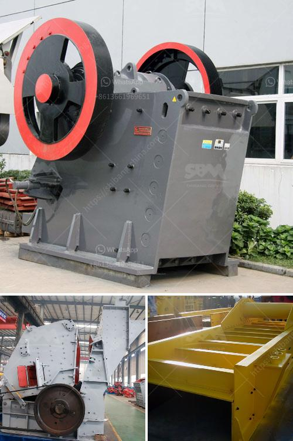

<h3>slag grinding mill india</h3>
Slag is a by-product of the metallurgical industry that is generated during the smelting process of various ores. It is composed of a mixture of metal oxides, silicon dioxide, and other impurities, which make it difficult to dispose of and can also be harmful to the environment if not handled properly.

Fortunately, in recent years, India has made significant progress in developing technologies to recycle and utilize slag effectively. One such advancement is the introduction of slag grinding mills, which are designed to grind the slag into fine particles. These mills have become an essential tool in the process of slag recycling, allowing for efficient utilization of this waste material.

Slag grinding mills in India are designed to grind and dry materials with moisture content up to 15% and hardness ranging from medium to high. They are capable of grinding materials such as clinker, slag, ore, quartz, and limestone into various product sizes, ranging from 20 to 3000 mesh, providing a wide range of options for industries to achieve their desired product specifications.

The main advantages of using slag grinding mills in India are their high grinding efficiency, low maintenance cost, and environmental friendliness. These mills are equipped with advanced technology and highly efficient grinding systems, which ensure a high grinding capacity while reducing energy consumption. Furthermore, they are equipped with dust collectors and other environmental control systems to minimize dust emissions and maintain a clean working environment.

The production process of slag grinding mills involves feeding the raw materials into the mill, which is equipped with grinding media such as steel balls or ceramic beads. As the material passes through the grinding chamber, it is ground by the impact and friction of the grinding media. The ground material is then discharged through the discharge port, while the oversized particles are returned to the grinding chamber for further grinding.

The final product obtained from slag grinding mills in India is a fine powder with a particle size distribution suitable for various applications. This powder can be used as a cement additive, replacing a portion of clinker in the production of cement. It can also be used as a raw material for the production of slag cement or as a filler material in the construction industry.

In conclusion, the introduction of slag grinding mills in India has been a significant step towards the efficient utilization of slag waste. These mills provide industries with an effective solution for grinding and recycling slag, contributing to the reduction of waste and the sustainable development of the metallurgical industry. With continued research and development, it is anticipated that slag grinding mills will further evolve and play a crucial role in the transformation of slag waste into valuable resources.
<h3>Contact us</h3><ul><li><strong>Whatsapp:&nbsp;<a href="https://wa.me/8613661969651">+8613661969651</a></strong></li><li><a href="https://swt.shibang-china.com/?git&amp;zhl&amp;slag grinding mill india"><strong>Online Service(chat now)</strong></a></li></ul><h3>Related</h3><ul><li><a href='stone crushers china.md'>stone crushers china</a></li><li><a href='limestone grinding mill unit manufacturers.md'>limestone grinding mill unit manufacturers</a></li><li><a href='limestone calcium hydroxide machine.md'>limestone calcium hydroxide machine</a></li><li><a href='mobile crusher sale price.md'>mobile crusher sale price</a></li><li><a href='crushing plant for sale.md'>crushing plant for sale</a></li></ul>