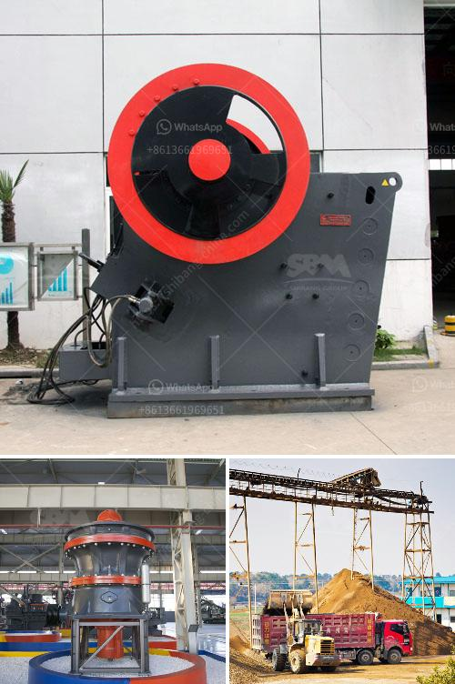

<h3>small aggregate wash plants</h3>
Small aggregate wash plants are compact and portable machines designed to clean and separate small-sized materials. These plants are commonly used in the construction industry to wash sand and gravel and remove impurities such as silt and clay. With their efficient cleaning process, they ensure high-quality aggregates that are vital for various construction projects.

One of the significant advantages of small aggregate wash plants is their size. These plants are designed to be easily transported and set up at different job sites. They can be mounted on a trailer or a skid for convenient mobility. This flexibility allows contractors to bring the wash plant directly to the source of raw materials, reducing transportation costs and time.

Despite their compact size, small aggregate wash plants are equipped with powerful mechanisms that effectively clean the aggregates. They typically consist of a vibrating screen, a hydrocyclone, and a dewatering screen. The vibrating screen separates the materials based on size, while the hydrocyclone removes impurities through centrifugal force. The dewatering screen further removes excess water, ensuring the washed aggregates are ready to be used immediately.

The continuous cleaning process of small aggregate wash plants helps to achieve consistent quality aggregates. By removing silt, clay, and other impurities, the washed aggregates have improved physical characteristics such as higher strength and reduced porosity. This leads to better workability, durability, and overall performance of the concrete or asphalt produced with these aggregates.

Apart from the construction industry, small aggregate wash plants are also used in mining operations to wash coal, iron ore, and other minerals. Their versatility and functionality make them a valuable asset for various industries.

In conclusion, small aggregate wash plants are essential machines for cleaning and separating small-sized materials in the construction and mining industries. Their compact size, mobility, and powerful cleaning mechanisms make them an ideal choice for contractors and mine operators. By producing high-quality washed aggregates, they contribute to the success and efficiency of construction and mining projects.
<h3>Contact us</h3><ul><li><strong>Whatsapp:&nbsp;<a href="https://wa.me/8613661969651">+8613661969651</a></strong></li><li><a href="https://swt.shibang-china.com/?git&amp;zhl&amp;small aggregate wash plants"><strong>Online Service(chat now)</strong></a></li></ul><h3>Related</h3><ul><li><a href='mobile crushing plant philippines.md'>mobile crushing plant philippines</a></li><li><a href='cone crusher company.md'>cone crusher company</a></li><li><a href='conveyor belts specifications.md'>conveyor belts specifications</a></li><li><a href='crushing and screening plant supplier china.md'>crushing and screening plant supplier china</a></li><li><a href='stone crushing machineries imphal.md'>stone crushing machineries imphal</a></li></ul>